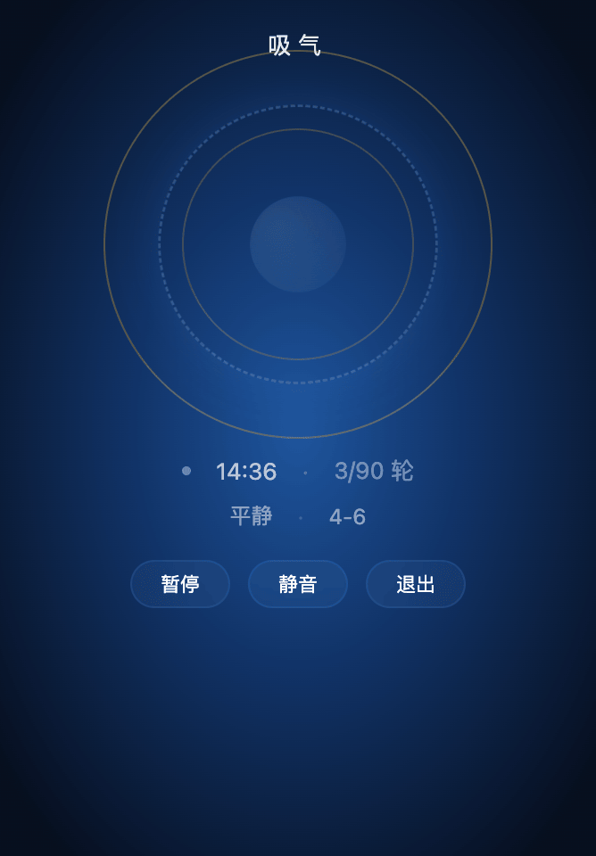

# Breathe Web

[](LICENSE)

A web-based paced breathing app for vagal tone training. A single HTML file, zero dependencies, works in any browser. Inspired by [breathe-cli](https://github.com/marekkowalczyk/breathe-cli).



## Why this exists

Resonance breathing — slow, paced breathing at around 6 breaths per minute — is one of the few non-pharmacological interventions shown to improve cardiac vagal tone. The mechanism is straightforward: slow breathing amplifies respiratory sinus arrhythmia (RSA), the natural heart-rate variation linked to the breath cycle. Stronger RSA means stronger vagal outflow, which in turn improves baroreceptor sensitivity and shifts autonomic balance away from sympathetic dominance.

This matters most for people with heart failure with reduced ejection fraction (HFrEF), where sympathetic overdrive is both a symptom and an accelerant of disease progression. Bernardi et al. (1998) demonstrated that slow breathing at 6 bpm improves oxygen saturation and exercise tolerance in CHF patients, with effects visible after a single session. A follow-up study (Bernardi et al. 2002) showed that slow breathing also increases arterial baroreflex sensitivity in CHF — a marker strongly associated with prognosis.

This app is a habit tool that makes daily practice frictionless: open `breathe.html` in a browser, tap start, follow the circle. It is not a medical device.

### The science in brief

**Why 6 breaths per minute?** The cardiovascular system has a resonance frequency — typically between 4.5 and 6.5 bpm in adults — at which heart rate oscillations are maximally amplified (Vaschillo et al. 2006). Breathing at or near this frequency produces the largest RSA swings, which drive the strongest vagal training stimulus. Individual resonance frequency varies and can only be identified precisely with HRV biofeedback hardware. Without it, 6 bpm is the best population-level default: it sits at the centre of the typical range and matches the rate used in the CHF clinical trials (Bernardi et al. 1998, 2002).

**Why a longer exhale in the `calm` and `extended` presets?** Cardiac vagal efferent activity is gated to the respiratory cycle — vagal outflow is stronger during expiration than inspiration. A longer exhale (4s in, 6s out) extends the phase of peak vagal drive within each breath, biasing the autonomic balance further toward parasympathetic tone (Russo et al. 2017, Lehrer & Gevirtz 2014). The total cycle is still 10 seconds (6 bpm). The `balanced` preset uses equal timing (5-5) as a neutral baseline; the `calm` and `extended` presets use the exhale-weighted ratio for parasympathetic emphasis.

### References

- Bernardi L, Spadacini G, Bellwon J, et al. ["Effect of breathing rate on oxygen saturation and exercise performance in chronic heart failure."](<https://doi.org/10.1016/S0140-6736(97)10341-5>) _Lancet_. 1998;351(9112):1308-1311.
- Bernardi L, Porta C, Spicuzza L, et al. ["Slow breathing increases arterial baroreflex sensitivity in patients with chronic heart failure."](https://doi.org/10.1161/hc0202.103311) _Circulation_. 2002;105(2):143-145.
- Vaschillo EG, Vaschillo B, Lehrer PM. ["Characteristics of resonance in heart rate variability stimulated by biofeedback."](https://doi.org/10.1007/s10484-006-9009-3) _Appl Psychophysiol Biofeedback_. 2006;31(2):129-142.
- Lehrer PM, Gevirtz R. ["Heart rate variability biofeedback: how and why does it work?"](https://doi.org/10.3389/fpsyg.2014.00756) _Front Psychol_. 2014;5:756.
- Russo MA, Santarelli DM, O'Rourke D. ["The physiological effects of slow breathing in the healthy human."](https://doi.org/10.1183/20734735.009817) _Breathe_. 2017;13(4):298-309.

## Usage

Open `breathe.html` in any modern browser. No installation, no server, no dependencies.

### Presets

Choose a preset from the bottom panel:

| Preset | Inhale | Exhale | Duration | BPM | Effect                |
| ------ | ------ | ------ | -------- | --- | --------------------- |
| 平衡   | 4s     | 6s     | 15 min   | 6   | Exhale-weighted, calm |
| 平衡   | 5s     | 5s     | 10 min   | 6   | Equal ratio, neutral  |
| 延长   | 4s     | 6s     | 20 min   | 6   | Full Bernardi dose    |
| 自定义 | 3–10s  | 3–10s  | 1–60 min | —   | Your own ratio        |

### Controls

| Action  | How                                 |
| ------- | ----------------------------------- |
| Start   | Tap the **开始** button             |
| Pause   | Tap **暂停** (or press `Space`)     |
| Resume  | Tap **继续** (or press `Space`)     |
| Mute    | Tap **静音** (or press `S`)         |
| Quit    | Tap **退出** (or press `Q` / `Esc`) |
| Restart | Tap **重新开始** after session ends |

### Display

```
  准备 3...                    ← Phase label (countdown / inhale / exhale)

        ╭───╮                 ← Outer reference ring (max expansion)
     ╭──│───│──╮
    ╭──│──●──│──╮             ← Active breath ring (dashed, scales 0.6↔1.0)
    │  │  ╱  │  │             ← Center glow (pulses with breath)
    │  │ ╱   │  │
    │  │╱    │  │
    ╰──│─────│──╯
     ╰──│───│──╯
        ╰───╯                 ← Inner reference ring (min contraction)

  ● 14:32 · 3/15 轮           ← Status dot · countdown · cycles
  平静 · 4-6                   ← Preset · ratio
```

- The **outer golden ring** shows where to expand to on inhale.
- The **inner golden ring** shows where to contract to on exhale.
- The **active ring** (dashed blue) scales between them.
- The **background gradient** shifts from cool deep blue (exhale) to brighter blue (inhale), following your breath.

## Design choices

**One file, zero friction.** Single HTML file. Open it on any device — phone, tablet, laptop. No install, no server, no app store.

**Visual anchors for breath progress.** Two fixed reference circles (golden, solid) mark the min/max boundaries. The active breath ring (blue, dashed) scales between them, so you always know how far through the current phase you are.

**No complex UI.** The app has one job: guide your breathing. Everything else — timer, cycle count, preset switching — is secondary and placed below the circle.

**Pause snaps back.** If you pause mid-cycle and resume, the breath restarts from the beginning of inhale. Interrupted cycles don't count. Timer tracks completed breathing time only.

**Audio cues.** Soft tones mark phase transitions — 396 Hz for inhale, 285 Hz for exhale — using the Web Audio API. No external files needed.

**Session logging.** Completed sessions are saved to `localStorage`. Your data stays on your device.

**No breath retention.** Inhale-exhale only. The app does not support holds between phases — consistent with the Bernardi protocol used in CHF clinical trials.

## Safety

**Stop immediately** if you experience:

- **Lightheadedness or dizziness** — you may be breathing too deeply. Reduce depth, not rate. If it persists, stop.
- **Palpitations** — stop, note the time, mention it at your next cardiology visit.
- **Tingling in hands or face** — hyperventilation signal. Stop, return to normal breathing.

## Disclaimer

This app is not a medical device. It does not diagnose, treat, cure, or prevent any disease or condition. Always consult your physician before starting a breathing practice, especially if you have a cardiac or respiratory condition. Use entirely at your own risk. The author assumes no liability for any adverse effects arising from the use of this software. By using this app you acknowledge that you understand and accept these terms.

## License

NO License.

Inspired by [breathe-cli](https://github.com/marekkowalczyk/breathe-cli) by Marek Kowalczyk.
