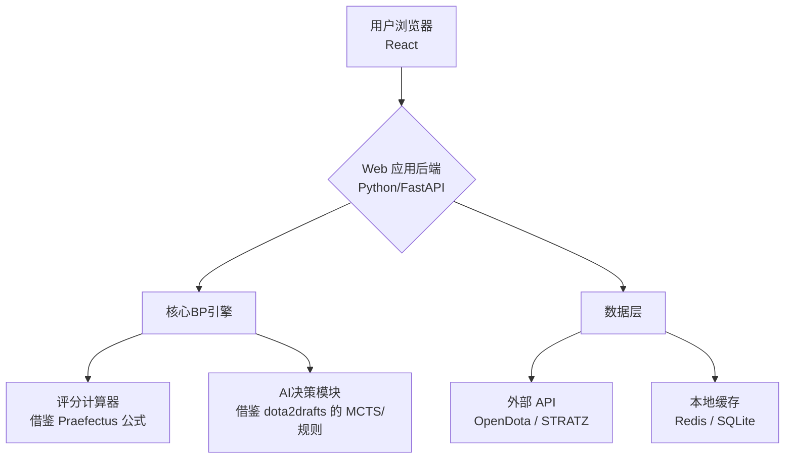

综合 `./dota2drafts` 的对抗框架和 `./Praefectus` 的评分算法，我们来梳理一个完整的BP对抗Web应用开发路线图。

这是一个融合了**AI决策引擎**（来自 [dota2drafts](https://github.com/larryfenn/dota2drafts) ）与**实时数据/评分体系**（来自 [Praefectus](https://github.com/AnleaR/Praefectus) ）的混合架构方案。

### 🗺️ 项目架构全景图

### 📝 分阶段开发路线图

#### **阶段一：数据与核心评分引擎** (MVP基础)

这个阶段的目标是实现一个能对任意阵容进行评分的函数。

1.  **数据获取与处理**：
    - 使用 **OpenDota API** 或 **STRATZ GraphQL API** 获取英雄基础信息（ID、名称、属性）以及英雄间的**克制与协同数据**（即 matchup 胜率）。
    - （参考 Praefectus）设计数据缓存策略，避免频繁请求外部API。

2.  **实现“阵容评分器”**：
    - （直接借鉴 Praefectus）用你熟悉的后端语言（如Python或Kotlin）实现其核心评分公式：
      `最终得分 = (vs_enemy_advantage × 1.5) + (with_ally_synergy × 1.0) + (meta_winrate_adjustment × 0.5)`
    - 编写单元测试，确保函数能正确输入英雄列表，输出一个可解释的比分（例如“天辉 56% : 44% 夜魇”）。

#### **阶段二：构建AI决策与对抗逻辑** (核心玩法)

这个阶段要实现AI的BP策略，并能进行完整的模拟对抗。

1.  **实现基础AI玩家**：
    - （借鉴 dota2drafts）从最简单的策略开始，实现 `RandomPicker`（随机选）、`HighestWinRatePicker`（选胜率最高）等类。
    - 每个AI玩家都实现一个 `choose_pick(current_team, enemy_team, available_heroes)` 方法，返回选中的英雄。

2.  **实现高级AI策略（可选，核心挑战）**：
    - 参考 dota2drafts 中关于 **MCTS (蒙特卡洛树搜索)** 的实现思路。简而言之，让AI在每一步都向前模拟若干步，用你的“阵容评分器”作为最终评估函数，选择最优路径。
    - **关键**：你需要设计一个合适的搜索深度和宽度（比如只搜索未来2-3轮），以平衡决策质量和计算时间。

3.  **搭建“模拟对战”引擎**：
    - 编写一个 `DraftSimulator` 类，它能：
      - 初始化两个AI玩家或一个AI+一个人类（通过Web接口输入）。
      - 按照Dota 2的BP规则（通常为“天辉Ban-夜魇Ban-天辉Pick-夜魇Pick...”或“队长模式”），交替执行BP操作。
      - 每一步都记录双方阵容和当前评分。
      - 模拟结束后，输出最终评分和完整的BP过程。

#### **阶段三：Web应用开发** (用户界面)

这个阶段将后端能力通过Web页面呈现给用户。

1.  **后端API服务**：
    - 使用 **FastAPI** (Python) 或 **Express.js** (Node.js) 创建API端点。
    - 核心端点示例：
      - `/api/heroes`：返回当前英雄列表和数据。
      - `/api/draft/start`：开始新对局，返回初始状态。
      - `/api/draft/step`：接收人类玩家的选/ban操作，返回AI的回应和更新后的状态。
      - `/api/draft/evaluate`：对当前阵容进行即时评分。

2.  **前端交互界面**：
    - 使用 **React** 或 **Vue** 构建单页应用。
    - 设计BP棋盘，清晰展示英雄池、双方已选/禁英雄、当前轮到谁操作。
    - 实时显示**评分变化趋势图**，让玩家直观感受每一步对胜率的影响，这是提升“对抗感”的关键。
    - 可以添加“AI建议”按钮，调用后端的评分API，高亮显示当前最优的几个选择。

### 💡 总结与关键技术决策点

| 决策点         | 你的选择                                 | 理由                                                                                            |
| :------------- | :--------------------------------------- | :---------------------------------------------------------------------------------------------- |
| **后端语言**   | Python (推荐)                            | Python库丰富（FastAPI, scikit-learn）                                                           |
| **AI核心算法** | 先实现**基于规则的评分**，再考虑**MCTS** | 基于规则的评分（Praefectus）是基础且有效；MCTS（dota2drafts）能提升AI的“思考深度”，但实现复杂。 |
| **数据源**     | **OpenDota API** (免费，快速起步)        | 满足MVP阶段需求，后续可切换至STRATZ获取更细粒度数据。                                           |
| **前端框架**   | **React + 组件库** (如Ant Design)        | 生态成熟，能快速构建复杂的交互式面板。                                                          |

### 开发注意事项

- 充分理解 ./dota2drafts 和 ./Praefectus 项目的内容，吸收其中有效的部分
- 数据/图片等资源来源保真，及时跟进现在的 dota2 版本。
- BP 的禁用/选取规则跟现在 dota2 队长模式对齐，预留扩展性
- AI vs 玩家，AI BP 的智能操作，设计多种难度系数
- 评分体系，BP 完成后需要对总体进行评判，可替换，可自我改进
- web 界面后续可能替换成 canvas 得 3D 引擎，保留好 数据 + 渲染 + 玩法的隔离
- ./dota2-bp-game 是工作区
