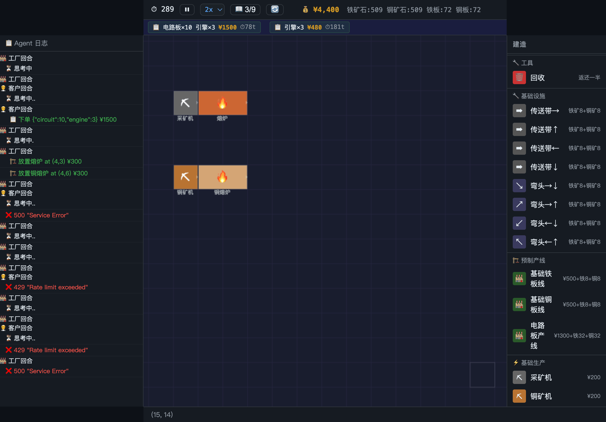

# 🏭 工厂模拟游戏 — AI Factory Game

一个 2D 俯视角工厂自动化模拟游戏。**真正的玩家是 AI Agent**——Factory Agent 自动建厂、Customer Agent 自动下单，人类只需观察和调试。

## 快速开始

```bash
# 1. 进入项目目录
cd game

# 2. 安装依赖
npm install

# 3. 配置 AI Agent（复制并填入 API Key）
cp .env.example .env
# 编辑 .env 文件：
#   OPENAI_API_KEY=sk-your-key
#   OPENAI_BASE_URL=https://api.deepseek.com  # 或 OpenAI 兼容接口
#   OPENAI_MODEL=deepseek-v4-flash                 # 或 gpt-4o-mini 等

# 4. 启动开发服务器
npm run dev
```

打开浏览器访问 `http://localhost:43001`。

## 游戏玩法

### 经济系统

| 物品 | 类型 | 售价 |
|------|------|------|
| 铁矿石 / 铜矿石 | 原料 | 不卖钱 |
| 铁板 / 铜板 / 齿轮 / 铁梁 | 中间产物 | 不卖钱 |
| 电路板 | 成品 | ¥35 |
| 电子元件 | 成品 | ¥50 |
| 引擎 | 成品 | ¥80 |

只有成品能通过**订单系统**卖钱。原料和中间产物只计数量，不产生收入。

### 生产链

```
铁矿石 → 熔炉 → 铁板 → 组装机 → 齿轮 ─┐
                                       ├→ 引擎装配机 → 引擎
铜矿石 → 铜熔炉 → 铜板 ─┬─→ 电路装配机 → 电路板
                        └→ 冲压机 → 铁梁 ─┘
```

### 建筑成本

| 建筑 | 成本 |
|------|------|
| 采矿机 / 铜矿机 | ¥200 |
| 熔炉 / 铜熔炉 | ¥300 |
| 组装机 / 冲压机 | ¥500 |
| 电路装配机 | ¥800 |
| 引擎装配机 | ¥1000 |
| 传送带（直/弯头） | 铁矿石×8 + 铜矿石×8 |

### 回收

选择「回收」模式（或右键点击建筑），返还 50% 成本。

## 核心架构

```
        ┌──────────────────────────┐
        │    Express + Socket.IO   │
        │      (src/index.ts)      │
        └────────────┬─────────────┘
                        │
        ┌──────────────┼───────────────┐
        ▼              ▼               ▼
┌───────────┐  ┌────────────┐  ┌──────────┐
│  Tick 循环 │  │  AI Agent  │  │  SQLite  │
│src/core/  │  │ src/core/  │  │  持久化   │
│ tick.ts   │  │ agent.ts   │  │ db.ts    │
└───────────┘  └────────────┘  └──────────┘
```

### 技术栈

| 层 | 技术 |
|----|------|
| 服务器 | Node.js + TypeScript + Express |
| 实时通信 | Socket.IO |
| 持久化 | better-sqlite3 |
| 前端 | 原生 Canvas 2D + 原生 JS |
| AI Agent | OpenAI 兼容 API（DeepSeek / GPT） |
| 开发工具 | tsx（热重载 TypeScript） |

### 目录结构

```
game/
├── src/
│   ├── index.ts             # 服务入口：Express + Socket.IO + 游戏主循环
│   └── core/
│       ├── agent.ts         # 双 Agent 系统（工厂 + 客户）
│       ├── db.ts            # SQLite 存取
│       ├── orders.ts        # 订单自动生成 / 检查 / 过期
│       ├── registry.ts      # 物品 / 机器 / 配方 注册表
│       ├── registry_machines.ts  # 机器具体定义
│       ├── tick.ts          # 每 tick 处理管线
│       ├── types.ts         # 核心类型定义
│       └── world.ts         # 世界状态工厂 + 辅助函数
├── public/
│   ├── index.html           # 主页面
│   ├── game.js              # Canvas 渲染 + 交互逻辑
│   └── style.css            # 样式
├── .env.example             # 配置模板
├── package.json
└── tsconfig.json
```

## 游戏循环

每 tick（速度可调 1x–6x）执行：

1. **采矿 & 加工** — 采矿机产原料，机器按配方加工
2. **传送带运输** — 物品在传送带上移动，每 tick 前进 1/4 格
3. **输出推送** — 机器生产完成后的物品推送到相邻传送带/机器
4. **订单处理** — 自动检查库存是否满足订单，满足则交付并奖励

### 回合制 AI Agent

每 10 tick 交替执行：
- **Factory Agent**（偶数回合）— 分析工厂状态，放置机器/传送带，优化布局
- **Customer Agent**（奇数回合）— 根据工厂产能自动生成订单

Agent 使用 OpenAI 兼容的 function calling API，每次调用直接输出结构化工具调用（`place_machine`、`place_belt`、`remove_tile`、`create_order`、`skip`），无需解析自由文本 JSON。

## 前端界面



左侧 Agent 日志面板  --- Canvas 地图 --- 右侧建造面板

- **拖拽** — 左键拖拽平移地图
- **滚轮** — 缩放（0.25x–4x）
- **R 键** — 旋转建筑朝向
- **右键** — 回收建筑
- **Esc** — 取消当前模式

### 新手引导

内置 10 步引导任务，进度显示在 HUD 的 📖 按钮中。

## 预设产线

点击右侧面板的「预制产线」快速放置完整生产线：

| 产线 | 内容 | 成本 |
|------|------|------|
| 基础铁板线 | 采矿机 → 传送带 → 熔炉 | ¥500 + 8Fe + 8Cu |
| 基础铜板线 | 铜矿机 → 传送带 → 铜熔炉 | ¥500 + 8Fe + 8Cu |
| 电路板产线 | 铁+铜双线 → 电路装配机 | ¥1300 + 32Fe + 32Cu |

## 环境变量

参见 `.env.example`：

| 变量 | 说明 | 默认值 |
|------|------|--------|
| `OPENAI_API_KEY` | AI API 密钥 | — |
| `OPENAI_BASE_URL` | API 端点 | `https://api.deepseek.com` |
| `OPENAI_MODEL` | 模型 ID | `deepseek-v4-flash` |
| `PORT` | 服务端口 | `43001` |

## 持久化

- 存档位置：`data/savegame.db`（SQLite）
- 自动保存：每 10 秒
- 重置：点击 🔄 按钮确认后清空存档并生成新世界

## 开发

```bash
# 热重载开发
npm run dev

# 编译
npm run build

# 运行编译后版本
npm start
```

## 设计理念

- **声明式元数据** — 物品、机器、配方以声明式注册表定义
- **AI 即玩家** — 人类是观察者，Agent 是真正的游戏参与者
- **Tick 驱动** — 所有逻辑围绕 tick 展开，可预测、可调试
- **纯原生前端** — 零框架、零构建步骤，Canvas 2D 直接渲染
