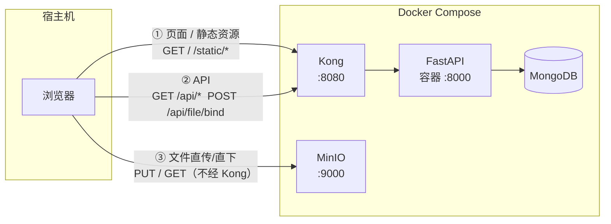
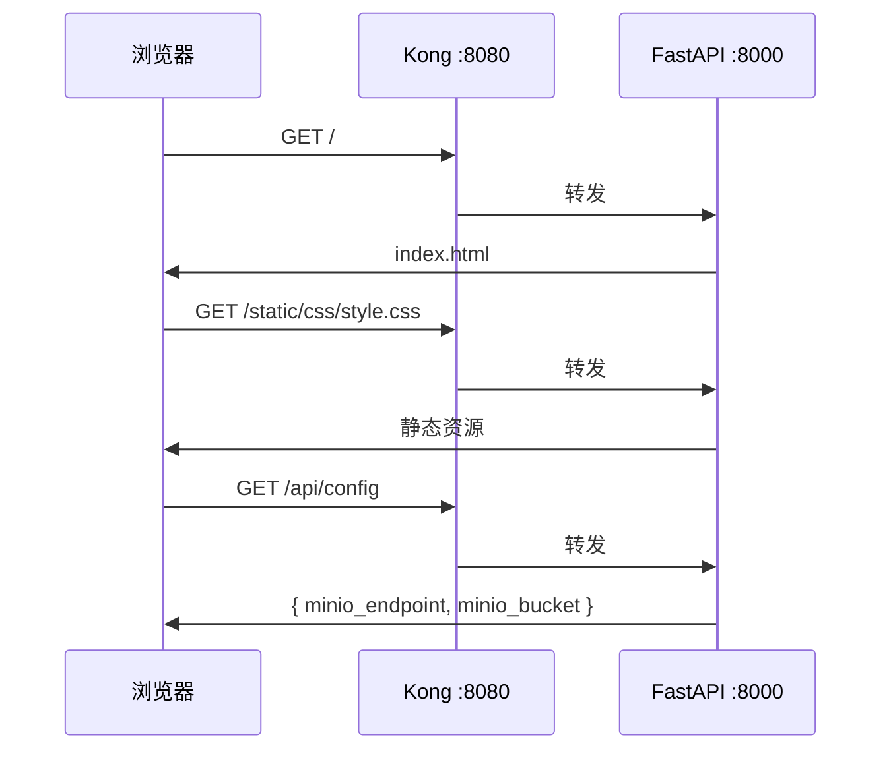
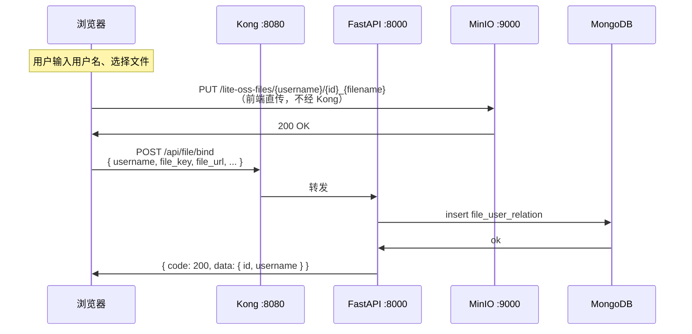
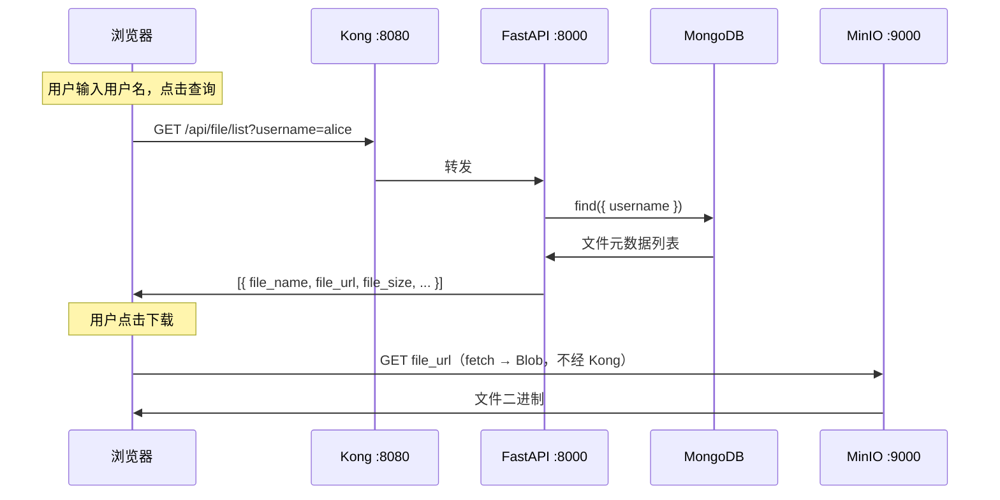
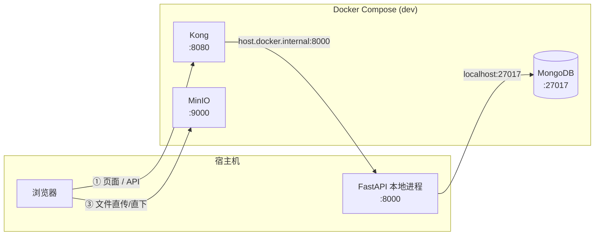
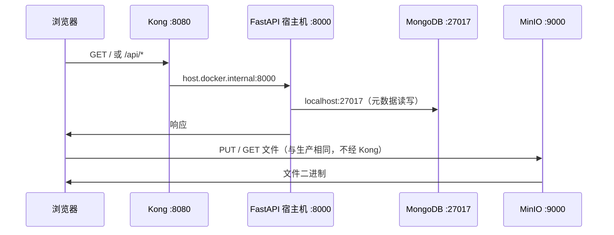

# Lite OSS

轻量文件上传下载管理系统，基于 Docker Compose 一键部署。

## 架构概览

系统分为 **页面/API 链路**（经 Kong 网关）和 **文件链路**（浏览器直连 MinIO，不经 Kong，避免大文件占用网关）。

| 链路 | 路径 | 说明 |
|------|------|------|
| 页面 | 浏览器 → Kong → FastAPI | 首页、静态资源 |
| API | 浏览器 → Kong → FastAPI → MongoDB | 配置、绑定、列表查询 |
| 文件 | 浏览器 ↔ MinIO | 上传 PUT、下载 GET（直传/直下） |

---

## 生产模式

`docker compose up -d --build`，全部服务容器化运行。

### 拓扑



### 请求链路

#### 1. 打开页面



#### 2. 上传文件



#### 3. 下载文件



### 启动

```bash
docker compose up -d --build
```

| 服务 | 地址 |
|------|------|
| 系统入口 (Kong) | http://localhost:8080 |
| MinIO API | http://localhost:9000 |
| MinIO Console | http://localhost:9001 |
| Kong Admin | http://localhost:8001 |

MinIO 控制台账号：`minioadmin` / `minioadmin`

---

## 开发模式

`docker compose -f docker-compose.dev.yml up -d`，仅基础设施跑在 Docker 里；**FastAPI 在宿主机本地运行**（支持 `--reload` 热重载）。

### 拓扑



与生产模式的差异：

| 组件 | 生产模式 | 开发模式 |
|------|----------|----------|
| FastAPI | Docker 容器内 `:8000` | 宿主机 `uv run uvicorn ... :8000` |
| Kong upstream | `http://app:8000` | `http://host.docker.internal:8000` |
| MongoDB | 仅容器内网 | 暴露 `localhost:27017` 供本地 Python 连接 |
| 页面/API 链路 | 浏览器 → Kong → 容器 | 浏览器 → Kong → 宿主机进程 |
| 文件链路 | 相同，浏览器直连 MinIO | 相同 |

### 请求链路

页面与 API 链路同生产模式，唯一区别是 Kong 将请求转发到 **宿主机** 而非容器：



### 启动

```bash
# 1. 启动基础设施
docker compose -f docker-compose.dev.yml up -d

# 2. 配置环境变量（首次）
cp .env.example .env

# 3. 安装依赖并启动本地 Python 服务
uv sync
uv run uvicorn app.main:app --reload --host 0.0.0.0 --port 8000
```

| 服务 | 地址 |
|------|------|
| 系统入口 (Kong → 本地 Python) | http://localhost:8080 |
| 本地 Python 直连（调试时可跳过 Kong） | http://localhost:8000 |
| MongoDB | localhost:27017 |
| MinIO API | http://localhost:9000 |

---

## 使用流程

1. 打开 http://localhost:8080
2. **上传模式**：输入用户名 → 选择文件 → 上传（前端直传 MinIO，成功后自动绑定元数据）
3. **下载模式**：输入用户名 → 查询列表 → 点击下载（浏览器 fetch MinIO 地址）

## API

统一响应格式：`{ "code": 200, "msg": "...", "data": ... }`

| 方法 | 路径 | 说明 |
|------|------|------|
| GET | `/health` | 健康检查 |
| GET | `/api/config` | MinIO 前端配置 |
| POST | `/api/file/bind` | 绑定文件元数据 |
| GET | `/api/file/list?username=` | 查询用户文件列表 |

## 停止

```bash
# 开发模式
docker compose -f docker-compose.dev.yml down

# 生产模式
docker compose down
```

数据持久化在 Docker volumes `mongo_data` 和 `minio_data` 中。
