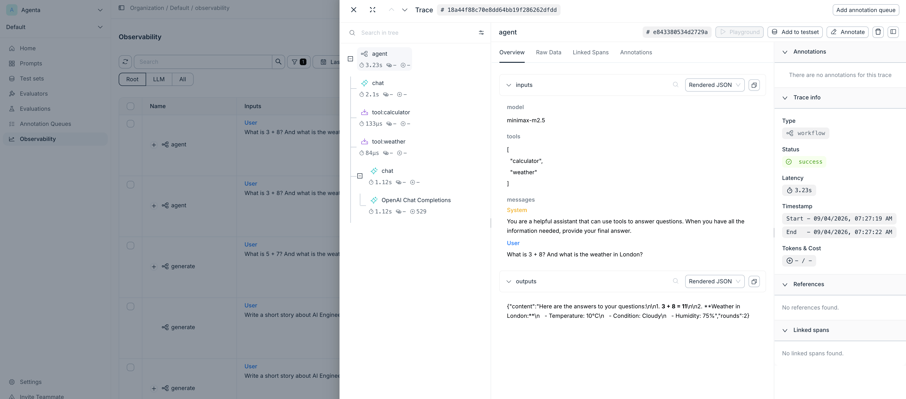

# Agenta — Self-Hosted LLMOps Platform

[Agenta](https://github.com/Agenta-AI/agenta) is a complete LLMOps platform for Node.js with:

- **Playground** — Interactive testing UI
- **Prompt Management** — Version and iterate on prompts
- **Tracing** — Full observability with span-based logging

## Quick Start (Self-Hosted)

### 1. Deploy with Docker

Follow the [official quick start](https://agenta.ai/docs/self-host/quick-start) guide.

### 2. Configure Environment

Edit the configuration file per [deployment guide](https://agenta.ai/docs/self-host/guides/deploy-remotely#edit-the-configuration-file). Traefik is recommended for reverse proxy.

```bash
TRAEFIK_PORT=3080
# Replace with your server's IP
TRAEFIK_DOMAIN=192.168.1.100
AGENTA_API_URL=http://192.168.1.100:3080/api
AGENTA_WEB_URL=http://192.168.1.100:3080
AGENTA_SERVICES_URL=http://192.168.1.100:3080/services
```

### 3. Send Traces from Client

```bash
cp .env.example .env
```

Fill in `AGENTA_API_KEY` and `AGENTA_HOST`, then:

```bash
npm run test
```

## Span Kinds

Agenta categorizes traces by **span kinds** to help understand different operation types:

| Kind         | Use For                      |
| ------------ | ---------------------------- |
| `agent`      | Autonomous agent operations  |
| `chain`      | Sequential operations        |
| `workflow`   | Complex multi-step processes |
| `tool`       | Tool or function calls       |
| `embedding`  | Vector embedding generation  |
| `query`      | Database or search queries   |
| `completion` | LLM completions              |
| `chat`       | Chat-based LLM interactions  |
| `rerank`     | Re-ranking operations        |

## Screenshot



## Notes

- All-in-one Docker image available for quick setup
- Node.js native — works well with existing JS/TS projects
- Active open-source project with regular updates
