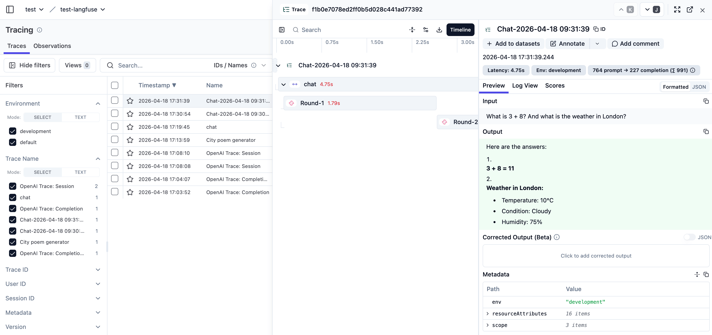

# Langfuse

1. [Self hosting](https://langfuse.com/self-hosting) is very easy using `docker compose`.

2. Create these necessary entity: Account - Organization - Project.

3. See [Cookbook](https://langfuse.com/guides/cookbook/js_integration_openai) for trace reporting examples.

This folder contains some live examples.

Langfuse create a span observation on each LLM request, so developers are responsible for grouping them into one session span. See [chat.mjs](./chat.mjs) for a hint.

