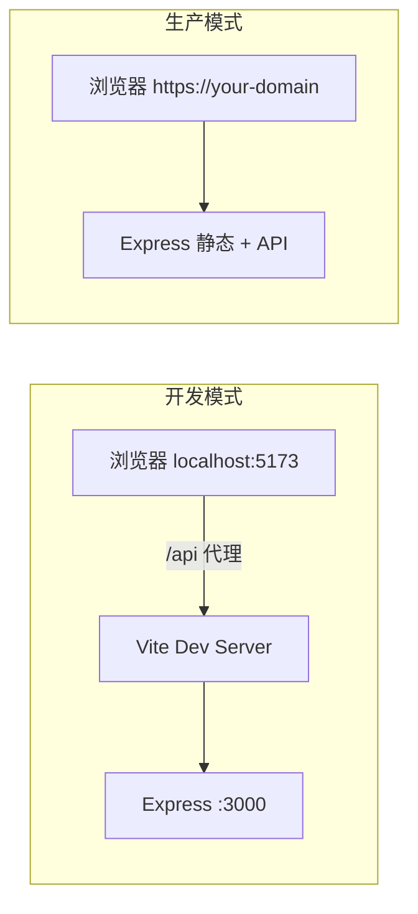
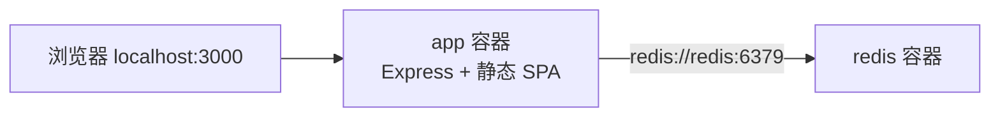
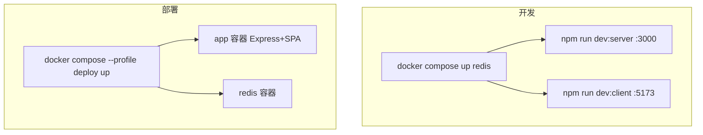
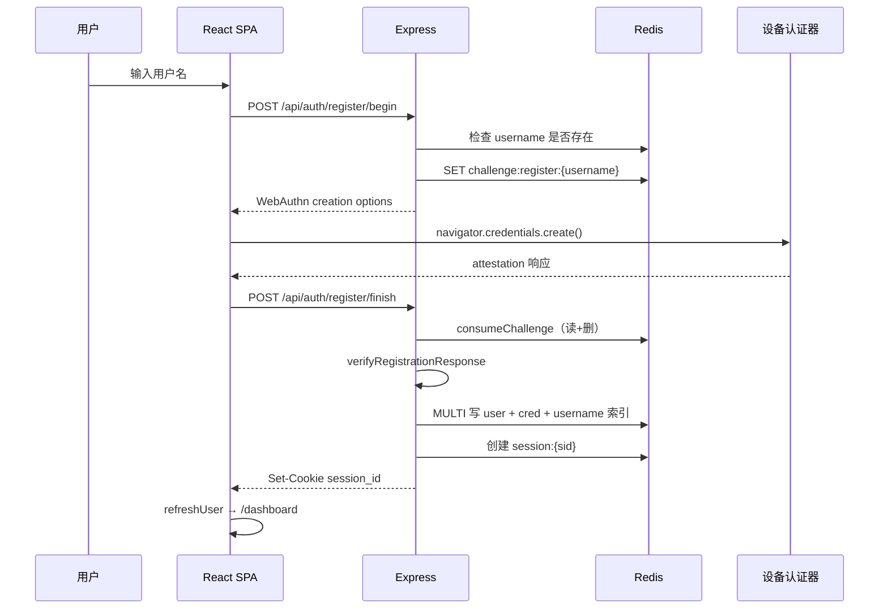
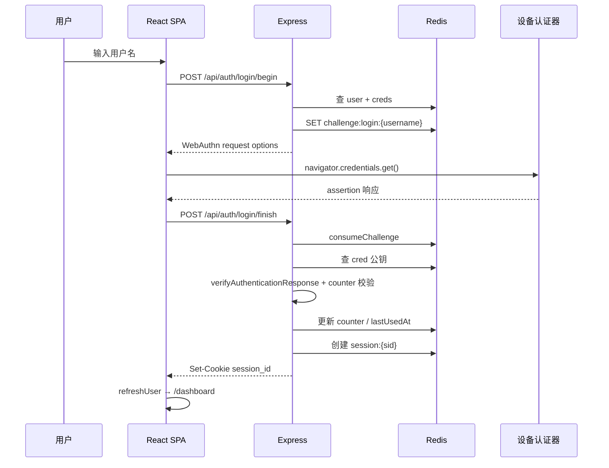
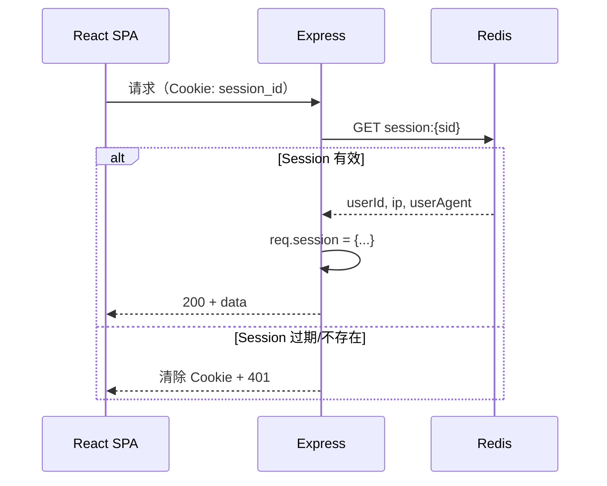
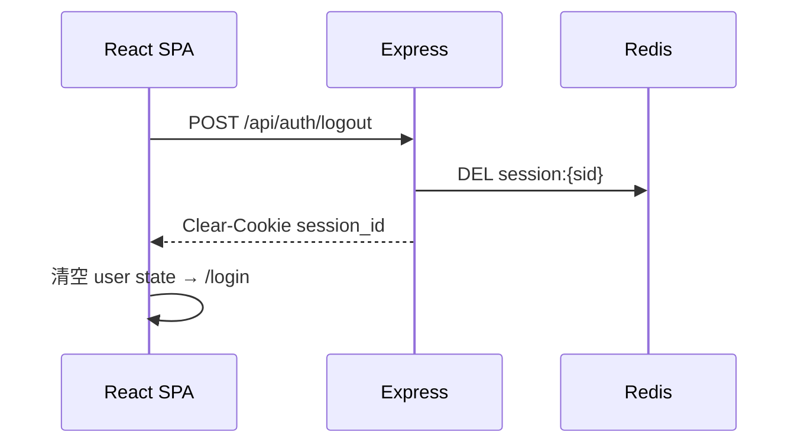
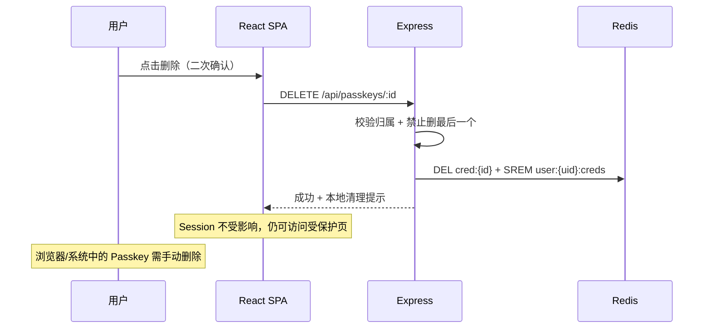

# Passkey Demo

一个演示 **WebAuthn Passkey 完整生命周期** 的 Web 应用：注册、登录、受保护页面、登出、Passkey 管理。

采用 **Express + React SPA + Redis** 架构，使用 **HttpOnly Cookie + Session** 维持登录态（无 JWT、无关系型数据库）。

---

## 目录

- [功能概览](#功能概览)
- [系统架构](#系统架构)
- [技术栈](#技术栈)
- [项目结构](#项目结构)
- [快速开始](#快速开始)
  - [运维模式概览](#运维模式概览)
  - [开发环境](#开发环境)
  - [部署环境](#部署环境)
  - [命令参考](#命令参考)
- [环境变量](#环境变量)
- [页面与路由](#页面与路由)
- [API 接口](#api-接口)
- [核心流程](#核心流程)
- [Redis 数据模型](#redis-数据模型)
- [安全设计](#安全设计)
- [Passkey 删除说明](#passkey-删除说明)
- [自动化测试](#自动化测试)
- [常见问题](#常见问题)

---

## 功能概览

| 能力 | 说明 |
|------|------|
| Passkey 注册 | 输入用户名 → 设备验证 → 创建账户并自动登录 |
| Passkey 登录 | 输入用户名 → 设备验证 → 建立 Session |
| 受保护页面 | `/dashboard`、`/passkeys` 需登录；后端 API 强制校验 |
| 登出 | 服务端销毁 Session，Cookie 立即失效 |
| Passkey 管理 | 列出 / 添加 / 删除（禁止删除最后一个） |
| 多 Passkey | 同一用户可绑定多个设备 |
| 无密码 | 仅 WebAuthn，不使用密码或 JWT |

---

## 系统架构

```mermaid
flowchart TB
  subgraph browser [浏览器 React SPA]
    PublicPages["公开页 / /login /register /about"]
    ProtectedPages["受保护页 /dashboard /passkeys"]
    AuthCtx[AuthContext]
    ProtectedRoute[ProtectedRoute / GuestRoute]
  end

  subgraph express [Express 后端 :3000]
    CookieParser --> SessionMW[Session 中间件]
    SessionMW --> RequireAuth[requireAuth]
    SessionMW --> Routes
    Routes --> AuthAPI[auth 路由]
    Routes --> PasskeyAPI[passkeys 路由]
    Routes --> ProtectedAPI[protected 路由]
    AuthAPI --> WebAuthn[@simplewebauthn/server]
    PasskeyAPI --> WebAuthn
    WebAuthn --> RedisLayer[Redis 模块]
    SessionMW --> RedisLayer
  end

  subgraph redis [Redis :6379]
    UserKeys["user:* / username:*"]
    CredKeys["cred:* / user:*:creds"]
    SessionKeys["session:* TTL 24h"]
    ChallengeKeys["challenge:* TTL 5min"]
  end

  browser -->|"fetch credentials:include\nCookie: session_id"| express
  RedisLayer --> redis
```

### 开发 vs 生产部署



### Docker Compose 部署



| 模式 | 前端 | API | WebAuthn ORIGIN | Cookie Secure |
|------|------|-----|-----------------|---------------|
| **Docker Compose** | Express 托管 `client/dist` | 同域 `:3000` | `http://localhost:3000` | `false` |
| 本地开发 | Vite `:5173`，`/api` 代理到 `:3000` | 浏览器视为同源 | `http://localhost:5173` | `false` |
| 生产（自建） | Express 托管 `client/dist` | 同域 | `https://your-domain` | `true` |

---

## 技术栈

| 层级 | 技术 |
|------|------|
| Monorepo | npm workspaces + [Turborepo](https://turbo.build/) |
| 前端 | React 19、Vite、react-router-dom、@simplewebauthn/browser |
| 后端 | Express、@simplewebauthn/server、ioredis |
| 存储 | Redis 7（Docker） |
| 容器化 | Docker Compose（app + redis） |
| 会话 | HttpOnly Cookie + Redis Session |
| 测试 | Playwright（虚拟 WebAuthn 认证器） |

**外部依赖**：Node.js 22+（开发）、Docker（Redis 或完整部署）

---

## 项目结构

```
passkey-demo/
├── client/                    # React SPA 前端
│   ├── src/
│   │   ├── pages/             # Home, Login, Register, Dashboard, Passkeys, About
│   │   ├── context/           # AuthContext
│   │   ├── components/        # Layout, ProtectedRoute, GuestRoute
│   │   └── api.js             # fetch 封装（credentials: include）
│   └── vite.config.js         # dev 代理 /api → :3000
│
├── server/                    # Express 后端
│   └── src/
│       ├── routes/            # auth, passkeys, protected
│       ├── redis/             # user, credential, session, challenge
│       ├── middleware/        # session, requireAuth, rateLimit
│       └── webauthn.js        # WebAuthn 封装
│
├── scripts/
│   └── e2e.mjs                # Playwright 全链路测试
│
├── Dockerfile                 # 多阶段构建：client build + server 运行
├── docker-compose.yml         # redis（开发）+ app（deploy profile 部署）
├── turbo.json                 # Turborepo 任务配置
├── Makefile                   # 常用命令快捷方式
└── .env.example               # 环境变量模板
```

---

### 运维模式概览

同一套 [`docker-compose.yml`](docker-compose.yml)，按场景启动不同服务：



| | 开发 | 部署 |
|---|------|------|
| **Redis** | Docker 容器（`redis` 服务） | Docker 容器（同上） |
| **后端** | 宿主机 Turbo（`:3000`） | `app` 容器（`:3000`） |
| **前端** | 宿主机 Vite（`:5173`） | `app` 容器内静态文件 |
| **访问地址** | http://localhost:5173 | http://localhost:3000 |
| **WebAuthn ORIGIN** | `http://localhost:5173` | `http://localhost:3000` |
| **启动命令** | `make dev` 或分步启动 | `make deploy` |

---

### 开发环境

**前置**：Node.js 22+、Docker（仅用于 Redis）

#### 方式 A：一键启动（推荐）

```bash
npm install
cp .env.example server/.env   # 可选

make dev
# 等价于：docker compose up redis -d && npm run dev
```

浏览器打开 **http://localhost:5173**。

#### 方式 B：分步启动（前后端各开终端）

```bash
# 终端 0 — 安装依赖（首次）
npm install
cp .env.example server/.env   # 可选

# 终端 1 — 只起 Redis
make dev-redis
# 或：npm run dev:redis
# 或：docker compose up redis -d

# 终端 2 — 后端
make dev-server
# 或：npm run dev:server

# 终端 3 — 前端
make dev-client
# 或：npm run dev:client
```

| 进程 | 端口 | 说明 |
|------|------|------|
| Redis 容器 | `6379` | `REDIS_URL=redis://localhost:6379` |
| Express | `3000` | API |
| Vite | `5173` | 前端，`/api` 代理到 `:3000` |

开发环境变量见 [`.env.example`](.env.example)（`ORIGIN=http://localhost:5173`）。

---

### 部署环境

**前置**：仅需 Docker

构建并启动 **app + redis** 完整栈（`app` 服务在 `deploy` profile 下）：

```bash
make deploy
# 或：npm run deploy:up
# 或：docker compose --profile deploy up --build -d
```

浏览器打开 **http://localhost:3000**。

常用操作：

```bash
make deploy-logs     # 查看 app 日志
docker compose --profile deploy ps
make deploy-down     # 停止
# 或：npm run deploy:down
```

Compose 内 `app` 服务环境：

| 变量 | 值 |
|------|-----|
| `REDIS_URL` | `redis://redis:6379` |
| `ORIGIN` | `http://localhost:3000` |
| `RP_ID` | `localhost` |
| `NODE_ENV` | `production` |

> WebAuthn 要求访问地址与 `ORIGIN` 一致：开发用 **:5173**，部署用 **:3000**。

### 宿主机生产预览（可选）

不走 Docker app 容器，在宿主机验证 build 产物（仍需 Redis 容器）：

```bash
make preview
# 或：npm run dev:redis && npm run preview:host
```

访问 **http://localhost:3000**。正式部署请用 `make deploy`。

### 命令参考

所有运维入口收敛到 **根目录 `package.json` scripts**；`Makefile` 是对常用流程的薄封装。

#### 开发（Redis 在 Docker，前后端在宿主机）

| npm script | make | 作用 | 访问 |
|------------|------|------|------|
| `dev:redis` | `dev-redis` | 只起 Redis 容器 | — |
| `dev:server` | `dev-server` | 只起 Express | API `:3000` |
| `dev:client` | `dev-client` | 只起 Vite | **http://localhost:5173** |
| `dev` | — | Turbo 并行起前后端（**不含 Redis**） | `:5173` |
| — | `dev` | `dev-redis` + `dev`（**日常开发推荐**） | `:5173` |

> `npm run dev` 仍有必要：它是 Turbo 并行启动前后端的核心，`make dev` 和分步开发都依赖它。

#### 部署（Docker Compose 完整栈）

| npm script | make | 作用 |
|------------|------|------|
| `deploy:up` | `deploy` | 构建镜像并启动 app + redis |
| `deploy:down` | `deploy-down` | 停止部署栈 |
| `deploy:logs` | `deploy-logs` | 查看 app 日志 |
| `deploy:build` | `deploy-build` | 仅重建 app 镜像 |

#### 构建 / 预览 / 测试

| npm script | make | 作用 |
|------------|------|------|
| `build` | `build` | Turbo 构建 client → `client/dist/` |
| `preview:host` | `preview` | 宿主机跑生产构建（`:3000`，需 Redis） |
| `test:e2e` | `test-e2e` | Playwright 全链路测试（需 `make dev`） |

#### 子包 scripts（由 Turbo 调用，一般不直接敲）

| 包 | script | 作用 |
|----|--------|------|
| `passkey-demo-server` | `dev` | `node --watch src/index.js` |
| `passkey-demo-server` | `start` | `node src/index.js`（生产运行时） |
| `passkey-demo-client` | `dev` | `vite` |
| `passkey-demo-client` | `build` | `vite build` |
| `passkey-demo-client` | `preview` | `vite preview`（**未接入根 scripts**，Vite 静态预览，不含 API） |

#### 已移除 / 不再推荐

| 旧命令 | 替代 |
|--------|------|
| 根目录 `npm run start` | `make deploy`（部署）或 `make preview`（宿主机预览） |
| `docker compose up -d`（无 profile） | 开发：`dev:redis`；部署：`deploy:up` |
| 直接 `npx turbo run dev --filter=...` | `npm run dev:server` / `dev:client` |

---

## 环境变量

复制 [.env.example](.env.example) 到 `server/.env`（或在 shell 中 export）：

| 变量 | 默认值 | 说明 |
|------|--------|------|
| `REDIS_URL` | `redis://localhost:6379` | Redis 连接地址 |
| `PORT` | `3000` | Express 监听端口 |
| `RP_ID` | `localhost` | WebAuthn Relying Party ID |
| `RP_NAME` | `Passkey Demo` | 显示给用户的 RP 名称 |
| `ORIGIN` | `http://localhost:5173` | WebAuthn 验证用的前端 origin |
| `COOKIE_SECURE` | `false` | 生产 HTTPS 下设为 `true` |
| `SESSION_TTL_SEC` | `86400` | Session 有效期（24 小时） |
| `CHALLENGE_TTL_SEC` | `300` | Challenge 有效期（5 分钟） |
| `NODE_ENV` | `development` | `production` 时启用静态托管 + SPA fallback |

> **注意**：
> - 本地 Turbo 开发：`ORIGIN` 为 `http://localhost:5173`
> - Docker Compose / 本地 prod：`ORIGIN` 为 `http://localhost:3000`
> - 自建 HTTPS 生产：`ORIGIN` 为 `https://your-domain`，`COOKIE_SECURE=true`

---

## 页面与路由

| 路径 | 页面 | 需登录 | 说明 |
|------|------|--------|------|
| `/` | Home | 否 | 公开首页 |
| `/login` | Login | 否 | 用户名 + Passkey 登录 |
| `/register` | Register | 否 | 用户名 + Passkey 注册 |
| `/about` | About | 否 | 架构说明 |
| `/dashboard` | Dashboard | **是** | 用户信息 + 受保护 API 演示 |
| `/passkeys` | Passkeys | **是** | Passkey 列表 / 添加 / 删除 |

**路由守卫**：

- `ProtectedRoute`：未登录重定向到 `/login`
- `GuestRoute`：已登录访问 `/login`、`/register` 时重定向到 `/dashboard`
- 前端守卫仅为体验优化；**真正的安全边界在后端 `requireAuth` 中间件**

---

## API 接口

统一响应格式：

```json
{ "ok": true, "data": { ... } }
{ "ok": false, "error": { "code": "...", "message": "..." } }
```

所有请求需带 `credentials: 'include'`（前端 `api.js` 已封装）。

| 方法 | 路径 | 认证 | 说明 |
|------|------|------|------|
| POST | `/api/auth/register/begin` | 否 | 开始注册，返回 WebAuthn options |
| POST | `/api/auth/register/finish` | 否 | 完成注册，写 Redis，建 Session |
| POST | `/api/auth/login/begin` | 否 | 开始登录，返回 challenge + allowCredentials |
| POST | `/api/auth/login/finish` | 否 | 完成登录，验签，建 Session |
| POST | `/api/auth/logout` | 是 | 销毁 Session，清除 Cookie |
| GET | `/api/auth/me` | 否 | 返回当前用户；未登录 401 |
| GET | `/api/passkeys` | 是 | 列出当前用户 Passkey |
| POST | `/api/passkeys/begin` | 是 | 开始添加 Passkey |
| POST | `/api/passkeys/finish` | 是 | 完成添加 Passkey |
| DELETE | `/api/passkeys/:id(*)` | 是 | 删除 Passkey（禁止删最后一个） |
| GET | `/api/protected/data` | 是 | 示例受保护数据 |

---

## 核心流程

### 注册流程



### 登录流程



### Session 与请求鉴权



### 登出流程



### 删除 Passkey 流程



---

## Redis 数据模型

| Key 模式 | 类型 | 内容 | TTL |
|----------|------|------|-----|
| `user:{userId}` | Hash | username, displayName, createdAt | 永久 |
| `username:{username}` | String | userId（唯一索引，`SET NX`） | 永久 |
| `cred:{credentialId}` | Hash | userId, publicKey, counter, deviceName, backedUp, transports, createdAt, lastUsedAt | 永久 |
| `user:{userId}:creds` | Set | 该用户所有 credentialId | 永久 |
| `session:{sid}` | Hash | userId, createdAt, ip, userAgent | **24h** |
| `challenge:{key}` | String | JSON（challenge + 流程元数据） | **5min** |

Challenge key 约定：

- 注册：`challenge:register:{username}`
- 登录：`challenge:login:{username}`
- 添加 Passkey：`challenge:passkey:{userId}`

Challenge 读取后立即 `DEL`（一次性，防重放）。

---

## 安全设计

| 项 | 措施 |
|----|------|
| 认证方式 | Passkey（WebAuthn），无密码 |
| 会话 | HttpOnly Cookie + Redis Session（非 JWT） |
| Challenge | 服务端生成、5 分钟 TTL、一次性消费 |
| 签名验证 | 服务端用存储的公钥验签 |
| Counter | 登录时校验递增，防凭据克隆 |
| Cookie | HttpOnly + SameSite=Lax + Secure（生产） |
| CSRF | SameSite=Lax 挡大部分跨站 POST |
| XSS | 敏感数据不进 localStorage |
| 用户名枚举 | register/login begin 返回统一通用错误 |
| 限流 | begin/finish 接口 20 次 / 15 分钟 / IP |
| 传输 | 必须 HTTPS 或 localhost |

### 为什么用 Session 而不是 JWT？

| 维度 | JWT | Session（本方案） |
|------|-----|-------------------|
| 存储位置 | localStorage / 可读 Cookie | 仅 HttpOnly Cookie |
| XSS 风险 | 高 | 低 |
| 主动失效 | 难（需黑名单） | 删 Redis key 即可 |
| 登出 | 客户端删 token | 服务端销毁，立即生效 |

---

## Passkey 删除说明

**删除操作仅移除服务端（Redis）中的凭据记录**，不会从浏览器或操作系统中删除 Passkey。

| 位置 | 删除后状态 |
|------|-----------|
| 服务端 Redis | 已删除，无法再用于登录 |
| 浏览器/系统 Passkey 存储 | **仍存在**，需用户手动清理 |

手动清理路径示例：

- **Chrome**：设置 → 自动填充和密码 → Google 密码管理器 → Passkey
- **Safari**：设置 → 密码 → 对应 Passkey

Passkeys 页面会始终显示此说明；删除确认弹窗和成功提示中也会再次提醒。

---

## 自动化测试

项目包含 Playwright 全链路 E2E 测试（使用虚拟 WebAuthn 认证器）：

```bash
# 开发模式：Redis + 前后端
make dev

# 另开终端
make test-e2e
```

测试覆盖：注册、登录、受保护 API、Session 持久化、GuestRoute、添加/删除 Passkey、登出、路由守卫等 **13 项**。

### 手动测试清单

1. 注册新用户 → 进入 Dashboard
2. 刷新页面 → Session 保持
3. 登出 → 访问 `/dashboard` 重定向到 `/login`
4. Passkey 登录 → `/api/protected/data` 返回数据
5. `/passkeys` 添加第二个 Passkey
6. 删除非最后一个 → 成功；最后一个 → 按钮禁用
7. 删除后 Session 仍有效
8. 重复用户名注册 → 通用错误（不泄露是否存在）

---

## 常见问题

### WebAuthn 注册/登录失败

- 确认使用 **localhost** 或 **HTTPS**（WebAuthn 安全要求）
- 开发模式下 `ORIGIN` 必须是 `http://localhost:5173`
- 检查 `RP_ID` 与访问域名匹配（本地为 `localhost`）

### `Too many attempts` / 限流

begin/finish 接口有 IP 限流（20 次 / 15 分钟）。重启 dev server 可重置内存计数器。

### Redis 连接失败

**部署模式**：

```bash
docker compose --profile deploy ps
docker compose --profile deploy logs app
```

**开发模式**：

```bash
docker compose up redis -d
docker compose ps
```

Server 启动时会 `PING` Redis，失败则 exit 并提示。

### 删除 Passkey 后浏览器里还在

这是预期行为，见 [Passkey 删除说明](#passkey-删除说明)。

### 部署环境 `/dashboard` 404

- **Docker 部署**（`make deploy`）：访问 http://localhost:3000
- **本地开发**：前端路由由 Vite（`:5173`）处理
- **宿主机预览**（`make preview`）：确认已 `npm run build`

---

## License

MIT（演示项目，按需使用）
