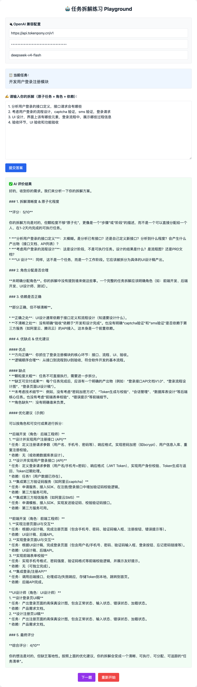

# 智能体任务拆解练习 Playground

## 项目简介

**Agent 任务拆解训练场** —— 专为智能体工程、AI 应用开发学习者设计的**任务拆解能力刻意练习工具**。

区别于让 AI 无脑自动拆解任务，本项目核心目标是：**训练人的拆解思维**。任务拆解是智能体（LangChain / MetaGPT / Cursor Coding Agent）工程的核心底层能力，决定了智能体协作是否有序、任务是否可落地、流程是否无冗余。

你手动拆解任务 → AI 专业评分、纠错、优化 → 迭代提升，彻底解决「AI 能拆，但自己不懂拆解逻辑、复杂场景无从下手」的问题。

<details>
<summary>示例</summary>



</details>

## 核心功能

- **随机出题**：内置前端开发、线上故障排查、功能模块开发等实战场景题库

- **手动拆解作答**：用户自主完成原子任务拆分、角色分配、任务依赖梳理

- **AI 智能点评打分**：兼容所有 OpenAI 大模型，自动解析拆解方案

- **全方位评价体系**：1-10 分评分、优点总结、问题缺陷、精准优化方案

- **循环练习机制**：支持下一题继续训练、一键重置，沉浸式刻意练习

- **通用模型兼容**：支持 GPT3.5/4、通义千问、DeepSeek、星火等所有 OpenAI 兼容接口

## 为什么需要手动练习拆解？（核心解惑）

很多学习者的疑惑：**Cursor/AI 可以自动拆解任务，为什么还要人练？**

这里给出工程落地的核心逻辑：

1. **简单需求 AI 能拆，复杂业务 AI 必崩**：企业级复杂需求、带约束、带权限、带依赖的场景，AI 容易出现粒度混乱、依赖倒置、分工错误。

2. **拆解能力是「架构能力」，不是工具能力**：智能体工程的核心是**人定规则，AI 执行**。你不会拆解，就无法制定任务规则、无法修正 AI 错误、无法设计多智能体协作流程。

3. **本练习的本质**：不是为了拆完一个任务，是训练你的**原子化拆分、串行/并行判断、智能体角色分工、依赖管理**的底层思维。

## 快速上手（零部署成本）

### 1. 项目特点

纯前端单文件、无需后端、无需安装依赖、无数据库，**打开即用**。

### 2. 使用步骤

1. 任意浏览器双击打开该文件

2. 填写大模型接口配置（支持任意 OpenAI 兼容接口）

3. 点击「开始新练习」获取随机实战任务

4. 手动输入你的任务拆解方案（原子任务 + 执行智能体 + 任务依赖）

5. 提交后等待 AI 评分点评，根据优化建议修正思维

6. 点击「下一题」持续训练，或「重新开始」重置页面

## 模型配置说明

页面支持三个核心配置项，适配所有主流大模型：

- **Base URL**：接口地址，默认 OpenAI 官方地址，可替换为中转/国内模型地址

- **API Key**：你的大模型密钥

- **模型名称**：`gpt-3.5-turbo`、`gpt-4o-mini`、`deepseek-chat` 等

推荐低配高效组合：**gpt-3.5-turbo / deepseek-chat**，足够满足拆解点评训练需求。

## 标准作答格式（推荐）

练习统一规范，贴合智能体工程落地标准，AI 点评更精准：

```Plain Text
1. 任务描述 - 执行智能体 - 依赖任务编号
2. 任务描述 - 执行智能体 - 依赖任务编号
...
```

示例：

```Plain Text
1. 梳理待办网页核心需求与页面结构 - 产品Agent - 无
2. 初始化Vite+React+TS项目 - CodingAgent - 1
3. 定义待办数据类型与状态 - CodingAgent - 2
```

## AI 评价维度

每次提交后，AI 会固定输出 5 项核心评价：

1. **任务原子化评分**：任务粒度是否合理、无过大/过碎任务

2. **角色分工合理性**：产品/编码/测试智能体分配是否合规

3. **任务依赖正确性**：串行、前置后置依赖是否逻辑通顺

4. **优点总结**：提炼拆解方案的可取之处

5. **问题与优化建议**：精准指出漏洞，给出可落地修改方案

## 适配学习场景

- LangChain / MetaGPT 智能体任务拆解学习

- Cursor Coding Agent 工程协作训练

- AI 提示工程、智能体架构入门练习

- 软件工程需求拆解、流程思维刻意训练

## 拓展规划（可选迭代方向）

- 自定义题库：支持用户手动输入练习任务

- 练习记录本地存储：保存历史得分与拆解方案

- 串行/并行任务专项识别点评

- 拆解标准答案对照功能

## 许可证

开源免费，仅供个人学习练习使用，可自由修改、拓展功能。
