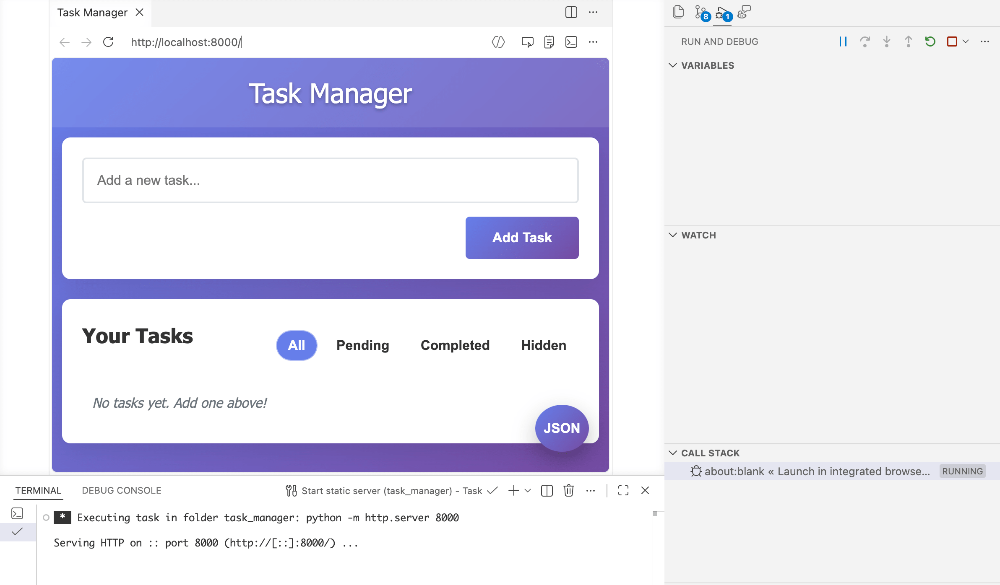

# Quick Start

This is a practice project for [Get started with GitHub Copilot in VS Code](https://code.visualstudio.com/docs/copilot/getting-started).

Here's the prompt history, [chat_replay.json](./docs/chat_replay.json).

## Start

Launch the debug "Launch is integrated browser" from `Run And Debug`, the integrated browser would open the page automatically.

or

Start the static server by `python -m http.server 8000 -d src`, visit the `http://localhost:8000` by hand.
