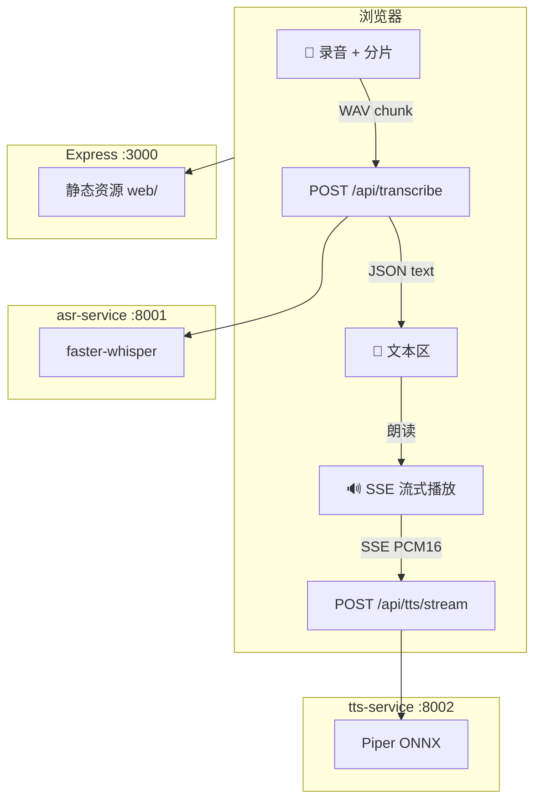
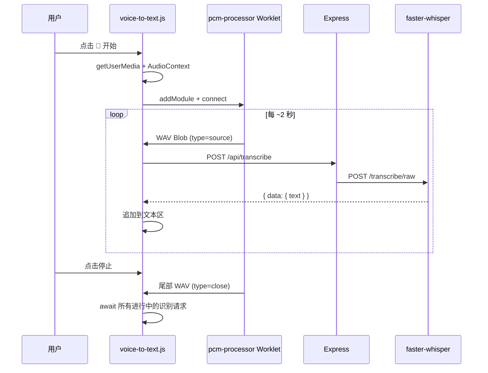
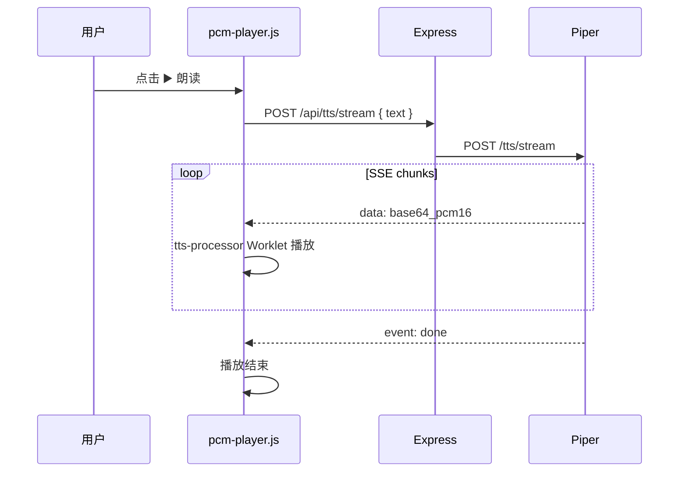

# text-n-audio

轻量 MVP：**语音转文字**（faster-whisper）+ **文字转语音**（Piper TTS）。前端纯 HTML/JS，Express 提供静态资源与 API，模型在本地容器内运行。

## 快速启动

```bash
cd text-n-audio
cp .env.example .env
docker compose up --build
```

打开 http://localhost:3000

首次启动会从 Hugging Face 下载模型（可通过 `HF_ENDPOINT` 使用镜像）：

| 服务 | 模型 | 体积（约） |
|------|------|-----------|
| ASR | `Systran/faster-whisper-base` | ~150MB |
| TTS | `rhasspy/piper-voices` → `zh_CN-huayan-medium` | ~60MB |

healthcheck 最长等待约 2 分钟（模型预热）。

## 国内网络

Dockerfile 已做基础适配：

| 环节 | 配置 |
|------|------|
| Debian apt | `mirrors.bfsu.edu.cn` |
| pip | `-i https://mirrors.bfsu.edu.cn/pypi/web/simple/` |
| Hugging Face 模型 | `.env` 中设置 `HF_ENDPOINT=https://hf-mirror.com` |

基础镜像：`python:3.12-slim`（ASR / TTS）、`node:22-alpine`（Web）。

## 本地开发（不用 Docker）

```bash
# 终端 1 — ASR
cd asr-service && pip install -r requirements.txt
uvicorn app:app --host 0.0.0.0 --port 8001

# 终端 2 — TTS
cd tts-service && pip install -r requirements.txt
uvicorn app:app --host 0.0.0.0 --port 8002

# 终端 3 — Web
cd server && npm install && npm start
```

---

## 整体架构



| 链路 | 协议 | 说明 |
|------|------|------|
| 麦克风 → 文本 | HTTP POST `audio/wave` | 每 ~2s 一块 WAV，并行识别，文本增量追加 |
| 文本 → 扬声器 | HTTP POST + SSE | JSON 入参，SSE 输出 base64 PCM16，边收边播 |
| 静态页 | HTTP GET | Tailwind CDN + ES modules |

---

## ASR 链路



- `pcm-processor` 在 AudioWorklet 线程将 float PCM 编码为 WAV
- 分片间隔：`sampleRate × 2` 采样（24kHz 下约 2 秒）
- 停止时仍处理尾部 chunk，避免丢字

---

## TTS 链路



**SSE 响应格式**：

```
data: <base64 PCM16 mono>

event: done
data:

```

- 输出采样率 24000 Hz（Piper 原生 22050，服务端 resample）
- 播放中再次点击可 `AbortController` 中断

---

## API

| 方法 | 路径 | 说明 |
|------|------|------|
| GET | `/api/health` | ASR + TTS 就绪状态 |
| POST | `/api/transcribe` | `Content-Type: audio/wave`，返回 `{ data: { text } }` |
| POST | `/api/tts/stream` | JSON `{ text, spk_id? }`，返回 `text/event-stream` |

---

## 配置

| 变量 | 默认 | 说明 |
|------|------|------|
| `HF_ENDPOINT` | `https://huggingface.co` | 国内建议 `https://hf-mirror.com` |
| `WHISPER_MODEL` | `Systran/faster-whisper-base` | ASR 模型 |
| `WHISPER_DEVICE` | `cpu` | 有 GPU 可设 `cuda` |
| `PIPER_MODEL_FILE` | `zh/zh_CN/huayan/medium/zh_CN-huayan-medium.onnx` | TTS 音色 |
| `TTS_SAMPLE_RATE` | `24000` | 与前端播放器一致 |

---

## 限制

- 面向**短句**；ASR 分片独立识别，TTS 按标点分句合成
- ASR「实时」= 分片 HTTP 并行，非 WebSocket 流式
- TTS `spk_id` 为预留字段；当前 Piper 模型为单说话人
- 麦克风需 **HTTPS 或 localhost**

---

## 目录

```
text-n-audio/
├── docker-compose.yml
├── asr-service/          # faster-whisper (FastAPI :8001)
├── tts-service/          # Piper ONNX (FastAPI :8002)
├── server/               # Express 静态 + API (:3000)
└── web/
    ├── index.html
    └── js/
        ├── pcm-processor.js
        ├── audio-visualizer.js
        ├── voice-to-text.js
        ├── tts-processor.js
        ├── pcm-player.js
        ├── reusable-pcm-player.js
        ├── sse-client.js
        └── app.js
```
