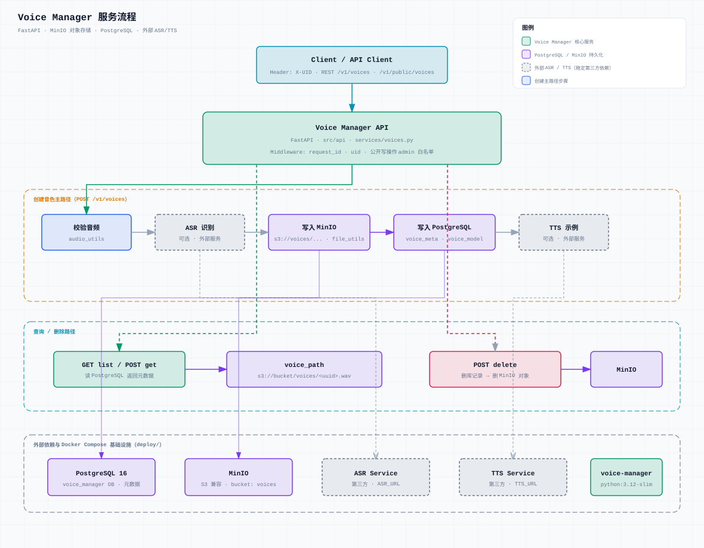

# Voice Manager

FastAPI service for private/public voice management.

## Project layout

```
voice_manager/
├── src/
│   ├── main.py              # 进程入口
│   ├── api/                 # FastAPI app、路由、依赖、异常处理
│   ├── services/            # 业务逻辑
│   ├── schemas/             # Pydantic 请求/响应模型
│   ├── common/              # 配置、日志、异常
│   ├── voice_model.py
│   ├── audio_utils.py
│   ├── file_utils.py
│   ├── tts_utils.py
│   └── http_client.py
├── config/
│   ├── config.json
│   └── config.docker.json
├── tests/
├── deploy/
├── docs/
├── pyproject.toml
└── README.md
```

## Architecture

浅色服务流程图：用户交互、创建音色主路径、以及 ASR / TTS / PostgreSQL / MinIO 等外部依赖。



源文件：[`docs/diagram/voice-manager-service-flow.svg`](docs/diagram/voice-manager-service-flow.svg) · PNG：[`voice-manager-service-flow@2x.png`](docs/diagram/voice-manager-service-flow@2x.png)

### 请求流摘要

1. 客户端带 `X-UID` 调用 REST 资源（OpenAPI：`/docs`）
2. 依赖注入当前用户；公开写操作要求 admin（403）
3. **创建** `POST /v1/voices`：校验音频 →（可选）ASR → MinIO → PostgreSQL →（可选）TTS，返回 **201** + `Location`
4. **列表** `GET /v1/voices?offset=&limit=`：分页元数据 `{items, offset, limit, total}`
5. **读取** `GET /v1/voices/{id}`；**删除** `DELETE /v1/voices/{id}` → **204**
6. 公开目录在 `/v1/public/voices`（创建/删除需 admin）

| 方法   | 路径                           | 说明                  |
| ------ | ------------------------------ | --------------------- |
| GET    | `/health`                      | 探活，无需 `X-UID`    |
| GET    | `/v1/voices`                   | 列出当前用户私有音色  |
| POST   | `/v1/voices`                   | 创建私有音色          |
| GET    | `/v1/voices/{voice_id}`        | 获取私有音色          |
| DELETE | `/v1/voices/{voice_id}`        | 删除私有音色          |
| GET    | `/v1/public/voices`            | 列出公开音色          |
| POST   | `/v1/public/voices`            | 创建公开音色（admin） |
| GET    | `/v1/public/voices/{voice_id}` | 获取公开音色          |
| DELETE | `/v1/public/voices/{voice_id}` | 删除公开音色（admin） |

## Setup

```bash
uv sync
uv run pre-commit install
cp .env.example .env
```

## 本地开发

代码迭代统一在 Docker 容器内进行（挂载源码 + uvicorn reload）。依赖服务只有两种接法：

| 模式           | 命令           | 说明                                                                   |
| -------------- | -------------- | ---------------------------------------------------------------------- |
| 本地 infra     | `make dev-up`  | 本机 Docker 起 Postgres + MinIO，挂载代码热重载                        |
| 测试环境 infra | `make dev-app` | 仅起 app 容器；在 `.env` 中配置 `DATABASE_URL`、`MINIO_*` 指向测试环境 |

`.env` 中按需覆盖连接信息；ASR/TTS 为外部第三方服务，通过 `ASR_URL` / `TTS_URL` 配置。

音频存储统一走 MinIO（S3 兼容），见 `config/config.docker.json` 或 `MINIO_*` 环境变量。

## 部署演示

```bash
make demo-up    # 构建镜像并启动完整栈（infra + app）
make demo-down
make logs
```

## Lint & test

```bash
uv run ruff check .
uv run ruff format --check .
uv run pytest
```

Pre-commit runs file checks, ruff lint/format, and pytest on commit.
