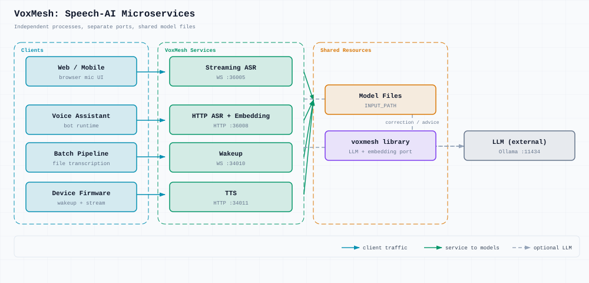

# Microservices architecture

VoxMesh is a **set of deployable speech-AI services**, not a monolith. Each service owns its process, port, and protocol.

## Why microservices

Speech workloads have conflicting requirements:

| Workload                | Needs                              | Service                   |
| ----------------------- | ---------------------------------- | ------------------------- |
| Live meetings, voice UI | Low latency, persistent connection | Streaming ASR (WebSocket) |
| File transcription      | High throughput, batch-friendly    | HTTP ASR                  |
| Voiceprint enrollment   | Short HTTP calls                   | Embedding API             |
| Device standby          | Always-on, lightweight             | Wakeup                    |
| Playback / cloning      | Streaming audio out                | TTS                       |

Splitting them allows:

- **Per-GPU allocation** — e.g. one GPU for streaming, another for batch
- **Independent release** — upgrade TTS without touching ASR
- **Selective deployment** — transcription-only installs skip wakeup/TTS
- **Horizontal scale** — multiple HTTP ASR instances behind a load balancer

## Service map



## Service reference

| Service       | Protocol  | Port  | Code                      | Responsibility                                                                   |
| ------------- | --------- | ----- | ------------------------- | -------------------------------------------------------------------------------- |
| Streaming ASR | WebSocket | 36005 | `services/streaming_asr/` | Real-time ASR, VAD, diarization, session restore, optional LLM correction/advice |
| HTTP ASR      | HTTP      | 36008 | `services/offline_asr/`   | Sync/async file transcription, hotword correction                                |
| Embedding     | HTTP      | 36008 | `POST /embedding_extract` | Speaker embeddings (same process as HTTP ASR today)                              |
| Wakeup        | WebSocket | 34010 | `services/wakeup/`        | Keyword spotting                                                                 |
| TTS           | HTTP      | 34011 | `services/tts/`           | OpenAI-compatible synthesis (CosyVoice2)                                         |

LLM (Ollama, vLLM, etc.) is an **external** OpenAI-compatible HTTP service.

## Shared library vs services

```
┌──────────────────────────────────────────────────┐
│  Services (separate processes, separate ports)    │
│  streaming_asr │ offline_asr │ wakeup │ tts      │
└────────────────────┬─────────────────────────────┘
                     │
┌────────────────────▼─────────────────────────────┐
│  voxmesh/  — shared Python package (in-process)  │
│  · llm/         correction client + prompts      │
│  · embedding/   SpeakerEmbeddingPort + adapters  │
│  · app/         StreamingApp / OfflineApp roots  │
└──────────────────────────────────────────────────┘
```

`voxmesh` is **not** a microservice. It avoids duplicating LLM and embedding code across services.

## Integration patterns

### Voice assistant

```
Mic → Wakeup (:34010) → Streaming ASR (:36005) → LLM (:11434) → TTS (:34011)
```

### Meeting product

```
Live: Streaming ASR → live captions + speaker labels
Post: HTTP ASR async API → full transcript with timestamps
```

### Voiceprint

```
Enroll: POST /embedding_extract
Recognize: Streaming ASR init with pre-registered speakers
```

## Deployment modes

**Development** — start everything on one machine:

```bash
cd deploy
./infer_streaming.sh
./infer_http_asr.sh
./infer_wakeup_server.sh
```

**Production** — split by node/GPU; see [deploy/docker-compose.example.yml](../../deploy/docker-compose.example.yml) for a reference layout.

## Service boundaries

### Streaming ASR vs HTTP ASR

|                 | Streaming                               | HTTP                                    |
| --------------- | --------------------------------------- | --------------------------------------- |
| Connection      | WebSocket, long-lived                   | HTTP, short-lived                       |
| State           | Sessions, speaker clustering            | Stateless (async jobs write local JSON) |
| Scaling metric  | Concurrent connections                  | QPS / queue depth                       |
| Model lifecycle | Pooled detectors + ASR + speaker models | Single FunASR pipeline load             |

Same model **files** (`INPUT_PATH`), different **runtimes** — do not merge into one process.

### Embedding on HTTP ASR

Offline embedding shares the CampPlus stack with offline ASR to save GPU memory. Externally it is still one HTTP endpoint; `SpeakerEmbeddingPort` allows splitting later.

## Related docs

- [Project layout](project-layout.md)
- [Deployment overview](../deployment/overview.md)
- [WebSocket protocol](../guides/client-integration.md)
