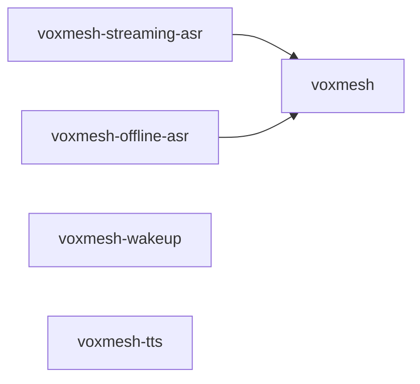

# Monorepo layout

VoxMesh uses a **uv workspace** with one shared library and four service packages.

```
voxmesh/                          # workspace root (package: voxmesh)
├── pyproject.toml                # workspace + shared lib metadata
├── uv.lock                       # locked dependency graph
├── voxmesh/                      # importable shared library
└── services/
    ├── streaming_asr/pyproject.toml   # voxmesh-streaming-asr
    ├── offline_asr/pyproject.toml     # voxmesh-offline-asr
    ├── wakeup/pyproject.toml          # voxmesh-wakeup
    └── tts/pyproject.toml             # voxmesh-tts
```

## Packages

| Package | Path | Depends on `voxmesh` |
|---------|------|----------------------|
| `voxmesh` | repo root | — |
| `voxmesh-streaming-asr` | `services/streaming_asr/` | yes |
| `voxmesh-offline-asr` | `services/offline_asr/` | yes |
| `voxmesh-wakeup` | `services/wakeup/` | no |
| `voxmesh-tts` | `services/tts/` | no |

Service `pyproject.toml` files declare **runtime dependencies only**. PyTorch is installed separately for your GPU/platform.

There is **no root `requirements.txt`** — dependencies live in `pyproject.toml` and are locked in `uv.lock`.

## Install

### uv (recommended)

```bash
# install uv: https://docs.astral.sh/uv/getting-started/installation/
uv sync --all-packages              # full dev stack
uv sync --package voxmesh-streaming-asr   # one service
```

### pip (no uv)

```bash
./scripts/sync-deps.sh              # all packages
./scripts/sync-deps.sh streaming    # one service
```

`sync-deps.sh` runs `pip install -e` on the root package and selected `services/*/` directories.

## Dependency flow



## Adding a dependency

Edit the service `pyproject.toml` (or use `uv add`):

```bash
cd services/streaming_asr
uv add some-package          # updates pyproject.toml + uv.lock
```

Commit both `pyproject.toml` and `uv.lock` changes.

## Linting

Ruff is configured once at the workspace root (`pyproject.toml`) and covers `voxmesh/` + `services/`.

```bash
ruff check voxmesh services deploy/web_server.py
```
