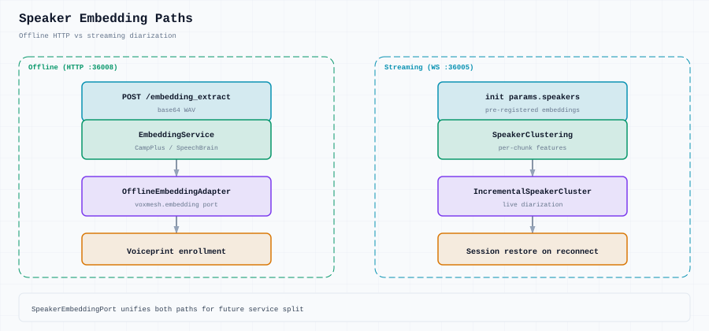

# Speaker embedding

## Offline (HTTP)

`services/offline_asr/embedding_service.py` — CampPlus / SpeechBrain via `model_factory.py`.

`POST /embedding_extract` accepts base64 WAV, returns base64 float32 embedding.

## Streaming

`services/streaming_asr/speaker/speaker_clustering.py` — extracts embeddings per speech chunk, clusters speakers incrementally (`km_clustering.py`).

Pre-registered speakers: pass embeddings in WebSocket `init` → `params.speakers`.

## Unified port

`voxmesh.embedding.SpeakerEmbeddingPort` with adapters:

- `StreamingEmbeddingAdapter` — chunk-level extraction
- `OfflineEmbeddingAdapter` — file-based extraction

Allows future split of embedding into its own service without changing call sites.

## Session state

Speaker cluster state (centers, registered speakers) serialized in `pipeline/speaker_state.py` for session restore.
