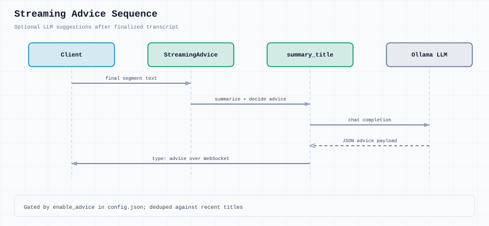

# Streaming AI advice

Optional feature when `enable_advice` is true in `config.json`.

## Flow

1. Finalized transcript segment triggers `StreamingAdvice`
2. `summary_title.py` calls OpenAI-compatible LLM (`knowledge_config`)
3. Returns JSON: whether to advise, title, and prompt content
4. Server sends `advice` WebSocket message to client

## LLM config

`services/streaming_asr/common/config.json` → `knowledge_config`:

- `api_url`, `api_key`, `model`, `max_tokens`
- Default: Ollama at `http://localhost:11434/v1`, `qwen2.5:7b`

## Client

Query queue status: `{"type": "advice_status"}` → `advice_status` response.

Disable in config for transcription-only deployments.
