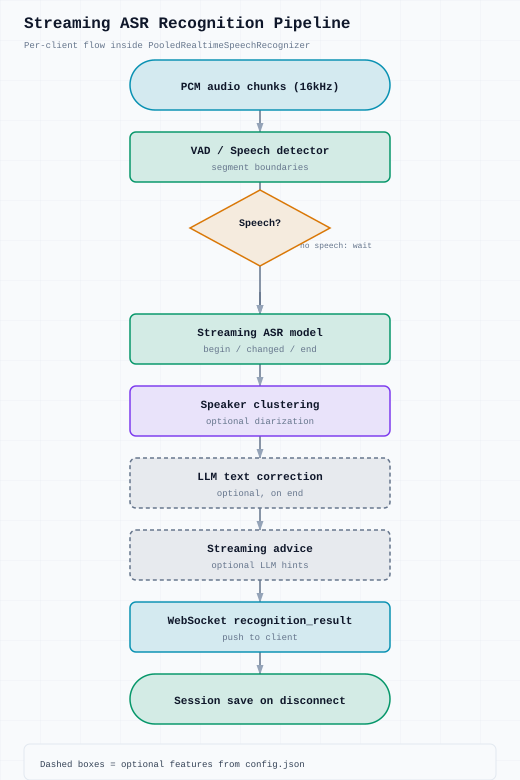
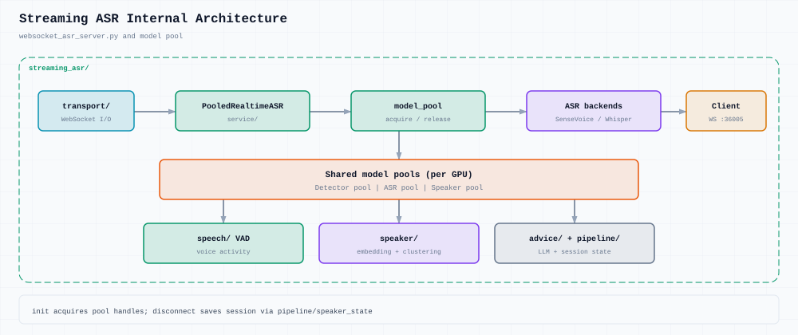

# Streaming ASR internals

WebSocket protocol: [client integration](../guides/client-integration.md)

## Diagrams





## Components

```
websocket_asr_server.py
├── transport/              # WebSocket sessions, message routing
├── service/
│   └── pooled_realtime_asr.py   # Core recognition loop
├── model/model_pool.py          # Detector, ASR, speaker pools
├── speech/                      # VAD / speech detection
├── speaker/speaker_clustering.py
└── advice/streaming_advice.py   # Optional LLM suggestions
```

## Model pool

Shared GPU resources across clients:

- **Detector pool** — VAD
- **ASR pool** — SenseVoice, FunASR, Whisper, Qwen backends
- **Speaker pool** — embedding + incremental clustering

Clients acquire models on `init`, release on disconnect.

## Recognition pipeline

1. Binary PCM → VAD segments speech
2. Streaming ASR hypotheses (`begin` / `changed` / `end`)
3. Optional speaker ID per finalized segment
4. Optional LLM text correction on `end`
5. Optional streaming advice on finalized text

## Session persistence

On disconnect, speaker clustering state is saved to `session_dir`.  
Reconnect with `init` + `session_id` to restore.

## Configuration

All default behavior from `services/streaming_asr/common/config.json`.  
Client `init` params only apply `hotword`, `speakers`, `record_time`.
