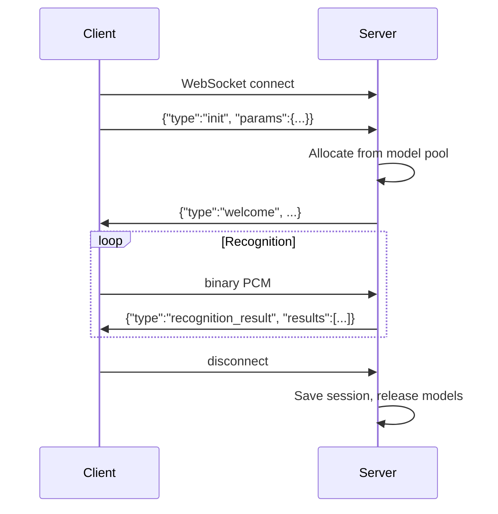

# WebSocket client integration

Authoritative reference for `services/streaming_asr/websocket_asr_server.py`.  
Web test UI: [web-asr-client.html](web-asr-client.html)

## Connection

| Item | Value |
|------|-------|
| Protocol | `ws://` or `wss://` |
| Default URL | `ws://localhost:36005` |
| Subprotocol | `binary` (see `services/streaming_asr/client.py`) |
| Audio | 16 kHz, 16-bit, mono PCM as binary frames |

Port comes from `services/streaming_asr/common/config.json` (`network_config.port`) or `./infer_streaming.sh --port`.

## Flow



Send `init` first. Wait for `welcome` before audio; earlier audio yields `error`.

## Client → server

### `init` (required)

```json
{
  "type": "init",
  "session_id": "optional-session-id",
  "params": {
    "hotword": ["term1", "term2"],
    "speakers": [
      {"speaker_id": "user1", "embedding": "<base64 float32>"}
    ],
    "record_time": 0
  }
}
```

| Field | Notes |
|-------|-------|
| `session_id` | Optional session restore from `session_dir` |
| `params.hotword` | Max 200 terms, 50 chars each |
| `params.speakers` | Pre-registered speaker embeddings |
| `params.record_time` | Time offset when restoring session |

**Limitation:** Only `hotword`, `speakers`, and `record_time` from `params` are applied. Other fields (e.g. `vad_threshold`) come from `config.json`.

### Binary audio

After `welcome`, stream PCM. Suggested chunk ~60 ms:

```python
chunk_ms = 60
chunk_bytes = 16000 * 2 * chunk_ms // 1000
```

### Other JSON messages

| type | Purpose |
|------|---------|
| `ping` | Heartbeat → `pong` |
| `advice_status` | AI advice queue status |
| `pool_status` | Model pool stats |

## Server → client

JSON messages include `type`, `timestamp`, `client_id`.

### `recognition_result`

```json
{
  "type": "recognition_result",
  "results": [
    {"type": "begin", "id": 0, "text": null, "ts": 1.23, "b_ts": 0.5},
    {"type": "changed", "id": 0, "text": "hello", "ts": 2.1},
    {"type": "end", "id": 0, "text": "hello world", "ts": 3.5, "current_speaker": "0"}
  ]
}
```

| Result `type` | Meaning |
|---------------|---------|
| `begin` | Speech segment started |
| `changed` | Partial hypothesis |
| `end` | Final text + speaker |

### Other message types

| type | Meaning |
|------|---------|
| `welcome` | Ready for audio |
| `advice` | LLM suggestion (`title`, `prompt`) |
| `volume_warning` | Low microphone level |
| `error` | Error with `message` |
| `init_failed` | ASR init failed |
| `connection_limit` | `max_clients` exceeded |

## Example

```bash
cd streaming_asr
python client.py audio.wav ws://localhost:36005
```

```python
import asyncio, json, websockets

async def main():
    async with websockets.connect("ws://localhost:36005", subprotocols=["binary"]) as ws:
        await ws.send(json.dumps({"type": "init", "params": {}}))
        async for msg in ws:
            if json.loads(msg)["type"] == "welcome":
                break
        # await ws.send(pcm_bytes)

asyncio.run(main())
```

Config: `services/streaming_asr/common/config.json.example`
