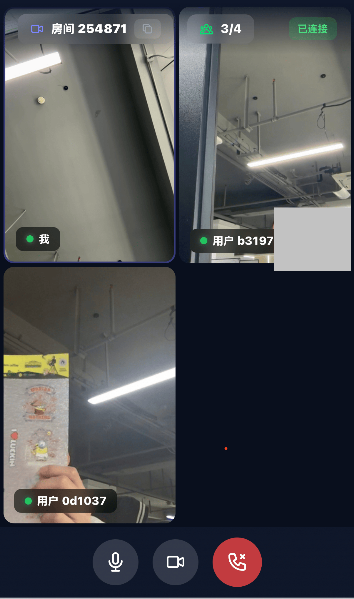

# Web Meeting — 多人实时视频聊天系统

基于 **原生 HTML + JavaScript + Tailwind CSS + Express + Socket.io + Mediasoup** 搭建的服务端中转（SFU）多人实时音视频聊天 MVP。支持最多 **4 人同房间**在线通话，Web 端纯原生，零框架依赖。

## 

## 功能特性

### ✅ 房间管理

- **创建房间** — 一键创建，系统自动生成 6 位房间号
- **加入房间** — 输入房间号加入已有会议室
- **4 人上限** — 满员后提示「房间人数已满」，禁止新用户加入
- **自动销毁** — 最后一人退出后自动回收所有媒体资源
- **房间号复制** — 一键复制房间号分享给好友

### ✅ 音视频通话

- **SFU 架构** — 服务端统一转发音视频流（Mediasoup），避免 P2P 带宽瓶颈
- **本地媒体展示** — 固定窗口展示本地实时视频，标注「我」
- **远端媒体展示** — 自适应网格布局（1×1 / 1×2 / 2×2）展示远端视频
- **全双工通话** — 多人同时发言、视频传输，无单向阻塞
- **设备控制** — 一键开关摄像头/麦克风

### ✅ 状态与连接

- **实时人数** — 当前/最大在线人数（如 2/4）
- **连接状态** — 已连接 / 连接中 / 已断开
- **自动重连** — 网络波动自动重试
- **退出/断连** — 主动退出或关闭页面后自动回收资源

---

## 技术架构

```
┌─────────────────────────────────────────────────┐
│                  浏览器 (用户层)                   │
│  原生 HTML + JavaScript + Tailwind CSS (CDN)    │
│  mediasoup-client (esbuild bundle)              │
└──────────────┬──────────────────────────────────┘
               │ Socket.io WebSocket 信令
               │ WebRTC (ICE/DTLS) 媒体流
               ▼
┌─────────────────────────────────────────────────┐
│              Node.js 服务 (控制层)                 │
│  Express + Socket.io + Mediasoup (内嵌 SFU)     │
│                                                  │
│  ┌──────────────┐   ┌───────────────────────┐   │
│  │  信令服务     │   │  Mediasoup            │   │
│  │  · 房间管理   │──▶│  · Worker (C++ 进程)  │   │
│  │  · 用户管理   │   │  · Router (每个房间)   │   │
│  │  · 事件广播   │   │  · Transport          │   │
│  └──────────────┘   │  · Producer/Consumer  │   │
│                      └───────────────────────┘   │
└─────────────────────────────────────────────────┘
```

### 数据流（全双工中转）

```
客户端 ──上行──▶  Mediasoup SFU ──下行──▶ 其他客户端
         Producer                    Consumer
```

1. 用户创建/加入房间，与 Node 信令服务建立 Socket 长连接
2. 信令服务通知 Mediasoup 创建房间对应的媒体路由
3. 客户端采集本地音视频，生成媒体轨道，推流至 Mediasoup（Producer）
4. Mediasoup 接收上行流，同步转发给房间内其他用户（Consumer）
5. 客户端拉取服务端转发的远端流，渲染至页面

### 技术栈

| 层级       | 技术                                            |
| ---------- | ----------------------------------------------- |
| 前端       | 原生 HTML、原生 JavaScript、Tailwind CSS（CDN） |
| 信令       | Express + Socket.io                             |
| SFU        | Mediasoup（内嵌，单进程）                       |
| 客户端媒体 | mediasoup-client（esbuild bundle）              |
| 通信协议   | WSS 加密信令、WebRTC（ICE/DTLS）媒体传输        |

---

## 快速开始

### 前置条件

- Node.js >= 18
- npm >= 8
- 编译工具（用于编译 mediasoup worker）：
  - **macOS**: Xcode Command Line Tools (`xcode-select --install`)
  - **Linux**: `build-essential`, `meson`, `ninja`
  - **Windows**: Visual Studio Build Tools

### 安装与运行

```bash
# 1. 克隆项目
cd web-meeting

# 2. 安装依赖（首次会编译 mediasoup worker，耗时较长）
pnpm install

# 3. 构建前端 bundle + 启动服务
pnpm start

# 4. 打开浏览器访问
#    HTTP  : http://localhost:3000
#    HTTPS : https://localhost:3443
# 也可以通过本机的 IP 访问
```

> **首次安装** mediasoup 需要编译 C++ worker，耗时 3-10 分钟。
> macOS 用户可能需要先签名的 worker 二进制（详见 `setup-worker.js`）。

### 快速测试

1. 在浏览器 A 中打开 `http://localhost:3000`，点击「创建房间」
2. 复制生成的 6 位房间号
3. 在浏览器 B 中打开 `http://localhost:3000`，输入房间号加入
4. 两边的摄像头画面应出现在 1×2 网格中

---

## 项目结构

```
web-meeting/
├── server.js              # Express + Socket.io 信令服务器
├── mediasoup.js           # Mediasoup SFU 媒体管理核心
├── setup-worker.js        # 安装后 worker 二进制复制脚本
├── package.json           # 依赖与构建脚本
├── ssl/                   # HTTPS 自签名证书（自动生成）
│   ├── server.key
│   └── server.crt
├── worker-bin/            # mediasoup-worker 二进制副本
│   └── out/Release/mediasoup-worker
├── public/
│   ├── index.html         # 首页 - 创建/加入房间
│   ├── room.html          # 通话页面 - 视频网格 + 控制栏
│   ├── client.js          # 浏览器端 bundle（含 mediasoup-client）
│   └── client-main.js     # 浏览器端源码（ES module 入口）
└── README.md
```

---

## 核心信令流

### 房间创建 & 加入

```
Browser A                          Server                    Browser B
   │                                │                          │
   ├─ createRoom ──────────────────▶│                          │
   │                                ├─ 生成 6 位房间号          │
   │                                ├─ 创建 mediasoup Router   │
   │◀──── roomCreated(roomId) ─────┤                          │
   │                                │                          │
   ├─ joinRoom(roomId) ────────────▶│                          │
   │                                ├─ 校验人数 < 4             │
   │◀── roomJoined(producers[]) ───┤                          │
   │                                │                          │
   │  initializeMedia()            │                          │
   │  ├─ getRouterRtpCapabilities  │                          │
   │  ├─ getUserMedia              │                          │
   │  ├─ createSendTransport       │                          │
   │  ├─ createRecvTransport       │                          │
   │  └─ produceMedia() ──────────▶│                          │
   │                    (audio+video)                         │
   │                                ├─ 创建 Producer           │
   │                                ├─ newProducer ──────────▶│
   │                                │         (给其他 peer)    │
```

### 视频渲染

```
Producer 创建
     ↓
其他 peer 收到 newProducer
     ↓
requestConsume(producerId) → doConsume → socket.emit('consume')
     ↓
Server 创建 Consumer
     ↓
socket.on('consumed') → handleConsumed
     ↓
stream.addTrack(videoTrack) → renderRemoteVideo(peerId, stream)
     ↓
创建 <video> → 挂载 DOM → srcObject = stream → play()
```

---

## HTTPS 支持

服务端自动生成自签名证书，同时提供 HTTP（3000）和 HTTPS（3443）访问：

- HTTPS 用于局域网内通过 IP 地址访问（浏览器 WebRTC 需要安全上下文）
- HTTP 用于 localhost 开发调试
- HTTP 到 HTTPS 的 Socket.io polling 请求不会被重定向（避免握手破坏）

---

## 常见问题

### Transport state: failed

**现象**: 浏览器控制台报 `[transport] Send transport state: failed`，远端画面黑屏。

**原因**: WebRTC ICE 连接失败。常见原因：

1. `announcedIp` 配置为 `127.0.0.1` → 某些浏览器会丢弃回环地址的 ICE candidate
2. UDP 端口 `40000-49999` 被防火墙拦截

**解决**:

- 服务端会自动检测本机局域网 IP 作为 `announcedIp`
- 已开启 `enableTcp: true` 作为 TCP 备选
- 如果仍需手动指定：`ANNOUNCED_IP=192.168.x.x npm start`

### 远端视频黑屏，但容器已渲染

**原因**: 浏览器 autoplay policy 阻止了 `<video>` 播放（含音频轨道的视频需要 `muted`）。

**解决**: 代码已处理（`muted=true` 启动 + 播放后 unmute），如果仍有问题请检查浏览器控制台是否有 `NotAllowedError`。

### mediasoup worker 编译失败

macOS 上 mediasoup 的 C++ worker 二进制可能因为代码签名问题被系统拦截：

```bash
# 复制 worker 二进制到外部目录绕过签名限制
node setup-worker.js
```

---

## License

MIT
