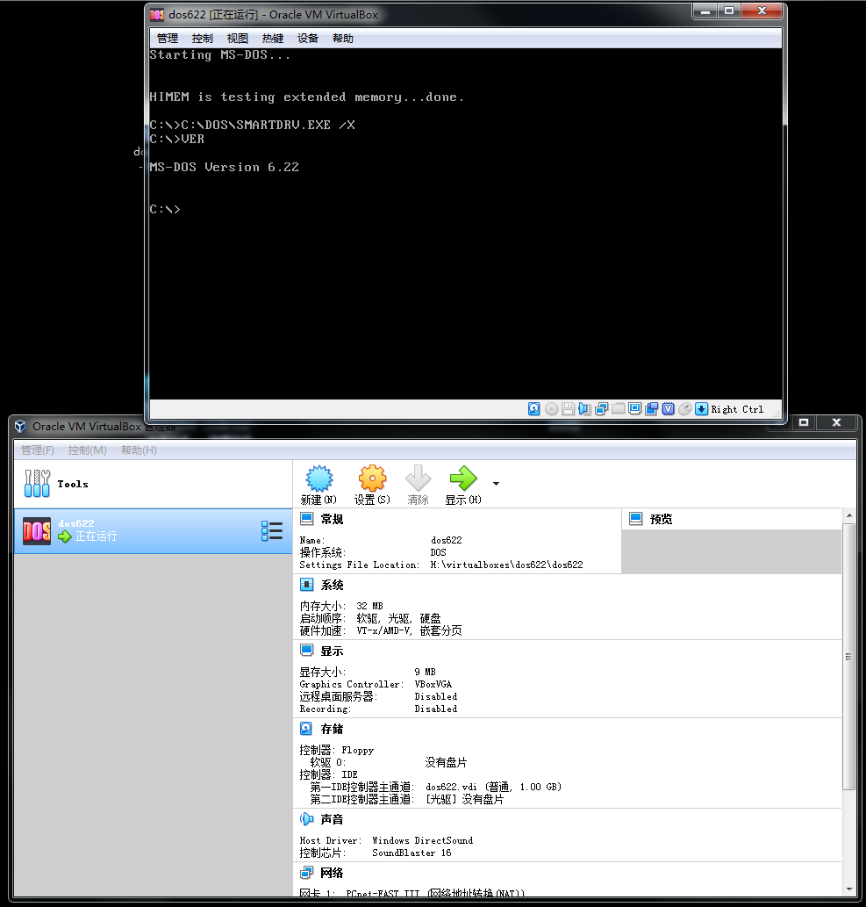
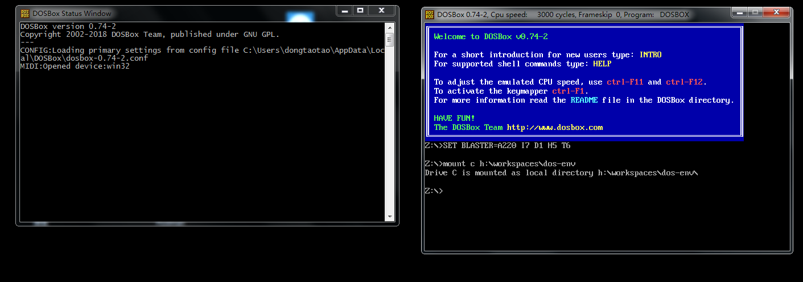
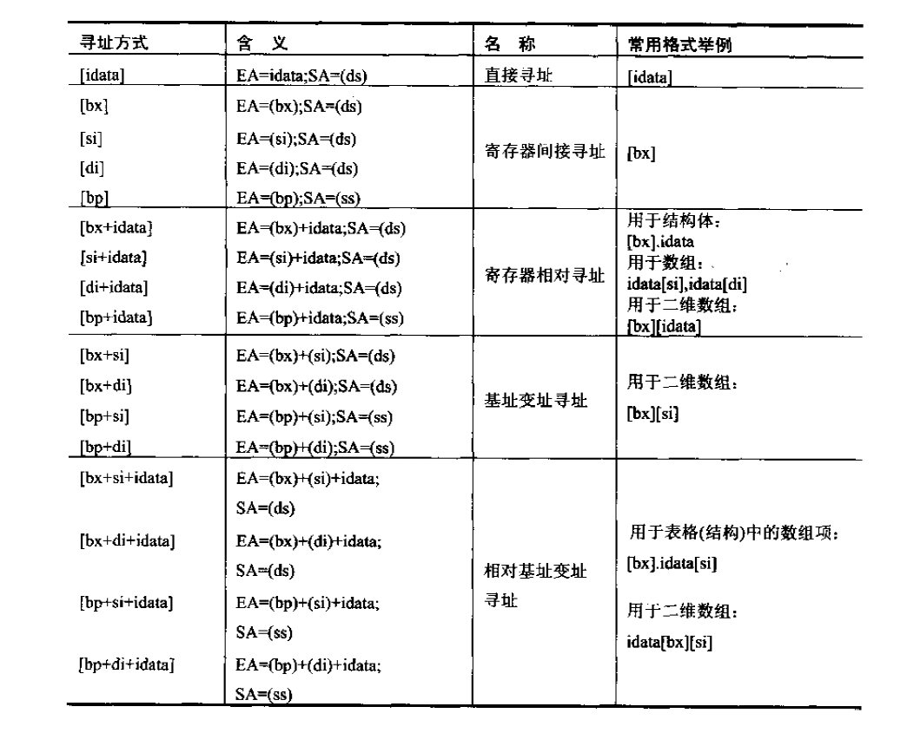
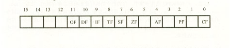

# Assembly

Awesome Assembly!

# A small assembler-simulator is [here](https://akatquas.github.io/assembler-simulator/).

# Environment

We can set up the DOS environment by two means.

1. Installing [MS-DOS](https://github.com/Microsoft/MS-DOS) in the [Virtual Box](https://www.virtualbox.org/).

   What you need are:

   1. An dos image (soft disk)

   1. A DOS ISO (CD-ROM)

   Install them in the old-school way:

   Open the Computer, copy the files in the soft disk to your virtual hard driver and reboot. If you are lucky enough, you would get the DOS:

   

2. Mount a local folder to [DOS-BOX](https://www.dosbox.com/) **Recommended**

   

   You can write the `asm` files in the host computer (Windows, MacOS, etc), and compile and debug them in **Dos-Box**.

# Tricks

## Debug Commands

[Useful online pdf](http://kipirvine.com/asm/debug/debug_tutorial.pdf), [backup pdf file](debug_tutorial.pdf). All copy rights are reserved to the author whom I believe is [Kip Irvine](http://kipirvine.com/).

## Addressing the memory

1. `[idata]`, a constant for addressing the memory directly

1. `[bx]`, using variable (register value)

1. `[bx+idata]`, using varible (register value) and offset, aka `[bx].idata`

1. `[bx+si/di]`, using two varibles (two register values) , aka `[bx][si/di]`

1. `[bx+si/di+idata]`, using two varibles and offset, aka `[bx][si/di].idata`



## Flag Register in 8086



## DOSBox 常用命令 debug 模式下：

- -g 执行完 exe 运行结果显示
- -a 编写汇编命令
- -t 单步执行
- -p 直接执行完不是单步执行
- -u 反编译
- -r 查看修改寄存器的值
- -d 查看内存单元
- -e 修改内存单元
- -? 查看指令帮助

## X86 和 X87 汇编指令大全（有注释）

### 数据传输指令

它们在存贮器和寄存器、寄存器和输入输出端口之间传送数据.

- 通用数据传送指令.

| CMD     | note                                                                                                             |
| ------- | ---------------------------------------------------------------------------------------------------------------- |
| MOV     | 传送字或字节.                                                                                                    |
| MOVSX   | 先符号扩展,再传送.                                                                                               |
| MOVZX   | 先零扩展,再传送.                                                                                                 |
| PUSH    | 把字压入堆栈.                                                                                                    |
| POP     | 把字弹出堆栈.                                                                                                    |
| PUSHA   | 把 AX,CX,DX,BX,SP,BP,SI,DI 依次压入堆栈.                                                                         |
| POPA    | 把 DI,SI,BP,SP,BX,DX,CX,AX 依次弹出堆栈.                                                                         |
| PUSHAD  | 把 EAX,ECX,EDX,EBX,ESP,EBP,ESI,EDI 依次压入堆栈.                                                                 |
| POPAD   | 把 EDI,ESI,EBP,ESP,EBX,EDX,ECX,EAX 依次弹出堆栈.                                                                 |
| BSWAP   | 交换 32 位寄存器里字节的顺序                                                                                     |
| XCHG    | 交换字或字节.(至少有一个操作数为寄存器,段寄存器不可作为操作数)                                                   |
| CMPXCHG | 比较并交换操作数.(第二个操作数必须为累加器 AL/AX/EAX)                                                            |
| XADD    | 先交换再累加.(结果在第一个操作数里)                                                                              |
| XLAT    | 字节查表转换.----BX 指向一张 256 字节的表的起点,AL 为表的索引值(0-255,即 0-FFH);返回 AL 为查表结果.([BX+AL]->AL) |

- 输入输出端口传送指令.

| CMD | note                                                                                                                              |
| --- | --------------------------------------------------------------------------------------------------------------------------------- |
| IN  | I/O 端口输入. ( 语法: IN 累加器, {端口号 │DX} )                                                                                   |
| OUT | I/O 端口输出. ( 语法: OUT {端口号 │DX},累加器 )输入输出端口由立即方式指定时, 其范围是 0-255; 由寄存器 DX 指定时,其范围是 0-65535. |

- 目的地址传送指令.

| CMD | note                                                                           |
| --- | ------------------------------------------------------------------------------ |
| LEA | 装入有效地址.例: LEA DX,string ;把偏移地址存到 DX.                             |
| LDS | 传送目标指针,把指针内容装入 DS.例: LDS SI,string ;把段地址:偏移地址存到 DS:SI. |
| LES | 传送目标指针,把指针内容装入 ES.例: LES DI,string ;把段地址:偏移地址存到 ES:DI. |
| LFS | 传送目标指针,把指针内容装入 FS.例: LFS DI,string ;把段地址:偏移地址存到 FS:DI. |
| LGS | 传送目标指针,把指针内容装入 GS.例: LGS DI,string ;把段地址:偏移地址存到 GS:DI. |
| LSS | 传送目标指针,把指针内容装入 SS.例: LSS DI,string ;把段地址:偏移地址存到 SS:DI. |

- 标志传送指令.

| CMD   | note                                     |
| ----- | ---------------------------------------- |
| LAHF  | 标志寄存器传送,把标志装入 AH.            |
| SAHF  | 标志寄存器传送,把 AH 内容装入标志寄存器. |
| PUSHF | 标志入栈.                                |
| POPF  | 标志出栈.                                |
| PUSHD | 32 位标志入栈.                           |
| POPD  | 32 位标志出栈.                           |

### 算术运算指令

| CMD  | note                                                                                      |
| ---- | ----------------------------------------------------------------------------------------- |
| ADD  | 加法.                                                                                     |
| ADC  | 带进位加法.                                                                               |
| INC  | 加 1.                                                                                     |
| AAA  | 加法的 ASCII 码调整.                                                                      |
| DAA  | 加法的十进制调整.                                                                         |
| SUB  | 减法.                                                                                     |
| SBB  | 带借位减法.                                                                               |
| DEC  | 减 1.                                                                                     |
| NEG  | 求反(以 0 减之).                                                                          |
| CMP  | 比较.(两操作数作减法,仅修改标志位,不回送结果).                                            |
| AAS  | 减法的 ASCII 码调整.                                                                      |
| DAS  | 减法的十进制调整.                                                                         |
| MUL  | 无符号乘法.结果回送 AH 和 AL(字节运算),或 DX 和 AX(字运算),                               |
| IMUL | 整数乘法.结果回送 AH 和 AL(字节运算),或 DX 和 AX(字运算),                                 |
| AAM  | 乘法的 ASCII 码调整.                                                                      |
| DIV  | 无符号除法.结果回送:商回送 AL,余数回送 AH, (字节运算);或 商回送 AX,余数回送 DX, (字运算). |
| IDIV | 整数除法.结果回送:商回送 AL,余数回送 AH, (字节运算);或 商回送 AX,余数回送 DX, (字运算).   |
| AAD  | 除法的 ASCII 码调整.                                                                      |
| CBW  | 字节转换为字. (把 AL 中字节的符号扩展到 AH 中去)                                          |
| CWD  | 字转换为双字. (把 AX 中的字的符号扩展到 DX 中去)                                          |
| CWDE | 字转换为双字. (把 AX 中的字符号扩展到 EAX 中去)                                           |
| CDQ  | 双字扩展. (把 EAX 中的字的符号扩展到 EDX 中去)                                            |

### 逻辑运算指令

| CMD  | note                                             |
| ---- | ------------------------------------------------ |
| AND  | 与运算.                                          |
| OR   | 或运算.                                          |
| XOR  | 异或运算.                                        |
| NOT  | 取反.                                            |
| TEST | 测试.(两操作数作与运算,仅修改标志位,不回送结果). |
| SHL  | 逻辑左移.                                        |
| SAL  | 算术左移.(=SHL)                                  |
| SHR  | 逻辑右移.                                        |
| SAR  | 算术右移.(=SHR)                                  |
| ROL  | 循环左移.                                        |
| ROR  | 循环右移.                                        |
| RCL  | 通过进位的循环左移.                              |
| RCR  | 通过进位的循环右移.                              |

以上八种移位指令,其移位次数可达 255 次.
移位一次时, 可直接用操作码. 如 SHL AX,1.
移位>1 次时, 则由寄存器 CL 给出移位次数.
如

```assembly
MOV CL,04
SHL AX,CL
```

### 串指令

DS:SI 源串段寄存器 :源串变址.
ES:DI 目标串段寄存器:目标串变址.
CX 重复次数计数器.
AL/AX 扫描值.
D 标志 0 表示重复操作中 SI 和 DI 应自动增量; 1 表示应自动减量.
Z 标志 用来控制扫描或比较操作的结束.

| CMD         | note                                                                                                  |
| ----------- | ----------------------------------------------------------------------------------------------------- |
| MOVS        | 串传送.( MOVSB 传送字符. MOVSW 传送字. MOVSD 传送双字. )                                              |
| CMPS        | 串比较.( CMPSB 比较字符. CMPSW 比较字. )                                                              |
| SCAS        | 串扫描.把 AL 或 AX 的内容与目标串作比较,比较结果反映在标志位.                                         |
| LODS        | 装入串.把源串中的元素(字或字节)逐一装入 AL 或 AX 中.( LODSB 传送字符. LODSW 传送字. LODSD 传送双字. ) |
| STOS        | 保存串.是 LODS 的逆过程.                                                                              |
| REP         | 当 CX/ECX<>0 时重复.                                                                                  |
| REPE/REPZ   | 当 ZF=1 或比较结果相等,且 CX/ECX<>0 时重复.                                                           |
| REPNE/REPNZ | 当 ZF=0 或比较结果不相等,且 CX/ECX<>0 时重复.                                                         |
| REPC        | 当 CF=1 且 CX/ECX<>0 时重复.                                                                          |
| REPNC       | 当 CF=0 且 CX/ECX<>0 时重复.                                                                          |

### 程序转移指令

- 无条件转移指令 (长转移)

| CMD      | note           |
| -------- | -------------- |
| JMP      | 无条件转移指令 |
| CALL     | 过程调用       |
| RET/RETF | 过程返回.      |

- 条件转移指令 (短转移,-128 到+127 的距离内)( 当且仅当(SF XOR OF)=1 时,OP1<OP2 )

| CMD     | note                                              |
| ------- | ------------------------------------------------- |
| JA/JNBE | 不小于或不等于时转移.                             |
| JAE/JNB | 大于或等于转移.                                   |
| JB/JNAE | 小于转移.                                         |
| JBE/JNA | 小于或等于转移.                                   |
| &nbsp;  | 以上四条,测试无符号整数运算的结果(标志 C 和 Z).   |
| JG/JNLE | 大于转移.                                         |
| JGE/JNL | 大于或等于转移.                                   |
| JL/JNGE | 小于转移.                                         |
| JLE/JNG | 小于或等于转移.                                   |
| &nbsp;  | 以上四条,测试带符号整数运算的结果(标志 S,O 和 Z). |
| JE/JZ   | 等于转移.                                         |
| JNE/JNZ | 不等于时转移.                                     |
| JC      | 有进位时转移.                                     |
| JNC     | 无进位时转移.                                     |
| JNO     | 不溢出时转移.                                     |
| JNP/JPO | 奇偶性为奇数时转移.                               |
| JNS     | 符号位为 "0" 时转移.                              |
| JO      | 溢出转移.                                         |
| JP/JPE  | 奇偶性为偶数时转移.                               |
| JS      | 符号位为 "1" 时转移.                              |

- 循环控制指令(短转移)

| CMD           | note                        |
| ------------- | --------------------------- |
| LOOP          | CX 不为零时循环.            |
| LOOPE/LOOPZ   | CX 不为零且标志 Z=1 时循环. |
| LOOPNE/LOOPNZ | CX 不为零且标志 Z=0 时循环. |
| JCXZ          | CX 为零时转移.              |
| JECXZ         | ECX 为零时转移.             |

- 中断指令

| CMD  | note     |
| ---- | -------- |
| INT  | 中断指令 |
| INTO | 溢出中断 |
| IRET | 中断返回 |

- 处理器控制指令

| CMD  | note                                           |
| ---- | ---------------------------------------------- |
| HLT  | 处理器暂停, 直到出现中断或复位信号才继续.      |
| WAIT | 当芯片引线 TEST 为高电平时使 CPU 进入等待状态. |
| ESC  | 转换到外处理器.                                |
| LOCK | 封锁总线.                                      |
| NOP  | 空操作.                                        |
| STC  | 置进位标志位.                                  |
| CLC  | 清进位标志位.                                  |
| CMC  | 进位标志取反.                                  |
| STD  | 置方向标志位.                                  |
| CLD  | 清方向标志位.                                  |
| STI  | 置中断允许位.                                  |
| CLI  | 清中断允许位.                                  |

### 伪指令

| CMD     | note              |
| ------- | ----------------- |
| DW      | 定义字(2 字节).   |
| PROC    | 定义过程.         |
| ENDP    | 过程结束.         |
| SEGMENT | 定义段.           |
| ASSUME  | 建立段寄存器寻址. |
| ENDS    | 段结束.           |
| END     | 程序结束.         |

### 处理机控制指令：标志处理指令

| CMD  | note                |
| ---- | ------------------- |
| CLC  | 进位位置 0 指令     |
| CMC  | 进位位求反指令      |
| STC  | 进位位置为 1 指令   |
| CLD  | 方向标志置 1 指令   |
| STD  | 方向标志位置 1 指令 |
| CLI  | 中断标志置 0 指令   |
| STI  | 中断标志置 1 指令   |
| NOP  | 无操作              |
| HLT  | 停机                |
| WAIT | 等待                |
| ESC  | 换码                |
| LOCK | 封锁                |

### 浮点运算指令集

- 控制指令(带 9B 的控制指令前缀 F 变为 FN 时浮点不检查，机器码去掉 9B)

| CMD                 | note                      | Machine Code   |
| ------------------- | ------------------------- | -------------- |
| FINIT               | 初始化浮点部件            | 9B DB E3       |
| FCLEX               | 清除异常                  | 9B DB E2       |
| FDISI               | 浮点检查禁止中断 9B DB E1 |
| FENI                | 浮点检查禁止中断二        | 9B DB E0       |
| WAIT                | 同步 CPU 和 FPU           | 9B             |
| FWAIT               | 同步 CPU 和 FPU           | D9 D0          |
| FNOP                | 无操作                    | DA E9          |
| FXCH                | 交换 ST(0)和 ST(1)        | D9 C9          |
| FXCH ST(i)          | 交换 ST(0)和 ST(i)        | D9 C1iii       |
| FSTSW ax            | 状态字到 ax               | 9B DF E0       |
| FSTSW word ptr mem  | 状态字到 mem              | 9B DD mm111mmm |
| FLDCW word ptr mem  | mem 到状态字              | D9 mm101mmm    |
| FSTCW word ptr mem  | 控制字到 mem              | 9B D9 mm111mmm |
| FLDENV word ptr mem | mem 到全环境              | D9 mm100mmm    |
| FSTENV word ptr mem | 全环境到 mem              | 9B D9 mm110mmm |
| FRSTOR word ptr mem | mem 到 FPU 状态           | DD mm100mmm    |
| FSAVE word ptr mem  | FPU 状态到 mem            | 9B DD mm110mmm |
| FFREE ST(i)         | 标志 ST(i)未使用          | DD C0iii       |
| FDECSTP             | 减少栈指针 1->0 2->1      | D9 F6          |
| FINCSTP             | 增加栈指针 0->1 1->2      | D9 F7          |
| FSETPM              | 浮点设置保护              | DB E4          |

- 数据传送指令

| CMD                 | note                           | Machine Code |
| ------------------- | ------------------------------ | ------------ |
| FLDZ                | 将 0.0 装入 ST(0)              | D9 EE        |
| FLD1                | 将 1.0 装入 ST(0)              | D9 E8        |
| FLDPI               | 将 π 装入 ST(0)                | D9 EB        |
| FLDL2T              | 将 ln10/ln2 装入 ST(0)         | D9 E9        |
| FLDL2E              | 将 1/ln2 装入 ST(0)            | D9 EA        |
| FLDLG2              | 将 ln2/ln10 装入 ST(0)         | D9 EC        |
| FLDLN2              | 将 ln2 装入 ST(0)              | D9 ED        |
| FLD real4 ptr mem   | 装入 mem 的单精度浮点数        | D9 mm000mmm  |
| FLD real8 ptr mem   | 装入 mem 的双精度浮点数        | DD mm000mmm  |
| FLD real10 ptr mem  | 装入 mem 的十字节浮点数        | DB mm101mmm  |
| FILD word ptr mem   | 装入 mem 的二字节整数          | DF mm000mmm  |
| FILD dword ptr mem  | 装入 mem 的四字节整数          | DB mm000mmm  |
| FILD qword ptr mem  | 装入 mem 的八字节整数          | DF mm101mmm  |
| FBLD tbyte ptr mem  | 装入 mem 的十字节 BCD 数       | DF mm100mmm  |
| FST real4 ptr mem   | 保存单精度浮点数到 mem         | D9 mm010mmm  |
| FST real8 ptr mem   | 保存双精度浮点数到 mem         | DD mm010mmm  |
| FIST word ptr mem   | 保存二字节整数到 mem           | DF mm010mmm  |
| FIST dword ptr mem  | 保存四字节整数到 mem           | DB mm010mmm  |
| FSTP real4 ptr mem  | 保存单精度浮点数到 mem 并出栈  | D9 mm011mmm  |
| FSTP real8 ptr mem  | 保存双精度浮点数到 mem 并出栈  | DD mm011mmm  |
| FSTP real10 ptr mem | 保存十字节浮点数到 mem 并出栈  | DB mm111mmm  |
| FISTP word ptr mem  | 保存二字节整数到 mem 并出栈    | DF mm011mmm  |
| FISTP dword ptr mem | 保存四字节整数到 mem 并出栈    | DB mm011mmm  |
| FISTP qword ptr mem | 保存八字节整数到 mem 并出栈    | DF mm111mmm  |
| FBSTP tbyte ptr mem | 保存十字节 BCD 数到 mem 并出栈 | DF mm110mmm  |
| FCMOVB              | ST(0),ST(i) <时传送            | DA C0iii     |
| FCMOVBE             | ST(0),ST(i) <=时传送           | DA D0iii     |
| FCMOVE              | ST(0),ST(i) =时传送            | DA C1iii     |
| FCMOVNB             | ST(0),ST(i) >=时传送           | DB C0iii     |
| FCMOVNBE            | ST(0),ST(i) >时传送            | DB D0iii     |
| FCMOVNE             | ST(0),ST(i) !=时传送           | DB C1iii     |
| FCMOVNU             | ST(0),ST(i) 有序时传送         | DB D1iii     |
| FCMOVU              | ST(0),ST(i) 无序时传送         | DA D1iii     |

### 比较指令

| CMD                  | note                          | Machine Code |
| -------------------- | ----------------------------- | ------------ |
| FCOM                 | ST(0)-ST(1)                   | D8 D1        |
| FCOMI                | ST(0),ST(i) ST(0)-ST(1)       | DB F0iii     |
| FCOMIP               | ST(0),ST(i) ST(0)-ST(1)并出栈 | DF F0iii     |
| FCOM real4 ptr mem   | ST(0)-实数 mem                | D8 mm010mmm  |
| FCOM real8 ptr mem   | ST(0)-实数 mem                | DC mm010mmm  |
| FICOM word ptr mem   | ST(0)-整数 mem                | DE mm010mmm  |
| FICOM dword ptr mem  | ST(0)-整数 mem                | DA mm010mmm  |
| FICOMP word ptr mem  | ST(0)-整数 mem 并出栈         | DE mm011mmm  |
| FICOMP dword ptr mem | ST(0)-整数 mem 并出栈         | DA mm011mmm  |
| FTST                 | ST(0)-0                       | D9 E4        |
| FUCOM ST(i)          | ST(0)-ST(i)                   | DD E0iii     |
| FUCOMP ST(i)         | ST(0)-ST(i)并出栈             | DD E1iii     |
| FUCOMPP              | ST(0)-ST(1)并二次出栈         | DA E9        |
| FXAM                 | ST(0)规格类型                 | D9 E5        |

### 运算指令

| CMD            | note                                                                                                                                                                                                                                                           |
| -------------- | -------------------------------------------------------------------------------------------------------------------------------------------------------------------------------------------------------------------------------------------------------------- |
| FADD           | 把目的操作数 (直接接在指令后的变量或堆栈缓存器) 与来源操作数 (接在目的操作数后的变量或堆栈缓存器) 相加，并将结果存入目的操作数                                                                                                                                 |
| FADDP ST(i),ST | 这个指令是使目的操作数加上 ST 缓存器，并弹出 ST 缓存器，而目的操作数必须是堆栈缓存器的其中之一，最后不管目的操作数为何，经弹出一次后，目的操作数会变成上一个堆栈缓存器了                                                                                       |
| FIADD          | FIADD 是把 ST 加上来源操作数，然后再存入 ST 缓存器，来源操作数必须是字组整数或短整数形态的变数                                                                                                                                                                 |
| FSUB           | 减                                                                                                                                                                                                                                                             |
| FSUBP          |
| FSUBR          | 减数与被减数互换                                                                                                                                                                                                                                               |
| FSUBRP         |
| FISUB          |
| FISUBR         |
| FMUL           | 乘                                                                                                                                                                                                                                                             |
| FMULP          |
| FIMUL          |
| FDIV           | 除                                                                                                                                                                                                                                                             |
| FDIVP          |
| FDIVR          |
| FDIVRP         |
| FIDIV          |
| FIDIVR         |
| FCHS           | 改变 ST 的正负值                                                                                                                                                                                                                                               |
| FABS           | 把 ST 之值取出，取其绝对值后再存回去。                                                                                                                                                                                                                         |
| FSQRT          | 将 ST 之值取出，开根号后再存回去。                                                                                                                                                                                                                             |
| FSCALE         | 这个指令是计算 ST\*2^ST(1)之值，再把结果存入 ST 里而 ST(1) 之值不变。ST(1) 必须是在 -32768 到 32768 (-215 到 215 )之间的整数，如果超过这个范围计算结果无法确定，如果不是整数 ST(1) 会先向零舍入成整数再计算。所以为安全起见，最好是由字组整数载入到 ST(1) 里。 |
| FRNDINT        | 这个指令是把 ST 的数值舍入成整数，FPU 提供四种舍入方式，由 FPU 的控制字组(control word)中的 RC 两个位决定                                                                                                                                                      |
| &nbsp;         | RC 舍入控制                                                                                                                                                                                                                                                    |
| &nbsp;         | 00 四舍五入                                                                                                                                                                                                                                                    |
| &nbsp;         | 01 向负无限大舍入                                                                                                                                                                                                                                              |
| &nbsp;         | 10 向正无限大舍入                                                                                                                                                                                                                                              |
| &nbsp;         | 11 向零舍去                                                                                                                                                                                                                                                    |

---

## To be Continued

- [ ] CPU Interrupt

- [ ] Example Interrupt Handler

- [ ] IO, and Screen Output

- [ ] Port listening, data exchange

# Example codes

> Fun Fact: the filename is no more than 8 bytes (8 characters) in DOS.

- [Reverse the data using stack](example/reverse-data-using-stack.asm)

- [Push a word into stack](example/push-a-word-into-stack.asm)

- [Add two byte according to their index](example/add-two-byte.asm)

- [uppercase or lowercase](example/uppercase-lowercase.asm) using `or`, `and`, bitwise.

- [copy data with offset](example/copy-with-offset.asm)

- loop in loop

  1. [save `cx` temporarily in `dx`](example/loop-in-dx.asm),
  1. [save `cx` temporarily in `stack`](example/loop-in-stack.asm)

- [change the `cs:ip` code in runtime](example/change-cs-code-runtime.asm), you can run the code, and the program would exit normally because we change the `cs:ip` dynamically.

- call another function

  1. one parameter, stored in `bx`, [call a sub funciton](example/call-sub-function.asm)
  1. more parameters, [using memory address and register](example/capital-character-in-string.asm)
