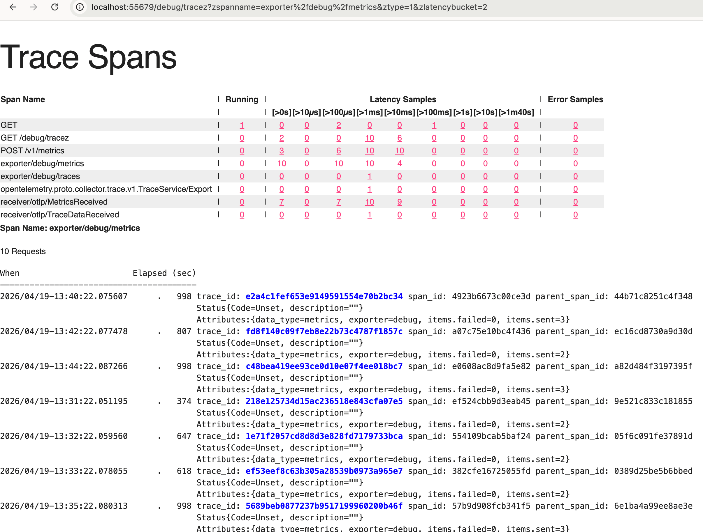
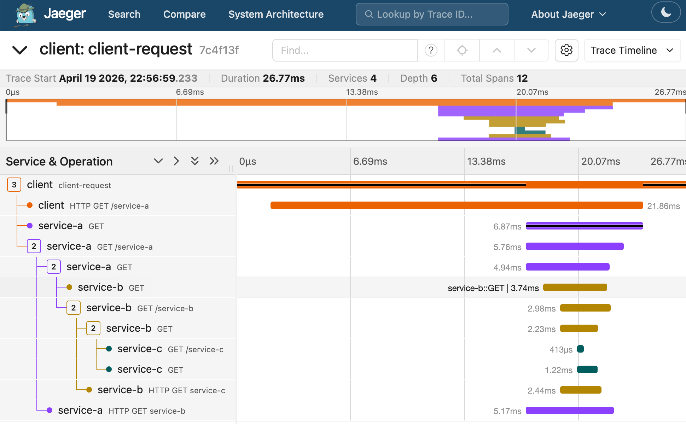
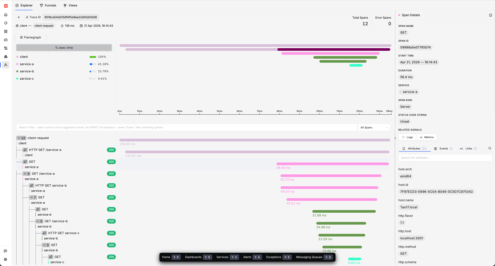

# OpenTelemetry Distributed Tracing Demo

A demo project showing how to implement distributed tracing across microservices using OpenTelemetry.

## Architecture

```
Client → Service A (3001) → Service B (3002) → Service C (3003)
        └────────────────── nested trace spans ──────────────────┘
```

## Files

| File                     | Description                                                      |
| ------------------------ | ---------------------------------------------------------------- |
| `tracing.mjs`            | OpenTelemetry SDK initialization                                 |
| `tracing-middleware.mjs` | Express middleware for request tracing                           |
| `http-utils.mjs`         | HTTP client wrapper with trace propagation                       |
| `service-a.mjs`          | Express server on port 3001                                      |
| `service-b.mjs`          | Express server on port 3002                                      |
| `service-c.mjs`          | Express server on port 3003 (leaf)                               |
| `client.mjs`             | Client with `requestWithTracing()` and `requestWithoutTracing()` |

## Usage

### Start OpenTelemetry Collector

```bash
# use jaeger collector
make jaeger_up
```

<details>
<summary> Or use TraceZ Page for quick debugging. </summary>

```bash
# use the otel/opentelemetry-collector
make collector_up

# or use the  otel/opentelemetry-collector-contrib
make collector_contrib_up
```

Quick debug in `http://localhost:55679/debug/tracez/`

However:

- zPages only keeps a few spans in RAM
- zPages does not index Trace IDs
- zPages has no UI to search/lookup a trace
- zPages is not persistent



</details>

### Start Services

```bash
make service_up
```

### Run App

Generate some spans from [app](./src/app.mjs).

```bash
make app
```

### Run Client

Generate some spans from [client](./src/client.mjs).

```bash
make client
```

### Stop Services

```bash
make service_down
```

## How Tracing Works

### 1. Setting the Context

In `client.mjs`, line 31:

```javascript
await context.with(trace.setSpan(context.active(), rootSpan), async () => {
```

This sets the root span as the "current" span in the async context:

- `trace.setSpan(context.active(), rootSpan)` - Creates a context where `rootSpan` is active
- `context.with(ctx, callback)` - Runs the callback inside that context

### 2. HTTP Instrumentation Auto-Propagation

The `HttpInstrumentation` in `tracing.mjs` automatically:

1. **Reads current context** when making outgoing HTTP requests
2. **Injects `traceparent` header** with trace info (traceId, spanId, flags)
3. **Extracts `traceparent` header** from incoming requests

### 3. The Propagation Flow

```
Client: rootSpan (traceId: abc)
   │
   │ HttpInstrumentation injects traceparent: 00-abc...-01
   ▼
Service A: span (traceId: abc, parent: rootSpan)
   │
   │ HttpInstrumentation injects traceparent: 00-abc...-01
   ▼
Service B: span (traceId: abc, parent: Service A)
   │
   │ HttpInstrumentation injects traceparent: 00-abc...-01
   ▼
Service C: span (traceId: abc, parent: Service B)
```



### 4. Traceparent Header Format

```
traceparent: 00-0af7651916cd43dd8448eb211c80319c-b7ad6b7169203331-01
             ^^-version-^^-trace_id────────────────────^^-span_id-^^-flags
```

- **version**: Always `00`
- **trace_id**: 32 hex chars - identifies the entire trace
- **span_id**: 16 hex chars - identifies the current span
- **flags**: 2 hex chars - trace flags (01 = sampled)

## Key Concepts

### Context Propagation

Trace context is passed via HTTP headers (`traceparent`), allowing each service to:

- Continue the same trace (same traceId)
- Create child spans (linking to parent spanId)

### Span Types

- **Server Span**: Created by `tracingMiddleware` for incoming requests
- **Client Span**: Created by `HttpInstrumentation` for outgoing requests

### Manual vs Automatic Tracing

- **Manual**: Use `tracing-middleware.mjs` and `http-utils.mjs` for explicit control
- **Automatic**: `HttpInstrumentation` handles HTTP propagation automatically

## HTTPInstrumentation with gRPC Exporter

This project uses `HttpInstrumentation` alongside `OTLPTraceExporter` (gRPC). Here's how they work together:

| Component             | Protocol | Purpose                                                                                                |
| --------------------- | -------- | ------------------------------------------------------------------------------------------------------ |
| `HttpInstrumentation` | HTTP     | Traces outgoing HTTP requests from your services and propagates trace context via `traceparent` header |
| `OTLPTraceExporter`   | gRPC     | Exports collected spans to the OpenTelemetry Collector                                                 |

### Important Notes

1. **They operate independently** - `HttpInstrumentation` traces your app's HTTP calls, while the gRPC exporter sends the collected spans to the backend. They don't interfere with each other.

2. **Endpoint configuration** - The default endpoint is `http://localhost:4317`. This works because gRPC can run over HTTP/2, but ensure your collector is listening on port 4317 with gRPC (not HTTP). The standard OTLP HTTP endpoint is `localhost:4318`.

3. **gRPC tracing** - If you also want to trace gRPC calls your app makes, you'll need to add `@opentelemetry/instrumentation-grpc` in addition to `HttpInstrumentation`.

# SigNoz Deployment

SigNoz deployment notes based on the official guide: [Install SigNoz using Docker Compose](https://signoz.io/docs/install/docker/#install-signoz-using-docker-compose).

## Deployment Steps

```bash
git clone -b main --depth=1 https://github.com/SigNoz/signoz.git
cd signoz/deploy/docker
docker compose up -d --remove-orphans
```

## Component Overview

SigNoz uses the [`signoz/signoz-otel-collector`](https://hub.docker.com/r/signoz/signoz-otel-collector) image as its OpenTelemetry Collector for trace ingestion.

## Generating & Viewing Traces

After the SigNoz stack is fully started:

- Run `make app` and `make client` to send trace data to the OTel Collector endpoint: `http://localhost:4317`
- Traces can be viewed in the SigNoz dashboard as shown below:



## Limitation for LLM Observability

SigNoz is **not well-suited** for LLM-specific observability use cases.
