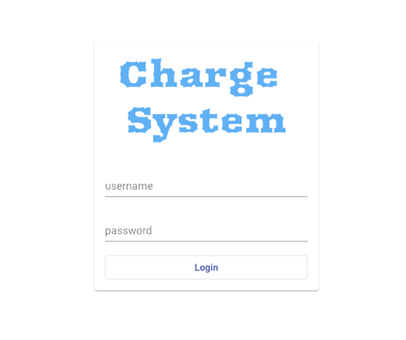
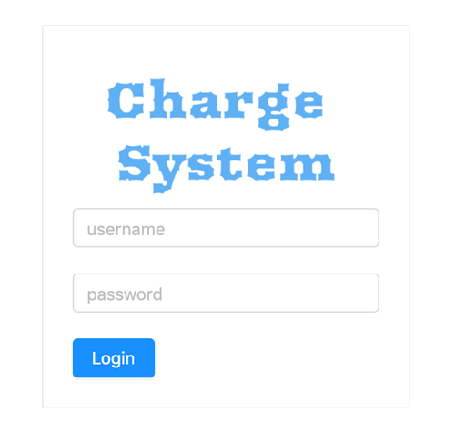

# Charge System

Here are two projects created using Angular 7.x.

> Amazing Angular Schematics!

The only difference between these two project is that they use different UI libraries. The main application is using [@anuglar/material](https://material.angular.io), while the other one [ng-zorro-antd](https://github.com/NG-ZORRO/ng-zorro-antd).

|Material Desing|Ng-Zorro|
|:-:|:-:|
|||

As pointed out at [angular.json](angular.json), the default project is [at-mat](projects/at-mat). If you need to start or build the other one [at-antd](projects/at-antd), remember to add the project after the command.

> Personally, I like *Ng-Zorro* more.

This project was generated with [Angular CLI](https://github.com/angular/angular-cli) version 7.1.4.

## Development server

Run `ng serve` for a dev server. Navigate to `http://localhost:4200/`. The app will automatically reload if you change any of the source files.

## Build

Run `ng build` to build the project. The build artifacts will be stored in the `dist/` directory. Use the `--prod` flag for a production build.

## Running unit tests

Run `ng test` to execute the unit tests via [Karma](https://karma-runner.github.io).

## Running end-to-end tests

Run `ng e2e` to execute the end-to-end tests via [Protractor](http://www.protractortest.org/).

## Further help

To get more help on the Angular CLI use `ng help` or go check out the [Angular CLI README](https://github.com/angular/angular-cli/blob/master/README.md).
