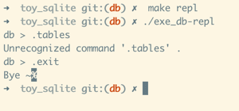
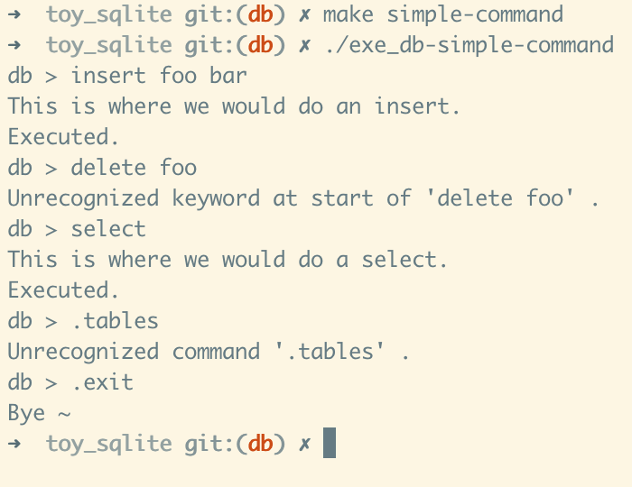
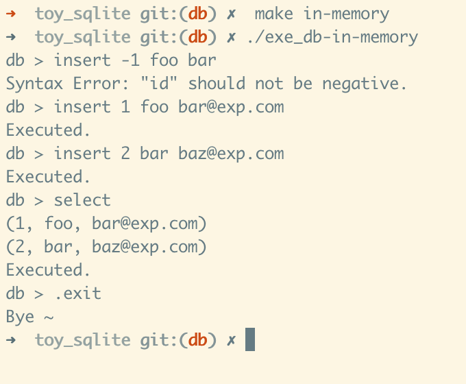
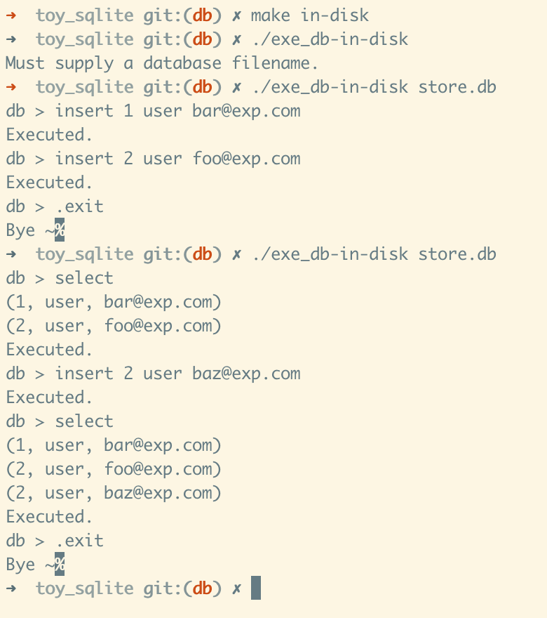
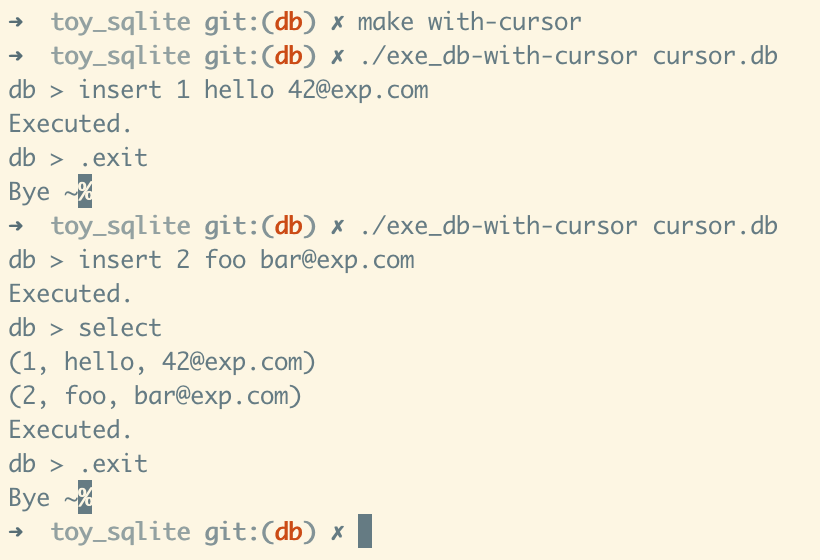
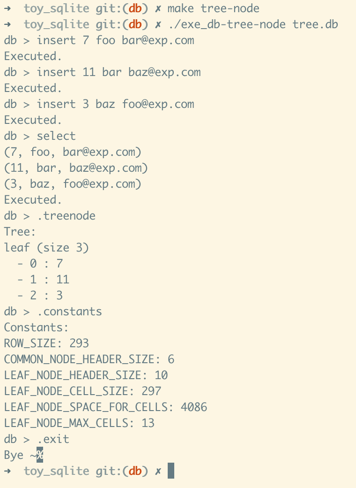
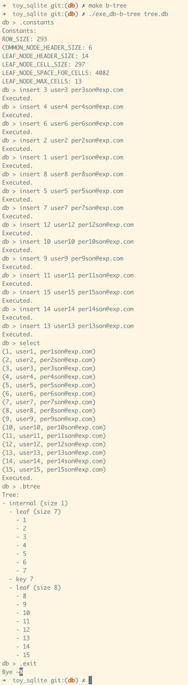

# Toy Sqlite

- [Let's Build a Simple Database](https://cstack.github.io/db_tutorial/)

- [code on GitHub](https://github.com/cstack/db_tutorial).

## How Does a Database Work?

- What format is data saved in? (in memory and on disk)
- When does it move from memory to disk?
- Why can there only be one primary key per table?
- How does rolling back a transaction work?
- How are indexes formatted?
- When and how does a full table scan happen?
- What format is a prepared statement saved in?

## Run tests with RSpec

This project use [RSpec](http://rspec.info/) to execute tests.

Each database implementation comes with corresponding spec file.

```bash
cat Gemfile

##  install dependencies
make setup_rspec
# bundle install --binstubs --path vendor/bundle

## run test
make test
# ./bin/bundle exec rspec
```

## How to run db-executable one by one

### Simple DB-REPL

```bash
make repl

./exe_db-repl
```

This db has only one command workable `.exit`.

<details>
<summary>screenshot</summary>



</details>

### Simple commands

```bash
make simple-command

./exe_db-simple-command
```

<details>
<summary>screenshot</summary>



</details>

### Simple Database in memory

This in-memory database has these features:

- Store rows in blocks of memory called pages
- Each page stores as many rows as it can fit
- Rows are serialized into a compact representation with each page
- Pages are only allocated as needed
- Keep a fixed-size array of pointers to pages

```bash
make in-memory

./exe_db-in-memory
```

<details>
<summary>screenshot</summary>



</details>

### Data storage in Disk

- Load data from disk on startup.

- Flush data to disk storage on exit.

```bash
make in-disk

./exe_db-in-disk store.db
```


<details>
<summary>screenshot</summary>



</details>


### Database with linear cursor

- Using Cursor to represent the storage position in database
- Cursor update is linear

```bash
make with-cursor

./exe_db-with-cursor cursor.db
```

<details>
<summary>screenshot</summary>



</details>

### Database with Tree Node Format

- The format of the table now is a Tree Node rather than unsorted array of rows.
- Every page is one Node.

```bash
make tree-node

./exe_db-tree-node tree.db
```

<details>
<summary>screenshot</summary>



</details>

### Database with B Tree Node Format

- Format of table is B-Tree, with binary search insertion.

```bash
make b-tree

./exe_db-b-tree tree.db
```

<details>
<summary>screenshot</summary>



</details>
