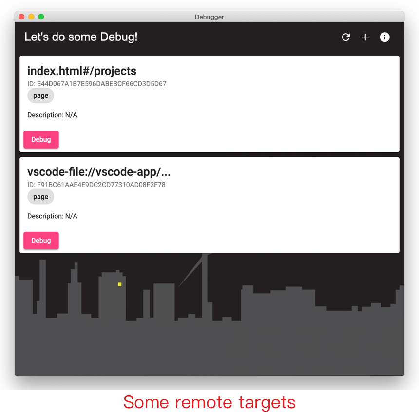
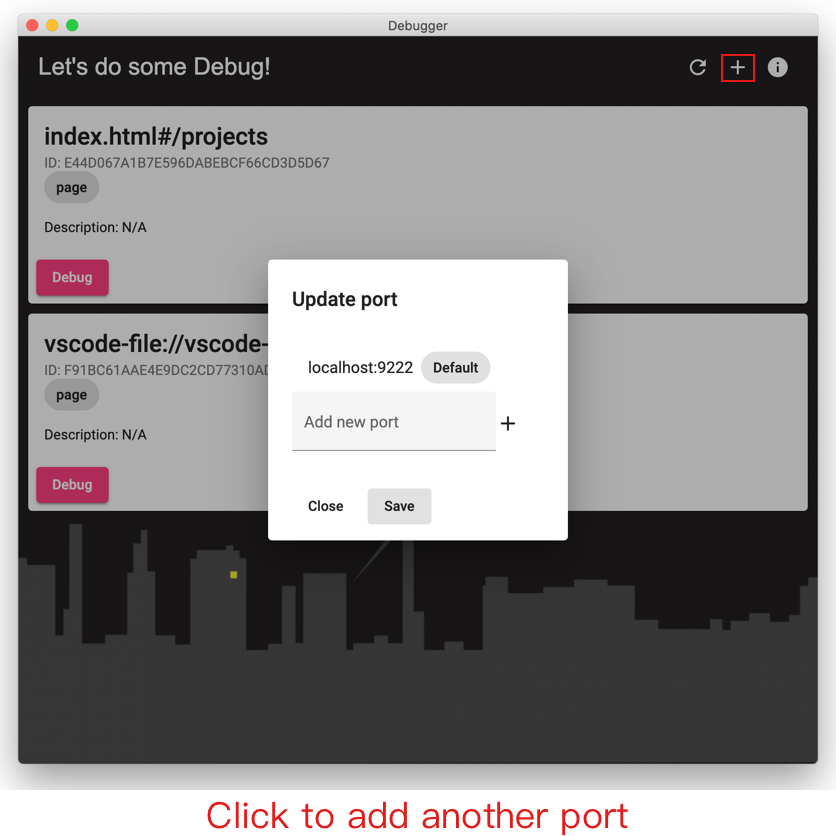
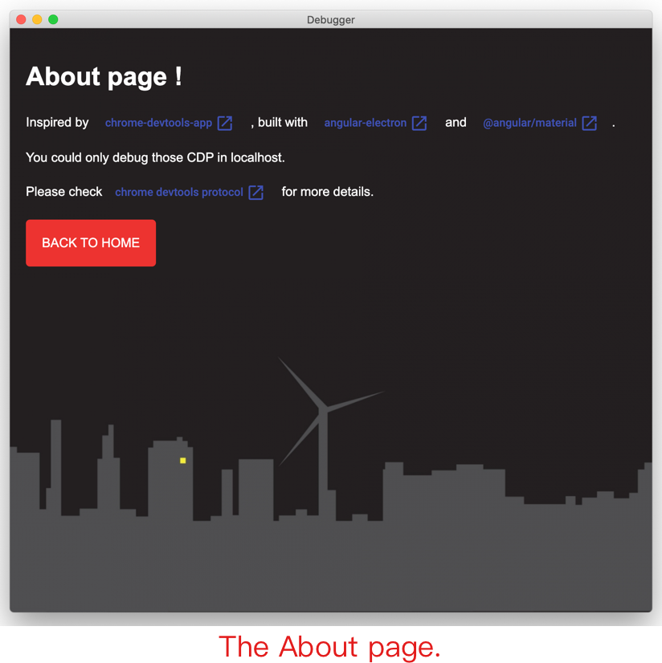

# Chrome Devtools App

> Inspired by [chrome-devtools-app](https://github.com/auchenberg/chrome-devtools-app).
>
> Built with [angular-electron](https://github.com/maximegris/angular-electron) and [@angular/material](https://material.angular.io/).

## Screenshots



There'll be some `Remote Target`s available in dashboard.



> 9222 is the default port.

You might add more ports to get more targets.



Some information in the about page.

## Development

```bash
npm install

overmind start
```

## Production / release

Build and package as Electron Application.

```bash
npm run electron:build
```
