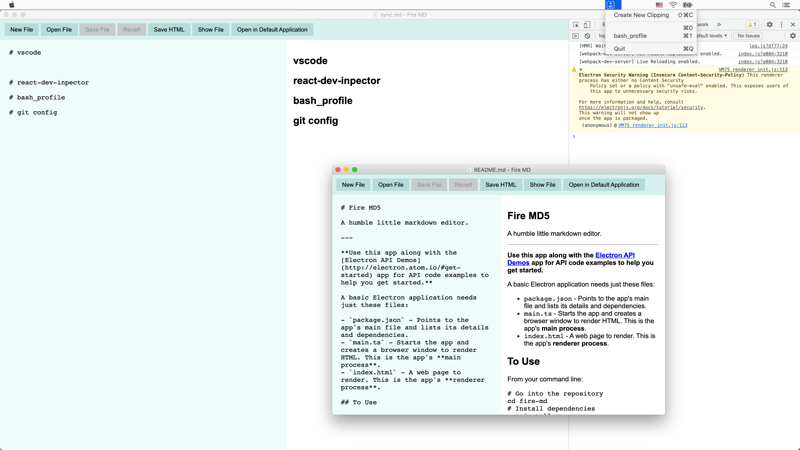

# Fire MD

A humble little markdown editor.

## Features

[main](./src/index.ts), [preload](./src/preload.ts), [renderer](./src/renderer.ts).
BrowserWindow for main UI.

Multiple window.

[Menus.ts](./src/application-menu.ts)

Menubar Tray interaction, [tray.ts](./src/tray.ts).

Persistent storage with knex/sqlite3, [database](./database.ts).

Spectron for Application Testing, [app.spec.js](./test/app.spec.js).

[Crash Report](./src/crash-reporter.ts) and [server](./server.js)

[AutoUpdater](./src/auto-updater.ts) and [server](./updater-server.js)

## Screenshots



---

**Use this app along with the [Electron API Demos](http://electron.atom.io/#get-started) app for API code examples to help you get started.**

A basic Electron application needs just these files:

- `package.json` - Points to the app's main file and lists its details and dependencies.
- `main.ts` - Starts the app and creates a browser window to render HTML. This is the app's **main process**.
- `index.html` - A web page to render. This is the app's **renderer process**.

## To Use

From your command line:

```bash
# Go into the repository
cd fire-md
# Install dependencies
npm install
# Run the app
npm start
```

Note: If you're using Linux Bash for Windows, [see this guide](https://www.howtogeek.com/261575/how-to-run-graphical-linux-desktop-applications-from-windows-10s-bash-shell/) or use `node` from the command prompt.

[CC0 1.0 (Public Domain)](LICENSE.md)
