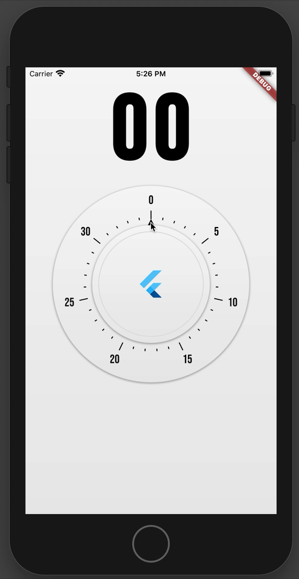
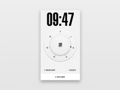

# egg_timer

A new Flutter project.



# What is used in this project

### Canvas

We could draw some widget using canvas.

In this project, the watch dial part is completely drawn in Canvas, (which is also the way to rendering widget in Flutter, just a guess at 2020.01.30).

[`TickPainter`](./lib/tick_painter.dart#L5) draws the sticks on the watch dial.

[`Arrowpainter`](./lib/arrow_painter.dart#L4) draws a small triangle.

### AnimationController

This class provides us a successive and reversible changing value when animating.

Typical usage is used in `StatefulWidget`:

```dart
import 'package:flutter/material.dart';

class TestWidget extends StatefulWidget {
  @override
  _TestWidgetState createState() => _TestWidgetState();
}

class _TestWidgetState extends State<TestWidget> with TickerProviderStateMixin {
  AnimationController _animationController;
  @override
  void initState() {
    super.initState();
    _animationController = AnimationController(
      vsync: this,
      duration: Duration(milliseconds: 150),
    )..addListener(() {
        print('Current Animation Value ${_animationController.value}');
        // @required
        setState(() {
          // empty call to re-render this widget
        });
      });
  }

  @override
  void dispose() {
    _animationController.dispose();
    super.dispose();
  }

  @override
  Widget build(BuildContext context) {
    if (someCondition) {
      _animationController.forward();
    } else {
      _animationController.reverse();
    }
    return Opacity(
      opacity: 1.0 * _animationController.value,
      child: Text('Test Widget Works!'),
    );
  }
}
```

# Acknowledgement

Original design is [here](https://cdn.dribbble.com/users/14407/screenshots/2764686/organic_timer2.gif).



**Bebas Neue**: This font comes from [here](https://www.dafont.com/bebas-neue.font).

## Getting Started

This project is a starting point for a Flutter application.

A few resources to get you started if this is your first Flutter project:

- [Lab: Write your first Flutter app](https://flutter.dev/docs/get-started/codelab)
- [Cookbook: Useful Flutter samples](https://flutter.dev/docs/cookbook)

For help getting started with Flutter, view our
[online documentation](https://flutter.dev/docs), which offers tutorials,
samples, guidance on mobile development, and a full API reference.
