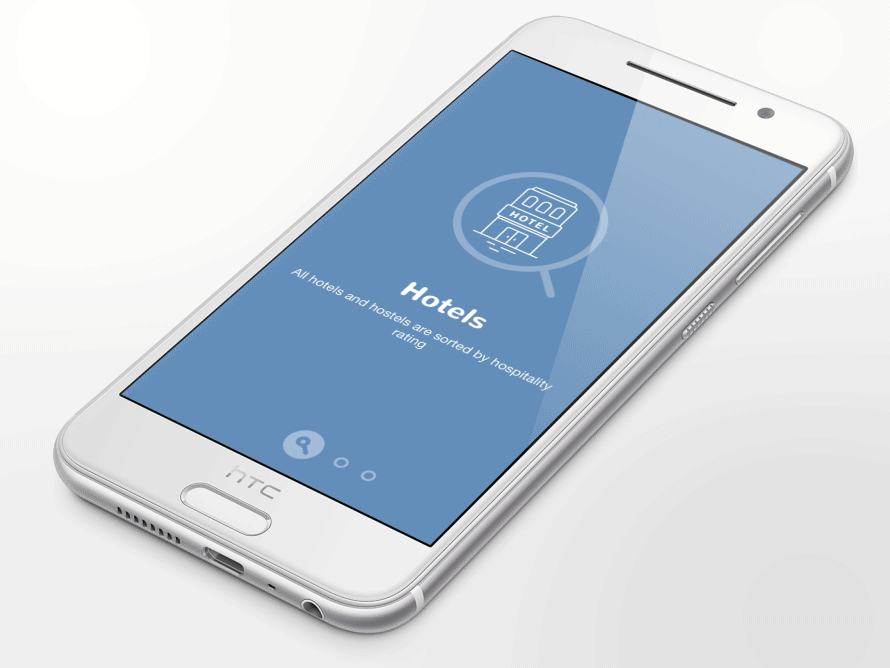
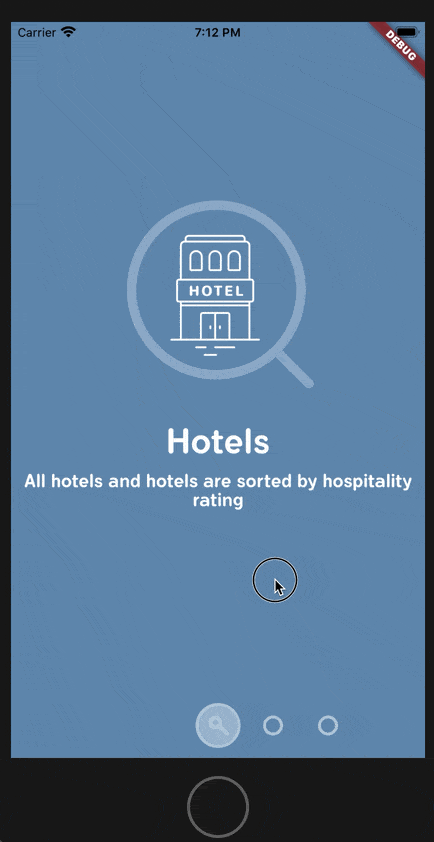

# paper_onboarding

A new Flutter project.

# Preview

Target

Reality

# What is used in this project

### ClipOval

It's kind of a mask in Photoshop to show only part of the widget.

[`PageReveal`](./lib/page_reveal.dart#L5) defines the widget.

### StreamController

It's similar to event stream, you can register listener first, and then add/trigger it when the timing comes.

[`PageDragger`](./lib/page_dragger.dart#L9) use the `slideUpdateStream` to report the drag event to parent widget.

#### ViewModel

You can find many viewmodel definitions, spreaded among the files, for almost every widget. It a pattern of writing code in MVC/MVVM style.

# Acknowledgement

Many of the assets in this project are created by those lovely people, here I list the source.

- Fonts

  **Flamante-Roma**: created by deFharo. [link1](http://defharo.com/fonts/flamante-round-family/), [link2](https://www.dafont.com/flamante-roma.font).

- Images

  **Paper-onboarding-android**: Paper Onboarding is a simple and easy to use onboarding slider for your app. [github repo](https://github.com/Ramotion/paper-onboarding-android).

## Getting Started

This project is a starting point for a Flutter application.

A few resources to get you started if this is your first Flutter project:

- [Lab: Write your first Flutter app](https://flutter.dev/docs/get-started/codelab)
- [Cookbook: Useful Flutter samples](https://flutter.dev/docs/cookbook)

For help getting started with Flutter, view our
[online documentation](https://flutter.dev/docs), which offers tutorials,
samples, guidance on mobile development, and a full API reference.
