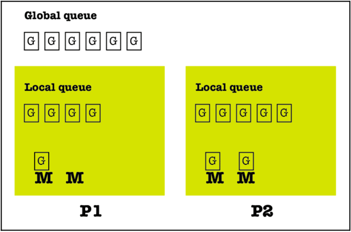

# Golang

I start from [this online tutorial](https://www.digitalocean.com/community/tutorial_series/how-to-code-in-go), which is a good and comprehensive tutorial.

Most content is excerpt from [Mastering Go](https://www.packtpub.com/product/mastering-go-second-edition/9781838559335). You'd better buy one if you like the book.

You'd really check it out, [Concurrency In Depth](./concurrency-in-go.md).

# Useful tips

go version go1.14.4 darwin/amd64

```bash
go doc --help

# go doc fmt

# go doc fmt.Printf

go tool compile <source.go>

go tool compile -pack <source.go>

# allow to detect race conditions, concurrency
go tool compile -race <source.go>

# go tool compile hello.go

# go tool compile -pack hello.go

# go tool compile -race hello.go

# The -W parameter tells the go tool compile command to
# print the `debug parse tree` after the type checking
go tool compile -W <source.go>
```

---

<details>

<summary>

### some example files

</summary>

Detailed on Garbage Collector in GO : [garbageCollector.go](./single-file-execute/garbageCollector.go).

Glance at the package `unsafe`: [unsafe.go](./single-file-execute/unsafe.go).

Glance at the keyword `defer`: [simple-defer.go](./single-file-execute/simple-defer.go), [flow-control](./single-file-execute/flow-control.go).

Glance at the built-in functions `panic` and `recover`: [panicRecover](./single-file-execute/panicRecover.go), [flow-control](./single-file-execute/flow-control.go), [error-handling](./single-file-execute/error-handling.go).

Glance at the package `time`: [dateAndTime.go](./single-file-execute/dateAndTime.go).

Glance at the package `strings`: [useStrings.go](./single-file-execute/useStrings.go).

Find out more information about the functions of the `runtime` package by visiting [https://golang.org/pkg/runtime/](https://golang.org/pkg/runtime/).

</details>

<details>

<summary>

## Basic Syntax and Grammar in GO

</summary>

```go
// using for loop to simulate while lopp
for {
  if (condition) {
    break
  }
}

// using for loop to simulate do...while loop
for ok := true; ok; ok = anExpression {

}

func differentS1AndS2() {
  s1 := []int{1, 2}
  s2 := s1[:]
  s1[1] = 4
  // at this time, s1 and s2 both point to the same internal array
  fmt.Printf("%v %[1]T\n", &s2)
  fmt.Printf("%v\n", &s1)
  s1 = append(s1, 5, 7,9,10)
  // at this time, s1 is different from s2
  fmt.Printf("%v %[1]T\n", &s2)
  fmt.Printf("%v\n", &s1)
}
```

Go has its own way of supporting `tuples`, which mainly allows functions to return _multiple values_ without needing to _group_ them in structures as is the case in C.

`new` returns the memory address of the allocated object. Put simply, `new` returns a pointer!

The main difference between `new` and `make` is that variables created with `make` are properly initialized without just zeroing the allocated memory space. Additionally, `make` can only be applied to maps, channels, and slices, and it does not return a memory address, which means that `make` does not return a _pointer_.

A Go `string` is a read-only `byte` `slice` that can hold any type of bytes, and it can have an arbitrary length.

A `rune` is an `int32` value, and therefore it is a Go type that is used for representing a Unicode code point. A Unicode code point or code position is a numerical value that is usually used for representing single Unicode characters; however, it can also have alternative meanings, such as providing formatting information.

A Go _package_ is a Go source file that begins with the `package` keyword followed by the name of the package.

A Go _type method_ is a function with a special _receiver_ argument. We declare methods as ordinary functions with an additional parameter that appears in front of the function name. This particular parameter **connects** the function to the type of that extra parameter. As a result, that parameter is called the _receiver_ of the method.

A type assertion is the `x.(T)` notation where `x` is of interface type and `T` is a type. Additionally, the actual value stored in `x` is of type `T`, and `T` must satisfy the interface type of `x`!

Type assertions help you do two things. The first thing is to check whether an interface value keeps a particular type. When used this way, a type assertion returns two values: the underlying value and a bool value. Although the underlying value is what you might want to use, the Boolean value tells you whether the type assertion was successful or not! The second thing a type assertion does is to allow you to use the concrete value stored in an interface or assign it to a new variable. This means that if there is an int variable in an interface, you can get that value using type assertion.

Glance at the usage of `interfaces`: [interfacesAssertion.go](./single-file-execute/interfacesAssertion.go).

</details>

<details>

<summary>

## Reflection

</summary>

**Reflection** is an advanced Go feature that allows you to dynamically learn the type of an arbitrary object as well as information about its structure. Go offers the `reflect` package for working with reflection.

Reflection is necessary for the implementation of packages such as `fmt`, `text/template`, and `html/template`. In the `fmt` package, reflection saves you from having to deal explicitly with every data type that exists.

Consequently, you might need to use reflection when you want to be as _generic_ as possible, or when you want to make sure that you will be able to deal with data types that do not exist at the time that you are writing your code. Additionally, reflection is handy when working with values of types that do not implement a common interface.

The stars of the reflect package are two types named reflect.Value and reflect.Type. The former type is used for storing values of any type, whereas the latter type is used for representing Go types.

Reflection should be used sparingly for three main reasons.

1.  The first reason is that extensive use of reflection will make your programs hard to read and maintain. A potential solution to this problem is good documentation; however, developers are famous for not having the time to write the required documentation.
1.  The second reason is that the Go code which uses reflection will make your programs slower. Generally speaking, Go code that is made to work with a particular data type will always be faster than Go code that uses reflection to work dynamically with any Go data type. Additionally, such dynamic code will make it difficult for tools to refactor or analyze your code.
1.  The last reason is that reflection errors cannot be caught at build time and are reported at runtime as a panic. This means that reflection errors can potentially crash your programs!

Glance at the package `reflection`: [reflection.go](./single-file-execute/reflection.go).

</details>

---

<details>

<summary>

## Go Concurrency

Go offers its own unique and innovative way of achieving concurrency, which comes in the form of **goroutines** and **channels**.

</summary>

Goroutines are the smallest Go entities that can be executed on their own in a Go program, which implyies that goroutines are not autonomous entities like Unix processes—goroutines live in threads that live in Unix processes.

Whilst channels can get data from goroutines in a concurrent and efficient way and thus allow goroutines to have a point of reference and communicate with each other.

Everything in Go is executed using goroutines; this makes perfect sense since Go is a concurrent programming language by design. Therefore, when a Go program starts its execution, its single goroutine calls the `main()` function, which starts the actual program execution.

> You should never make any assumptions about the order in which your goroutines will be executed.

The Unix kernel scheduler is responsible for the execution of the threads of a program.

On the other hand, the Go runtime has its own scheduler, which is responsible for the execution of the goroutines using a technique known as _m:n scheduling_, where _m_ goroutines are executed using _n_ operating system threads using multiplexing. The Go scheduler is the Go component responsible for _the way and the order_ in which the goroutines of a Go program get executed. This makes the Go scheduler a really important part of the Go programming language, as everything in a Go program is executed as a goroutine.

It is a very common misconception that _concurrency_ is the same thing as _parallelism_—this is just not true! _Parallelism_ is the _simultaneous execution of multiple entities of some kind_, whereas _concurrency_ is a way of structuring your components so that they _can be executed independently when possible_.

It is only when you build software components concurrently that you can safely execute them in parallel, when and if your operating system and your hardware permit it. In a valid concurrent design, adding concurrent entities makes the whole system run faster because more things can run in parallel. So, the desired parallelism comes from a better concurrent expression and implementation of the problem. So, the developer should not think about parallelism, but about breaking things into independent components that solve the initial problem when combined.

You can define a new goroutine using the `go` keyword followed by _a function name_ or the full definition of _an anonymous function_. The `go` keyword **makes the function call to return immediately, while the function starts running in the background as a goroutine and the rest of the program continues its execution**.

However, you cannot control or make any assumptions about the order in which your goroutines are going to be executed because this depends on the _scheduler of the operating system_, _the Go scheduler_, and _the load of the operating system_.

Glance at the package `sync` in goroutine: [goroutinesSync.go](./single-file-execute/goroutinesSync.go).

```go
// Although both functions implement the same functionality,
// their definitions are slightly different.
// The difference is created by the `<-` symbol found on
// the right of the `chan` keyword in the definition of the `f2()` function.
// This denotes that the `c` channel can be used for writing only.
func f1(c chan int, x int) {
  fmt.Println(x)
  c <- x
}
// `c` is send-only
func f2(c chan<- int, x int) {
  fmt.Println(x)
  c <- x
}

// `out` is send-only, `in` is receive-only
func f1(out chan<- int64, in <-chan int64) {
  fmt.Println(x)
  fmt.Println(<-out) // invalid
  out <- x
  in <- x // invalid
}
// `out`, `in` are bidirectional
func f2(out chan int64, in chan int64) {
  fmt.Println(x)
  c <- x
}
```

### scheduler in go

Go works using the _m:n scheduler_ (or _M:N scheduler_) that schedules goroutines using OS threads.

Go uses the _fork-join concurrency model_. The fork part of the model states that a child branch can be created at any point of a program. Analogously, the join part of the Go concurrency model is where the child branch will end and join with its parent. Among other things, both `sync.Wait()` statements and channels that collect the results of goroutines are join points, whereas any new goroutine creates a child branch.

The _fair scheduling strategy_ shares evenly all the load between the available processors.

A goroutine in Go is a _task_, whereas everything after the calling statement of a goroutine is a _continuation_. In the _work stealing strategy_ used by Go scheduler, a (logical) processor that is underutilized looks for additional work from other processors. When it finds such jobs, it steals them from the other processor(s), hence the name, _work stealing strategy_. Additionally, the work-stealing algorithm of Go queues and steals continuations. A _stalling join_ is a point where a thread of execution stalls at a join and starts looking for other work to do. Although both task stealing and continuation stealing have stalling joins, continuations happen more often than tasks; therefore, the Go algorithm works with continuations rather than tasks.

The main disadvantage of continuation stealing is that it requires extra work from the compiler of the programming language. Fortunately, Go provides that extra help and therefore uses _continuation stealing_ in its work-stealing algorithm. One of the benefits of continuation stealing is that you get the same results when using just functions or a single thread with multiple goroutines. This makes perfect sense as only one thing is executed at any given time in both cases.

Now, let's return back to the m:n scheduling algorithm used in Go.

The Go scheduler works using three main kinds of entities: OS threads (M) that are related to the operating system in use, goroutines (G), and logical processors (P). The number of processors that can be used by a Go program is specified by the `GOMAXPROCS` environment variable—at any given time there are most `GOMAXPROCS` processors.

The following figure illustrates this point:



There are two different kinds of queues: a global queue and a local queue attached to each logical processor.

Goroutines from the global queue are assigned to the queue of a logical processor in order to be executed. As a result, the Go scheduler needs to check the global queue in order to avoid executing goroutines that are only located at the local queue of each logical processor. However, the global queue is not checked all of the time, which means that it does not have an advantage over the local queues.

Additionally, each logical processor can have multiple threads, and _the stealing occurs between the local queues of the available logical processors_. Finally, keep in mind that the Go scheduler is allowed to create more OS threads when needed. OS threads are pretty expensive, however, which means that dealing with OS threads too much might slow down your Go applications.

### select

In practice, this means that `select` allows a goroutine to _wait_ on multiple communications operations. Therefore, the main benefit is that `select` gives you the power to work with multiple channels using a single `select` block. As a consequence, you can have nonblocking operations on channels.

> The biggest problem when using multiple channels and the `select` keyword is **deadlocks**, which needs extra care during the design and the development process.

You should checkout the file [selectSimple.go](./single-file-execute/selectSimple.go).

The biggest advantage of `select` is that it can connect and manage multiple channels. As channels connect goroutines, `select` connects channels that connect goroutines. Therefore, the `select` statement is one of the most important part of the Go concurrency model.

You should checkout the file [selectTimeout.go](./single-file-execute/selectTimeout.go), which use `timeout` and `select` to stop or return from goroutine earlier.

If you send a message to a closed channel, the program will _panic_. However, if you try to read from a closed channel, you will get the _zero value_ of the _type_ of that channel. So, after closing a channel, you can no longer write to it, but you can still read from it. Finally, if you try to close a nil channel, your program will panic.

In order to be able to close a channel, the channel must not be receive-only. Additionally, a `nil` channel always blocks, which means that trying to read or write from a `nil` channel will block. This property of channels can be very useful when you want to disable a branch of a select statement by assigning the `nil` value to a channel variable.

## buffered channels

Buffered channels are channels that allow the Go scheduler to put jobs in the queue quickly in order to be able to deal with more requests.

The technique presented here works as follows:
All incoming requests are forwarded to a channel, which processes them one by one. When the channel is done processing a request, it sends a message to the original caller saying that it is ready to process a new one. So, the capacity of the buffer of the channel restricts the number of simultaneous requests that it can keep.

## nil channel

The nil channels are a special kind of channel because they will always block.

You can read the usages of _buffered channels_ and _nil channel_ in this list [channelUsages](./single-file-execute/channelUsages.go).

An [example](./single-file-execute/channelInOrder.go) to use channel to ordering some goroutine execution.

## Shared Memory and Shared Variables

Shared memory and shared variables are the most common ways for Unix threads to communicate with each other.

A **Mutex** variable, which is an abbreviation for _mutual exclusion_ variable, is mainly used for thread synchronization and for protecting shared data when multiple writes can occur at the same time. A mutex works like a buffered channel of capacity one, which allows at most one goroutine to access a shared variable at any given time. This means that there is no way for two or more goroutines to try to update that variable simultaneously.

A **critical section** of a concurrent program is the code that cannot be executed simultaneously by all processes, threads, or, in this case, by all goroutines. It is the code that needs to be protected by mutexes. Therefore, identifying the critical sections of your code will make the whole programming process so much simpler that you should pay attention to this task.

> A critical section cannot be embedded in another critical section when both critical sections use the same sync.Mutex or sync.RWMutex variable. Put simply avoid, at almost any cost, spreading mutexes across functions because that makes it really hard to see whether you are embedding or not!

A simple [example](./single-file-execute/mutexSimple.go), with a lot of comments, to illustrate the `sync.Mutex` usage.

However, the programme would fall into deadlock if you forget to unlock `sync.Mutex`, as the [list](./single-file-execute/mutexDeadlocked.go) shows.

The `sync.RWMutex` type is another kind of mutex, to be honest, it is an improved version of `sync.Mutex`. In other words, `sync.RWMutex` is based on `sync.Mutex` with the necessary additions and improvements.

Although only _one writer_ is allowed to perform write operations using a `sync.RWMutex` mutex, you can have _multiple readers_ owning a `sync.RWMutex` mutex. However, there is one thing of which you should be aware: until _all of the readers_ of a `sync.RWMutex` mutex unlock that mutex, you cannot lock it for writing.

The functions that can help you work with a `sync.RWMutex` mutex are **`RLock()`** and **`RUnlock()`**, which are used for locking and unlocking the mutex, respectively, for _reading purposes_.

The `Lock()` and `Unlock()` functions used in a `sync.Mutex` mutex should still be used when you want to lock and unlock a `sync.RWMutex` mutex for _writing purposes_.

A simple [example](./single-file-execute/rwMutexSimple.go), with a lot of comments, to illustrate the `sync.RWMutex` usage.

## Sharing memory using goroutines

Although shared memory is the traditional way that threads use to communicate with each other, Go comes with built-in synchronization features that allow a single goroutine to own a shared piece of data. This means that other goroutines must send messages to this single goroutine that owns the shared data, which prevents the corruption of the data.

Such a goroutine is called a **monitor goroutine**. In Go terminology, this is _sharing memory by communicating_ instead of _communicating by sharing memory_.

> Simply _sharing memory_ brings us the problems such as race condition, read-write competition. While using _communicating_, using `channel` for example, we are sharing the data / message between gorountines.

> That said, Go does provide traditional locking mechanisms in the sync package. Most locking issues can be solved using either channels or traditional locks.
>
> So which should you use? Use whichever is most expressive and/or most simple.

A simple [example](./single-file-execute/goroutinesSharedMemory.go), with a lot of comments, to illustrate how we can implement shared memory among goroutines using goroutine and channels.

## Catching race conditions

Using the `-race` flag when running or building a Go source file will turn on the Go **race detector**, which will make the compiler create a modified version of a typical executable file. This modified version can record all accesses to shared variables as well as all synchronization events that take place, including calls to `sync.Mutex` and `sync.WaitGroup`. After analyzing the relevant events, the race detector prints a report that can help you identify potential problems so that you can correct them.

A simple [example](./single-file-execute/raceCatch.go), with a lot of comments, to illustrate how we can detect the race condition. Using `sync.Mutex`, we can get rid of the race condition since we locked it.

## The context package

The main purpose of the `context` package is to define the `Context` type and support _cancellation_! Yes, you heard that right; the main purpose of the context package is supporting cancellation because there are times that, for some reason, you want to abandon what you are doing. Also, it would be very helpful to be able to include some extra information about your cancelling decisions.

The `Context` type is an interface with four methods, named `Deadline()`, `Done()`, `Err()`, and `Value()`. The good news is that you do not need to implement all of these functions of the `Context` interface—you just need to modify a `Context` variable using functions such as `context.WithCancel()` and `context.WithTimeout()`.

A simple [example](./single-file-execute/contextSimple.go), with a lot of comments, to illustrate how we can create a context with `context.Background()`, how the `cancel()` function is called to _cancel_ the context.

An advanced [example](./single-file-execute/contextWithHttp.go), with a lot of comments, to illustrate how we can create a context with `context.Background()`, how the `cancel()` function is called to _cancel_ the `http.Request`.

## Worker pool

Generally speaking, a _Worker pool_ is a set of threads that are about to process jobs assigned to them. We replace the threads with goroutines to implement the worker pool. However, threads do not usually die after serving a request because the cost of ending a thread and creating a new one is too high, whereas goroutines do _die_ after finishing their job.

As you will see in the [example](./single-file-execute/workGerPool.go), worker pools are implemented with the help of buffered channels, because they allow you to limit the number of goroutines running at the same time.

The [example](./single-file-execute/workerPool.go) will implement a simple task: it will process integer numbers and print their square values using a single goroutine for serving each request.

</details>

<details>

<summary>

## Code Testing, Optimazition, Profiling

</summary>

**Code optimization** is the process where you try to discover the parts of your code that have a big influence on the performance of the entire program in order to make them _run faster_ or _use fewer resources_.

> The general advice for optimization is that you must _optimize bug-free code only_.

**Profiling** is a process of dynamic program analysis that measures various values related to program execution in order to give you a better understanding on the behavior of your program.

> The single most important thing to remember is that if you want to profile Go code, you will need to import the `runtime/pprof` standard Go package, either directly or indirectly. You can find the help page of the pprof tool by executing the `go tool pprof -help` command.

Go supports two kinds of profiling: **CPU profiling** and **memory profiling**.

Two examples: [using native package to profile](./single-file-execute/profileMe.go), [using third-party package to profile](./single-file-execute/profileMeBetter.go).

Go allows you to write tests for your Go code in order to detect bugs. Strictly speaking, this section is about **automated testing**, which involves writing extra code to verify whether the real code; that is, the production code, works as expected or not. Thus, the result of a test function is either _PASS_ or _FAIL_.

> Always put the testing code in a different source file. There is no need to create a huge source file that is hard to read and maintain.

An [example](./single-file-execute/testMe.go) with its [test file](./single-file-execute/testMe_test.go) show how to do some test in Go.

</details>

<details>

<summary>

## Network Programming

Some useful snippets on network programming in go could be found [here](./mastering-go-archive/network).

</summary>

You cannot create a TCP or UDP client or server in Go without using the functionality offered by the `net` package.

The `net.Dial()` function is used for connecting to a network as a client, whereas the `net.Listen()` function is used for telling a Go program to accept network connections and thus act as a server. The first parameter of both functions is the network type, but this is where their similarities end. The return value of both the `net.Dial()` and `net.Listen()` functions is of the `net.Conn` type, which implements the `io.Reader` and `io.Writer` interfaces.

### TCP client

TCP stands for Transmission Control Protocol, and its principal characteristic is that it is a reliable protocol.

The TCP header of each packet includes _source port_ and _destination port_ fields. These two fields, plus the source and destination IP addresses, are combined to identify uniquely a single TCP connection.

Examples: [TCP client 1](./single-file-execute/TCPclient.go), [TCP client 2](./single-file-execute/TCPclient_other.go), [TCP server 1](./single-file-execute/TCPserver.go), [TCP server 2](./single-file-execute/TCPserver_other.go), [TCP server with goroutines](./single-file-execute/TCPserver_goroutine.go), [TCP server 2 with goroutines](./single-file-execute/TCPserver_go_example.go).

### UDP client

The biggest difference between UDP and TCP is that UDP is not reliable by design. This also means that in general, UDP is simpler than TCP because UDP does not need to keep the state of a UDP connection.

Examples: [UDP client](./single-file-execute/UDPclient.go), [UDP server](./single-file-execute/UDPserver.go).

### Remote Procedure Call (RPC)

Remote Procedure Call (RPC) is a client-server mechanism for Interprocess communication that uses TCP/IP.

</details>

<details>

<summary>

## Examples for Closures and Anonymous Goroutines

</summary>

```go
var wg sync.WaitGroup
salutation := "hello"
wg.Add(1)
go func() {
  defer wg.Done()
  salutation = "welcome"
}()
wg.Wait()
fmt.Println(salutation) // salutation is modified to "welcome"
```

```go
// Compile warning: loop variable salutation captured by func literal
//
// output: the order is non-deterministic, but the salutation is "good day"
// 2 good day
// 0 good day
// 1 good day
var wg sync.WaitGroup
for i, salutation := range []string{"hello", "greetings", "good day"} {
  wg.Add(1)
  go func(index int) {
    defer wg.Done()
    fmt.Println(i, salutation)
  }(i)
}
wg.Wait()
```

In the above example, the goroutine is running a closure that has closed over the iteration variable `salutation`, which has a type of `string`. As our loop iterates, `salutation` is being assigned to the next string value in the slice literal. Because the goroutines being scheduled may run at any point in time in the future, it is undetermined what values will be printed from within the goroutine. This means the `salutation` variable falls out of scope. This is an interesting side note about how Go manages memory. The Go runtime is observant enough to know that a reference to the salutation variable is still being held, and therefore will transfer the memory to the heap so that the goroutines can continue to access it.

Usually, the _loop_ exits before any _goroutines_ begin running, so salutation is transferred to the heap holding a reference to the last value in the slice, `"good day"`.

The proper way to write this loop is to pass a copy of `salutation` into the closure so that by the time the goroutine is run, it will be operating on the data from its iteration of the loop.

```go
// output: order is non-deterministic
// hello
// good day
// greetings
var wg sync.WaitGroup
for _, salutation := range []string{"hello", "greetings", "good day"} {
  wg.Add(1)
  go func(salutation string) { // declare a parameter, which shadow the original salutation variable
    defer wg.Done()
    fmt.Println(salutation)
  }(salutation) // pass in the current iteration’s variable to the closure
}
wg.Wait()
```

</details>
