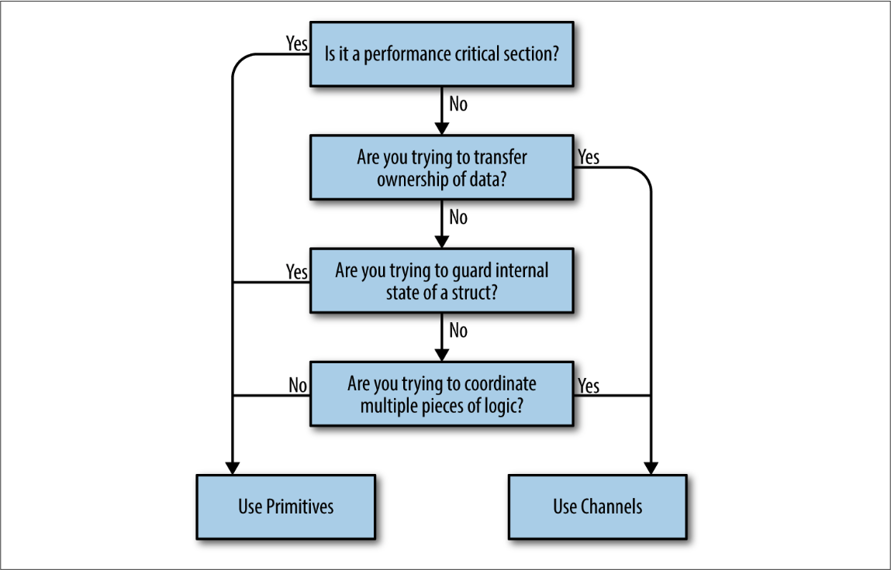

# Introduction on Concurrency and Parallelism

## Why is Concurrency hard?

It brings us

1. race condition

1. atomicity loss

1. memory access synchronization failure

1. deadlocks, livelocks, and starvation.

> In fact, there’s a name for a section of your program that needs exclusive access to a shared resource. This is called a _critical section_.

When interfacing with some concurrency-like code, these code should come with important comment that covers these aspects:

1. Who is responsible for the concurrency?

1. How is the problem space mapped onto concurrency primitives?

1. Who is responsible for the synchronization?

Go’s runtime does most of the heavy lifting and provides the foundation for most of Go’s concurrency niceties. For example, you would write a function and then prepend its invocation with the `go` keyword to start the thread. The runtime handles everything else we discussed automatically

Go’s runtime also automatically handles multiplexing concurrent operations onto operating system threads.

The low-latency garbage collector in Go is implemented through concurrency.

## The Difference Between Concurrency and Parallelism

In conversations, the two terms are often used interchangeably to mean _something that runs at the same time as something else._ Sometimes using the word _parallel_ in this context is correct, but usually if the we are discussing code, we really ought to be using the word _concurrent_.

The difference between _concurrency_ and _parallelism_ turns out to be a very powerful abstraction when modeling your code.

> Concurrency is a property of the code; parallelism is a property of the running program.

The chunks of our program code may appear to be running in parallel, but really they’re executing in a sequential manner _faster than is distinguishable_. If we were to run the same binary on a machine with two cores, the program’s chunks might actually be running in parallel. This reveals a few interesting and important things:

1. The first is that _we do not write parallel code_, **only concurrent code that we hope will be run in parallel**. Once again, parallelism is a property of the runtime of our program, not the code.

1. The second interesting thing is that we see it is possible—maybe even desirable—to **be ignorant of** whether our concurrent code is actually running in parallel, which is only made possible by the layers of abstraction that lie beneath our program’s model: the concurrency primitives, the program’s runtime, the operating system, the platform the operating system runs on (in the case of hypervisors, containers, and virtual machines), and ultimately the CPUs.

1. The third and final interesting thing is that parallelism is a function of time, or context. This context is defined as the bounds by which two or more operations could be considered parallel. For example, if our context was a space of five seconds, and we ran two operations that each took a second to run, we would consider the operations to have run in parallel. If our context was one second, we would consider the operations to have run sequentially.

It's obvious that most concurrent logic in our industry is written at one of the highest levels of abstraction: OS threads. If you wanted to write concurrent code, you would model your program in terms of threads and synchronize the access to the memory between them. If you had a lot of things you had to model concurrently and your machine couldn’t handle that many threads, you created a thread pool and multiplexed your operations onto the thread pool.

However, Go has added another link in that chain: the `goroutine`. In addition, Go has borrowed several concepts from the work of famed computer scientist Tony Hoare, and introduced new primitives for us to use, namely `channels`.

To be further, `goroutine` doesn't really added another layer of abstraction on top of OS threads, it has just supplanted them. Threads are still there, of course, but the developers find that they rarely have to think about our problem space in terms of OS threads. Instead, they model things in `goroutines` and `channels`, and _occasionally shared memory_.

## Communicating Sequential Processes

In a CSP programming language, inputs and outputs needed to be considered language primitives. This primitive can model input and output, or _communication_, _between processes_ correctly.

> Just because there is a framework available for a language that abstracts the concerns of parallelism away for you, doesn’t mean this natural way of modeling concurrent problems doesn’t matter! Someone has to write the framework, and your code will be sitting on top of whatever complexity the author(s) had to deal with. Just because the complexity is hidden from you doesn’t mean it’s not there, and complexity breeds bugs. In the case of Go, the language was designed around concurrency, so the language is not incongruent with the concurrency primitives it provides. This means less friction and fewer bugs!

Go’s runtime multiplexes goroutines onto OS threads automatically and manages their scheduling for us. This means that optimizations to the runtime can be made without us having to change how we’ve modeled our problem; this is classic separation of concerns. As advancements in parallelism are made, Go’s runtime will improve, as will the performance of your program.

The `channels`, for instance, are inherently composable with other channels. This makes writing large systems simpler because you can coordinate the input from multiple subsystems by easily composing the output together. You can combine input channels with timeouts, cancellations, or messages to other subsystems. Coordinating mutexes is a much more difficult proposition.

The `select` statement is the _complement_ to Go’s channels and is what enables all the difficult bits of composing channels. `select` statements allow you to efficiently wait for events, select a message from competing channels in a uniform random way, continue on if there are no messages waiting, and more.

CSP was and is a large part of what Go was designed around; however, Go also supports more traditional means of writing concurrent code through memory access synchronization and the primitives that follow that technique. Structs and methods in the `sync` and other packages allow you to perform _locks_, create _pools of resources_, preempt _goroutines_, and more.

One of Go’s mottos is “Share memory by communicating, don’t communicate by sharing memory.”

That said, Go does provide traditional locking mechanisms in the sync package. Most locking issues can be solved using either channels or traditional locks.

So which should you use? Use whichever is most expressive and/or most simple.



1. Are you trying to transfer ownership of data?

   If you have a bit of code that produces a result and wants to share that result with another bit of code, what you’re really doing is transferring ownership of that data. If you’re familiar with the concept of memory-ownership in languages that don’t support garbage collection, this is the same idea: data has an owner, and one way to make concurrent programs safe is to ensure only one concurrent context has ownership of data at a time. Channels help us communicate this concept by encoding that intent into the channel’s type.

   One large benefit of doing so is you can create buffered channels to implement a cheap in-memory queue and thus decouple your producer from your consumer. Another is that by using channels, you’ve implicitly made your concurrent code _composable_ with other concurrent code.

1. Are you trying to guard internal state of a struct?

   This is a great candidate for memory access synchronization primitives, and a pretty strong indicator that you shouldn’t use channels. By using memory access synchronization primitives, you can hide the implementation detail of locking your critical section from your callers. Here’s a small example of a type that is thread-safe, but doesn’t expose that complexity to its callers:

   ```go
   type Counter struct {
     mu sync.Mutex
     value int
   }

   func (c *Counter) Increment() {
     c.mu.Lock()
     defer c.mu.Unlock()
     c.value++
   }
   ```

   If you recall the concept of atomicity, we can say that what we’ve done here is defined the scope of atomicity for the `Counter` type. Calls to `Increment` can be considered _atomic_.

   Remember the key word here is _internal_. If you find yourself exposing locks beyond a type, this should raise a red flag. Try to keep the locks constrained to a small lexical scope.

1. Are you trying to coordinate multiple pieces of logic?

   Remember that channels are inherently more composable than memory access synchronization primitives. Having locks scattered throughout your object-graph sounds like a nightmare, but having channels everywhere is expected and encouraged! I can compose channels, but I can’t easily compose locks or methods that return values.

   You will find it much easier to control the emergent complexity that arises in your software if you use channels because of Go’s `select` statement, and their ability to serve as queues and be safely passed around. If you find yourself struggling to understand how your concurrent code works, why a deadlock or race is occurring, and you’re using primitives, this is probably a good indicator that you should switch to channels.

1. Is it a performance-critical section?

   This absolutely does not mean, “I want my program to be performant, therefore I will only use mutexes.” Rather, if you have a section of your program that you have profiled, and it turns out to be a major bottleneck that is orders of magnitude slower than the rest of the program, using memory access synchronization primitives may help this critical section perform under load. This is because channels use memory access synchronization to operate, therefore they can only be slower. Before we even consider this, however, a performance-critical section might be hinting that we need to restructure our program.

Stick to modeling your problem space with goroutines, use them to represent the concurrent parts of your workflow, and don’t be afraid to be liberal when starting them. Go’s philosophy on concurrency can be summed up like this: aim for simplicity, use channels when possible, and treat goroutines like a free resource.
