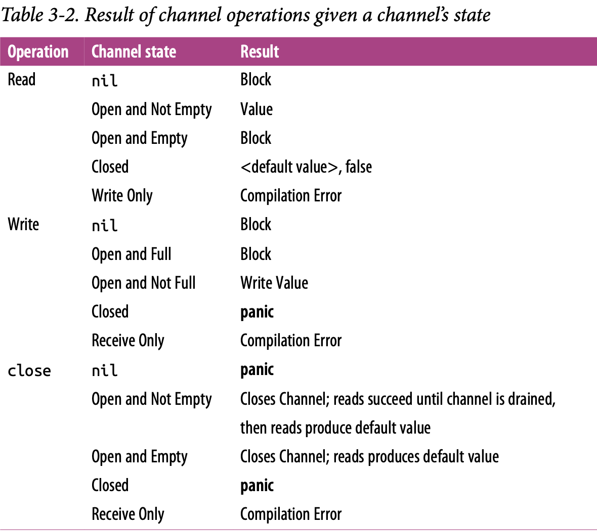

# Concurrency Primitives

Put very simply, a goroutine is a function that is running concurrently (remember: not necessarily in parallel!) alongside other code.

In fact, every Go program has at least one goroutine: the main goroutine, which is automatically created and started when the process begins.

So let’s look at what’s happening behind the scenes here: how do goroutines actually work? Are they OS threads? Green threads? How many can we create?

Goroutines are unique to Go (though some other languages have a concurrency primitive that is similar). They’re not OS threads, and they’re not exactly green threads—threads that are managed by a language’s runtime—they’re a higher level of abstraction known as coroutines. Coroutines are simply concurrent subroutines (functions, closures, or methods in Go) that are nonpreemptive—that is, they cannot be interrupted. Instead, coroutines have multiple points throughout which allow for suspension or reentry.

What makes goroutines unique to Go are their deep integration with Go’s runtime. Goroutines don’t define their own suspension or reentry points; Go’s runtime observes the runtime behavior of goroutines and automatically suspends them when they block and then resumes them when they become unblocked. In a way this makes them preemptable, but only at points where the goroutine has become blocked. It is an elegant partnership between the runtime and a goroutine’s logic. Thus, goroutines can be considered a special class of coroutine.

Coroutines, and thus goroutines, are implicitly concurrent constructs, but concurrency is not a property of a coroutine: something must host several coroutines simultaneously and give each an opportunity to execute. Note that this does not imply that coroutines are implicitly parallel. It is certainly possible to have several coroutines executing sequentially to give the illusion of parallelism

Go’s mechanism for hosting goroutines is an implementation of what’s called an **M:N scheduler**, which means it maps _M green threads_ to _N OS threads_. Goroutines are then scheduled onto the green threads. When we have more goroutines than green threads available, the scheduler handles the distribution of the goroutines across the available threads and ensures that when these goroutines become blocked, other goroutines can be run

Go follows a model of concurrency called the _fork-join_ model. The word _fork_ refers to the fact that at any point in the program, it can split off a _child_ branch of execution to be run concurrently with its _parent_. The word join refers to the fact that at some point in the future, these concurrent branches of execution will _join_ back together. Where the _child_ rejoins the parent is called a _join point_.

```
            main
              |
              |--fork--> child
              |            |
              |            |
join-point:   |-<- join ---|
              |            x
              |            |
            main         child
```

The _join points_ are what guarantee our program’s correctness and remove the race condition.

```go
var wg sync.WaitGroup
sayHello := func() {
  defer wg.Done() // the child would return to join?
  fmt.Println("hello")
}

wg.Add(1)
go sayHello()
wg.Wait() // this is the join part
```

Because goroutines operate within the same address space as each other, and simply host functions, utilizing goroutines is a natural extension to writing nonconcurrent code. Go’s compiler nicely takes care of pinning variables in memory so that goroutines don’t accidentally access freed memory, which allows developers to focus on their problem space instead of memory management; however, it’s not a blank check.

Since multiple goroutines can operate against the same address space, we still have to worry about synchronization. As we’ve discussed, we can choose either to synchronize access to the shared memory the goroutines access, or we can use CSP primitives to share memory by communication.

In the following example, we combine the fact that goroutines are not garbage collected with the runtime’s ability to introspect upon itself and measure the amount of memory allocated before and after goroutine creation:

```go
memConsumed := func() uint64 {
  runtime.GC()
  var s runtime.MemStats
  runtime.ReadMemStats(&s)
  return s.Sys
}
var c <-chan interface{}
var wg sync.WaitGroup
noop := func() {
  wg.Done()
  <-c // the goroutine would hang up forever
}

const numGoroutines = 1e4 // a big number of goroutines to create
wg.Add(numGoroutines)
before := memConsumed()
for i := numGoroutines; i > 0; i-- {
  go noop()
}
wg.Wait()
after := memConsumed()
fmt.Printf("%.3fkb", float64(after-before)/numGoroutines/1000)
```

Something that might dampen our spirits is _context switching_, which is when something hosting a concurrent process must save its state to switch to running a different concurrent process. At the OS level, with threads, this can be quite costly. The OS thread must save things like register values, lookup tables, and memory maps to successfully be able to switch back to the current thread when it is time. Then it has to load the same information for the incoming thread.

Context switching in software is comparatively much, much cheaper. Under a software-defined scheduler, the runtime can be more selective in what is persisted for retrieval, how it is persisted, and when the persisting need occur.

## The `sync` package

The `sync` package contains the concurrency primitives that are most useful for lowlevel memory access synchronization. In Go, these memory-access-synchronization operations have their use—mostly in small scopes such as a struct. It will be up to you to decide when memory access synchronization is appropriate.

## `WaitGroup`

`WaitGroup` is a great way to wait for a set of concurrent operations to complete when you either don’t care about the result of the concurrent operation, or you have other means of collecting their results. If neither of those conditions are true, I suggest you use `channels` and a `select` statement instead.

```go
// 2nd goroutine sleeping...
// 1st goroutine sleeping...
//
// All goroutines complete.
var wg sync.WaitGroup
wg.Add(1) // call Add with an argument of 1 to indicate that one goroutine is beginning.
go func() {
  defer wg.Done() // call Done using the defer keyword to ensure that before exiting the goroutine’s closure, indicating to the WaitGroup
  fmt.Println("1st goroutine sleeping...")
  time.Sleep(1)
}()
wg.Add(1)
go func() {
  defer wg.Done()
  fmt.Println("2nd goroutine sleeping...")
  time.Sleep(2)
}()
wg.Wait() // call Wait, which will block the main goroutine until all goroutines have indicated they have exited.
fmt.Println("All goroutines complete.")
```

Notice that the calls to `Add` are done outside the goroutines they’re helping to track. If we didn’t do this, we would have introduced a race condition:

> Had the calls to `Add` been placed inside the goroutines’ closures, the call to `Wait` could have returned without blocking at all because the calls to `Add` would not have taken place.

## `Mutex` and `RWMutex`

`Mutex` stands for “mutual exclusion” and is a way to guard critical sections of your program. A `Mutex` provides a concurrent-safe way to express exclusive access to these shared resources. The developers are responsible for coordinating access to this memory by guarding access to it with a mutex.

> To borrow a Goism, whereas channels share memory by communicating, a `Mutex` shares memory by creating a convention developers must follow to synchronize access to the memory.

```go
var count int
var lock sync.Mutex

increment := func() {
  lock.Lock() // request exclusive use of the critical section guarded by a `Mutex.lock`.
  defer lock.Unlock() // indicate that jobs are done with the critical section lock is guarding.
  count++
  fmt.Printf("Incrementing: %d\n", count)
}

decrement := func() {
  lock.Lock() // request exclusive use of the critical section guarded by a `Mutex.lock`.
  defer lock.Unlock() // indicate that jobs are done with the critical section lock is guarding.
  count--
  fmt.Printf("Decrementing: %d\n", count)
}

// Increment
var arithmetic sync.WaitGroup
for i := 0; i <= 5; i++ {
  arithmetic.Add(1)
  go func() {
  defer arithmetic.Done()
    increment()
  }()
}

// Decrement
for i: = 0; i <= 5; i++ {
  arithmetic.Add(1)
  go func() {
    defer arithmetic.Done()
    decrement()
  }()
}
arithmetic.Wait()
fmt.Println("Arithmetic complete.")
```

You’ll notice that we always call `Unlock` within a defer statement. This is a very common idiom when utilizing a `Mutex` to ensure the call always happens, even when `panicing`. Failing to do so will probably cause your program to deadlock.

Critical sections are so named because they reflect a bottleneck in your program. _It is somewhat **expensive to enter and exit** a critical section, and so generally people attempt to **minimize the time** spent in critical sections._

One strategy for doing so is to reduce the cross-section of the critical section. There may be memory that needs to be shared between multiple concurrent processes, but perhaps not all of these processes will read and write to this memory. If this is the case, you can take advantage of a different type of mutex: `sync.RWMutex`.

The `sync.RWMutex` is conceptually the same thing as a Mutex: it guards access to memory; however, You can request a lock for reading, in which case you will be granted access unless the lock is being held for writing. This means that an arbitrary number of readers can hold a reader lock or only a single writer lock.

```go
producer := func(wg *sync.WaitGroup, l sync.Locker) {
  defer wg.Done()
  for i := 5; i > 0; i-- {
    l.Lock()
    l.Unlock()
    time.Sleep(1)
  }
}

observer := func(wg *sync.WaitGroup, l sync.Locker) {
  defer wg.Done()
  l.Lock()
  defer l.Unlock()
}

test := func(count int, mutex, rwMutex sync.Locker) time.Duration {
  var wg sync.WaitGroup
  wg.Add(count+1)
  beginTestTime := time.Now()
  go producer(&wg, mutex)
  for i := count; i > 0; i-- {
    go observer(&wg, rwMutex)
  }
  wg.Wait()
  return time.Since(beginTestTime)
}

tw := tabwriter.NewWriter(os.Stdout, 0, 1, 2, ' ', 0)
defer tw.Flush()

var m sync.RWMutex
fmt.Fprintf(tw, "Readers\tRWMutext\tMutex\n")
for i := 0; i < 20; i++ {
  count := int(math.Pow(2, float64(i)))
  fmt.Fprintf(
    tw,
    "%d\t%v\t%v\n",
    count,
    test(count, &m, m.RLocker()),
    test(count, &m, &m),
  )
}
```

## `Cond`

The comment for the `Cond` type really does a great job of describing its purpose:

`Cond` implements a condition variable, a rendezvous point for goroutines waiting for or announcing the occurrence of an event.

In that definition, an “event” is any arbitrary signal between two or more goroutines that carries no information other than the fact that it has occurred.

Very often you’ll want to wait for one of these signals before continuing execution on a goroutine. If we were to look at how to accomplish this without the Cond type, one naive approach to doing this is to use an infinite loop:

```go
for conditionTrue() == false {
  time.Sleep(1*time.Millisecond) // using sleep to release the CPU core
}
```

This is better, but it’s still inefficient, and you have to figure out how long to sleep for: too long, and you’re artificially degrading performance; too short, and you’re unnecessarily consuming too much CPU time. It would be better if there were some kind of way for a goroutine to efficiently sleep until it was signaled to wake and check its condition. This is exactly what the Cond type does for us. Using a `Cond`, we could write the previous examples like this:

```go
// instantiate a new `Cond`
// The `NewCond` function takes in a type that satisfies the `sync.Locker` interface.
// This is what allows the `Cond` type to facilitate coordination with other goroutines in a concurrent-safe way.
c := sync.NewCond(&sync.Mutex{})

// lock the Locker for this condition
// This is necessary because the call to `Wait` automatically
// calls `Unlock` on the Locker when entered.
c.L.Lock()
for conditionTrue() == false {
  // wait to be notified that the condition has occurred.
  // This is a blocking call and the goroutine will be suspended.
  c.Wait()
}

// unlock the Locker for this condition.
// This is necessary because when the call to `Wait` exits,
// it calls `Lock` on the Locker for the condition
c.L.Unlock()
```

This approach is much more efficient. Note that the call to Wait doesn’t just block, it _suspends_ the current goroutine, allowing other goroutines to run on the OS thread.

A few other things happen when you call `Wait`: upon entering `Wait`, `Unlock` is called on the `Cond` variable’s Locker, and upon exiting `Wait`, `Lock` is called on the `Cond` variable’s Locker. This is effectively a hidden side effect of the method. It looks like we’re holding this lock the entire time while we wait for the condition to occur, but that’s not actually the case.

```go
// create condition using a standard `sync.Mutex` as the Locker
c := sync.NewCond(&sync.Mutex{})
// create a slice with a length of 0, capacity of 10.
queue := make([]interface{}, 0, 10)

removeFromQueue := func(delay time.Duration) {
  time.Sleep(delay)
  // enter the critical section for the condition
  // so we can modify data pertinent to the condition.
  c.L.Lock()

  // simulate dequeuing an item by reassigning
  // the head of the slice to the second item
  queue = queue[1:]
  fmt.Println("Removed from queue")

  //  exit the condition’s critical section
  c.L.Unlock()

  // let a goroutine waiting on the condition know that something has occurred
  c.Signal()
}

for i := 0; i < 10; i++ {
  // enter the critical section for the condition
  // by calling Lock on the condition’s `Locker`
  c.L.Lock()
  // This is important because a signal on the condition
  // doesn’t necessarily mean what you’ve been waiting for
  //  has occurred—only that something has occurred.
  for len(queue) == 2 {

    // suspend the main goroutine until
    // a signal on the condition has been sent.
    c.Wait()
  }
  fmt.Println("Adding to queue")
  queue = append(queue, struct{}{})

  // create a new goroutine that will
  // dequeue an element after one second
  go removeFromQueue(1*time.Second)

  // exit the condition’s critical section
  c.L.Unlock()
}
```

There's a new method in this example, `Signal`. This is one of two methods that the `Cond` type provides for notifying goroutines blocked on a `Wait` call that the condition has been triggered. The other is a method called `Broadcast`. Internally, the runtime maintains a FIFO list of goroutines waiting to be signaled; `Signal` finds the goroutine that’s been waiting the longest and notifies that, whereas `Broadcast` sends a signal to all goroutines that are waiting.

> In addition, the Cond type is much more performant than utilizing channels.

Like most other things in the sync package, usage of Cond works best when constrained to a tight scope, or exposed to a broader scope through a type that encapsulates it.

```go
/*
  An example to use `Broadcast`

  We’re creating a GUI application with a button on it.
  We want to register an arbitrary number of functions
  that will run when that button is clicked.

  A `Cond` is perfect for this because we can use
  its `Broadcast` method to notify all registered handlers.
*/

// define a type `Button` that contains a condition, `Clicked`.
type Button struct {
  Clicked *sync.Cond
}

button := Button{ Clicked: sync.NewCond(&sync.Mutex{}) }

// define a convenience function that will allow us
// to register functions to handle signals from a condition.
// Each handler is run on its own goroutine, and subscribe
// will not exit until that goroutine is confirmed to be running.
subscribe := func(c *sync.Cond, fun func()) {
  var goroutineRunning sync.WaitGroup
  goroutineRunning.Add(1)
  go func() {
    goroutineRunning.Done()
    c.L.Lock()
    defer c.L.Unlock()
    c.Wait()
    fn()
  }()
  goroutineRunning.Wait()
}

// set a handler for when the mouse button is raised
var clickRegistered sync.WaitGroup
clickRegistered.Add(3)
subscribe(button.Clicked, func() {
  fmt.Println("Maximizing window.")
  clickRegistered.Done()
})

subscribe(button.Clicked, func() {
  fmt.Println("Displaying annoying dialog box!")
  clickRegistered.Done()
})

subscribe(button.Clicked, func() {
  fmt.Println("Mouse clicked.")
  clickRegistered.Done()
})

button.Clicked.Broadcast()
clickRegistered.Wait()
```

## Once

As the name implies, `sync.Once` is a type that utilizes some sync primitives internally to ensure that _only one call_ to `Do` ever calls the function passed in—even on different goroutines.

```go
var count int
increment := func() {
  count++
}

var once sync.Once
var increments sync.WaitGroup
increments.Add(100)
for i := 0; i < 100; i++ {
  go func() {
    defer increments.Done()
    once.Do(increment)
  }()
}
increments.Wait()
// output
// Count: 1
fmt.Printf("Count is %d\n", count)
```

```go
var count int = 10
increment := func() { count++ }
decrement := func() { count-- }
var once sync.Once
once.Do(increment)
once.Do(decrement)
// output
// Count: 11
fmt.Printf("Count: %d\n", count)
```

This is because `sync.Once` only counts the number of times `Do` is called, not how many times unique functions passed into `Do` are called. In this way, copies of `sync.Once` are tightly coupled to the functions they are intended to be called with. Check more details in the source file of `sync/once`.

## `Pool`

`Pool` is a concurrent-safe implementation of the object pool pattern.

At a high level, a the pool pattern is a way to create and make available a fixed number, or pool, of things for use. It’s commonly used to constrain the creation of things that are expensive (e.g., database connections) so that only a fixed number of them are ever created, but an indeterminate number of operations can still request access to these things. In the case of Go’s `sync.Pool`, this data type can be safely used by multiple goroutines.

The primary interface of `Pool` is its `Get` method. When called, `Get` will first check whether there are any available instances within the pool to return to the caller, and if not, call its `New` member variable to create a new one. When finished, callers call `Put` to place the instance they were working with back in the pool for use by other processes.

```go
myPool := &sync.Pool {
  New: func() interface{} {
    fmt.Println("Creating new instance.")
    return struct{}{}
  }
}

myPool.Get()

instance := myPool.Get()
myPool.Put(instance)
myPool.Get()
```

So why use a pool and not just instantiate objects as you go? Go has a garbage collector, so the instantiated objects will be automatically cleaned up. What’s the point? Consider this example:

```go
var numCalcsCreated int
calcPool := &sync.Pool{
    New: func() interface{} {
        numCalcsCreated += 1
        mem := make([]byte, 1024)
        // storing the address of the slice of bytes
        return &mem
    },
}

calcPool.Put(calcPool.New())
calcPool.Put(calcPool.New())
calcPool.Put(calcPool.New())
calcPool.Put(calcPool.New())

const numWorkers = 1024 * 1024
var wg sync.WaitGroup
wg.Add(numWorkers)

for i := numWorkers; i > 0; i-- {
    go func() {
        defer wg.Done()
        // asserting the type is a pointer to a slice of bytes
        mem := calcPool.Get().(*[]byte)
        defer calcPool.Put(mem)
    }()
}

wg.Wait()
// output: becasue we only have 8 logic processor
// 8 calculators were created.
fmt.Printf("%d calculators were created.", numCalcsCreated)
```

Had this example is run without a `sync.Pool`, though the results are nondeterministic, in the worst case it could have been attempting to allocate a gigabyte of memory, but as you see from the output, the real memory allocation is only allocated 4 KB.

Another common situation where a `Pool` is useful is for _warming a cache of preallocated objects_ for operations that must run as quickly as possible. In this case, instead of trying to guard the host machine’s memory by constraining the number of objects created, we’re trying to guard consumers’ time by front-loading the time it takes to get a reference to another object.

This is very common when writing high- throughput network servers that attempt to respond to requests as quickly as possible. Checkout this example:

<details>

<summary>

A service that don't use `sync.Pool`

</summary>

```go
// simulates creating a connection to a service
func connectToService() interface{} {
  time.Sleep(1*time.Second)
  return struct{}{}
}

// a network handler that opens a connection
// to another service for every connection
// the network handler accepts.
func startNetworkDaemon() *sync.WaitGroup {
  var wg sync.WaitGroup
  wg.Add(1)
  go func() {
    server, err := net.Listen("tcp", "localhost:8080")
    if err != nil {
      log.Fatalf("cannot listen: %v", err)
    }
    defer server.Close()
    wg.Done()
    for {
      conn, err := server.Accept()
      if err != nil {
        log.Printf("cannot accept connection: %v", err)
        continue
      }
      connectToService()
      fmt.Fprintln(conn, "")
      conn.Close()
    }
  }()
  return &wg
}

// test functions
func init() {
  daemonStarted := startNetworkDaemon()
  daemonStarted.Wait()
}

func BenchmarkNetworkRequest(b *testing.B) {
  for i := 0; i < b.N; i++ {
    conn, err := net.Dial("tcp", "localhost:8080")
    if err != nil {
      b.Fatalf("cannot dial host: %v", err)
    }
    if _, err := ioutil.ReadAll(conn); err != nil {
      b.Fatalf("cannot read: %v", err)
    }
    conn.Close()
  }
}
```

</details>

<details>

<summary>

A service that use `sync.Pool` to host connections to the fictitious service.

</summary>

```go
func connectToService() interface{} {
  time.Sleep(1*time.Second)
  return struct{}{}
}

func warServiceConnCache() *sync.Pool {
  p := &sync.Pool {
      New: connectToService,
  }

  for i := 0; i < 10; i++ {
      p.Put(p.New())
  }
  return p
}

func startNetworkDaemon() *sync.WaitGroup {
  var wg sync.WaitGroup
  wg.Add(1)
  go func() {
      connPool := warServiceConnCache()
      server, err := net.Listen("tcp", "localhost:9090")

      if err != nil {
          log.Fatal("cannot listen: %v", err)
      }
      defer server.Close()

      wg.Done()

      for {
          conn, err := server.Accept()
          if err != nil {
              log.Printf("cannot accept connection: %v", err)
              continue
          }
          svcConn := connPool.Get()
          fmt.Fprintln(conn, "")
          connPool.Put(svcConn)
          conn.Close()
      }
  }()
  return &wg
}

// test functions
func init() {
  daemonStarted := startNetworkDaemon()
  daemonStarted.Wait()
}

func BenchmarkNetworkRequest(b *testing.B) {
  for i := 0; i < b.N; i++ {
    conn, err := net.Dial("tcp", "localhost:8080")
    if err != nil {
      b.Fatalf("cannot dial host: %v", err)
    }
    if _, err := ioutil.ReadAll(conn); err != nil {
      b.Fatalf("cannot read: %v", err)
    }
    conn.Close()
  }
}
```

</details>

The object pool design pattern is best used either when you have concurrent processes that require objects, but dispose of them very rapidly after instantiation, or when construction of these objects could negatively impact memory.

So when working with a Pool, just remember the following points:

1. When instantiating `sync.Pool`, give it a `New` member variable that is thread-safe when called.

1. When you receive an instance from `Get`, make no assumptions regarding the state of the object you receive back.

1. Make sure to call `Put` when you’re finished with the object you pulled out of the pool. Otherwise, the `Pool` is useless. Usually this is done with `defer`.

1. Objects in the pool must be roughly uniform in makeup.

## Channels

Channels are one of the synchronization primitives in Go derived from Hoare’s CSP. While they can be used to synchronize access of the memory, they are best used to communicate information between goroutines.

Like a river, a channel serves as a conduit for a stream of information; values may be passed along the channel, and then read out downstream. When using channels, you’ll pass a value into a `chan` variable, and then somewhere else in your program read it off the channel. The disparate parts of your program don’t require knowledge of each other, only a reference to the same place in memory where the channel resides. This can be done by passing references of channels around your program.

```go
var readOnlyStream <-chan interface{}
readOnlyStream := make(<-chan interface{})

var sendOnlyStream chan<- interface{}
sendOnlyStream := make(chan<- interface{})

var receiveChan <-chan interface{}
var sendChan chan<- interface{}
dataStream := make(chan interface{})
// Valid statements:
receiveChan = dataStream
sendChan = dataStream
```

It's not often to see unidirectional channels instantiated, but often them are used as function parameters and return types, which is very useful. This is possible because Go will implicitly convert bidirectional channels to unidirectional channels when needed

The channels in Go are said to be blocking:

- Any goroutine that attempts to write to a channel that is full will wait until the channel has been emptied

- Any goroutine that attempts to read from a channel that is empty will wait until at least one item is placed on it

```go
value, ok := <-someStream
// (true): Hello channels
fmt.Printf("(%v): %v", ok, value)

intStream := make(chan int)
go func () {
  intStream <- 3
  intStream <- 1
  close(intStream)
}
for {
  integer, ok := <- intStream
  fmt.Printf("(%v): %v", ok, integer)
}
// output:
// (true): 3
// (true): 1
// (false): 0
// (false): 0
// ... forever (false):0
```

The second return value is a way for a read operation to indicate whether the read off the channel was a value generated by a write elsewhere in the process, or a default value generated from a closed channel.

This opens up a few new patterns for us. The first is ranging over a channel. The `range` keyword—used in conjunction with the `for` statement—supports channels as arguments, and will automatically break the loop when a channel is closed. This allows for concise iteration over the values on a channel.

<details>

<summary>

Some examples.

</summary>

```go
intStream := make(chan int)
go func() {
  defer close(intStream)
  for i := 1; i <= 5; i++ {
    intStream <- i
  }
}()

for integer := range intStream {
  fmt.Printf("%v ", integer)
}
```

```go
begin := make(chan interface{})
var wg sync.WaitGroup
for i := 0; i < 5 ; i++ {
  wg.Add(1)
  go func(i int) {
    defer wg.Done()
    <-begin
    fmt.Printf("%v has begun\n", i)
  }(i)
}

fmt.Println("Unblocking goroutines...")
close(begin)
wg.Wait()
fmt.Println("Program exiting")
```

</details>

We can also create _buffered channels_, which are channels that are given a capacity when they’re instantiated. This means that even if no reads are performed on the channel, a goroutine can still perform n writes. Here’s how to declare and instantiate one:

```go
// we can place four things onto the channel
// regardless of whether it’s being read from
var dataStream chan interface{}
dataStream = make(chan interface{}, 4)

// equivalent statement
a := make(chan int)
b := make(chan int, 0)
```

The declaration of a buffered channel is no different than an unbuffered one. Unbuffered channels are also defined in terms of buffered channels: an unbuffered channel is simply a buffered channel created with a capacity of 0.

It also bears mentioning that if a buffered channel is empty and has a receiver, the buffer will be bypassed and the value will be passed directly from the sender to the receiver. In practice, this happens transparently, but it’s worth knowing for understanding the performance profile of buffered channels.

```go
// it’s a little faster than writing to stdout directly.
var stdoutBuff bytes.Buffer

// ensure that the buffer is written out
// to stdout before the process exits.
defer stdoutBuff.WriteTo(os.Stdout)

// create a buffered channel with a capacity of 4
// change the capacity, the output will change
// because the channel is buffered with size
intStream := make(chan int, 4)
go func() {
  defer close(intStream)
  defer fmt.Fprintln(&stdoutBuff, "Producer Done.")
  for i := 0; i < 5 ; i++ {
    fmt.Fprintf(&stdoutBuff, "Sending: %d\n", i)
    intStream <- i
  }
}()

for integer := range intStream {
  fmt.Fprintf(&stdoutBuff, "Recevied %v.\n", integer)
}
```



The first thing we should do to put channels in the right context is to assign channel _ownership_. The _owrnership_ is defined as being a goroutine that instantiates, writes, and closes a channel. Unidirectional channel declarations are the tool that will allow us to distinguish between goroutines that own channels and those that only utilize them: channel owners have a write-access view into the channel (`chan` or `chan<-`), and channel utilizers only have a read-only view into the channel (`<-chan`).

The goroutine that owns a channel should:

1. Instantiate the channel.
1. Perform writes, or pass ownership to another goroutine.
1. Close the channel.
1. Ecapsulate the previous three things in this list and expose them via a reader channel.

As a consumer of a channel, two things draw our attention:

1. Knowing when the channel is closed.

1. Responsibly handling blocking for any reason.

```go
chanOwner := func() <-chan int {
  // instantiate a buffered channel.
  // Since we know we’ll produce six results,
  // we create a buffered channel of 5
  // so that the goroutine can complete as quickly as possible.
  resultStream := make(chan int, 5)

  go func() {
    // ensure to close the channel once we finished usages
    defer close(resultStream)
    for i := 0; i <= 5; i ++ {
      resultStream <- i
    }
  }()
  // return read-only channel for consumers
  return resultStream
}

resultStream := chanOwner()
for result := range resultStream {
  fmt.Printf("Received: %d\n", result)
}
fmt.Println("Done Receiving!")
```

In many ways, channels are the glue that binds goroutines together.

## The `select` Statement

The `select` statement is the glue that binds channels together; it’s how we’re able to compose channels together in a program to form larger abstractions.

In addition to joining components, at these critical junctures in your program, select statements can help safely bring channels together with concepts like cancellations, timeouts, waiting, and default values.

Just like a `switch` block, a `select` block encompasses a series of `case` statements that guard a series of statements.

However, `case` statements in a `select` block aren’t tested sequentially, and execution won’t automatically fall through if none of the criteria are met. Instead, all channel reads and writes are considered simultaneously to see if any of them are ready: populated or closed channels in the case of reads, and channels that are not at capacity in the case of writes. If none of the channels are ready, the entire select statement blocks. Then when one the channels is ready, that operation will proceed, and its corresponding statements will execute. If more than one channel are ready, the Go runtime will perform a pseudo-random uniform selection over the set of case statements.

```go
start := time.Now()
c := make(chan interface{})
go func() {
  time.Sleep(5 * time.Second)
  close(c)
}()

fmt.Println("Blocking or read...")
select {
case <-c:
  fmt.Printf("Unblocked %v later.\n", time.Since(start))
}
// output:
// Blocking on read...
// Unblocked 5.000170047s later.
```

<details>

<summary>

We introduces a random variable into your equation—in this case, which channel to select from. By weighting the chance of each channel being utilized equally, all Go programs that utilize the select statement will perform well in the average case.

</summary>

```go
c1 := make(chan interface{})
close(c1)
c2 := make(chan interface{})
close(c2)
var c1Count, c2Count int
for i := 1000; i >= 0; i-- {
  select {
  case <-c1:
    c1Count++
  case <-c1:
    c1Count++
  case <-c2:
    c2Count++
  }
}
fmt.Printf("c1Count: %d\nc2Count: %d\n", c1Count, c2Count)
// c1Count is almost twice c2Count
```

```go
c1 := make(chan interface{})
close(c1)
c2 := make(chan interface{})
close(c2)
var c1Count, c2Count int
for i := 1000; i >= 0; i-- {
  select {
  case <-c1:
    c1Count++
  case <-c2:
    c2Count++
  }
}
fmt.Printf("c1Count: %d\nc2Count: %d\n", c1Count, c2Count)
// c1 is almost same as c2Count
```

</details>

Go’s time package provides an elegant way to do timeout problem with channels that fits nicely within the paradigm of select statements. The `time.After` function takes in a `time.Duration` argument and returns a channel that will send the current time after the duration.

```go
var c <-chan int
select {
case <-c:
case <- time.After(1 * time.Second):
  fmt.Println("Timed out.")
}
```

<details>

<summary>

Like `case` statements, the `select` statement also allows for a `default` clause in case you’d like to do something if all the channels you’re selecting against are blocking.

A `default` clause used in conjunction with a for-select loop. This allows a goroutine to make progress on work while waiting for another goroutine to report a result.

</summary>

```go
done := make(chan interface{})
go func() {
  time.Sleep(5*time.Second)
  close(done)
}()
workCounter := 0
loop:
for {
  select {
  case <-done:
    break loop
  default:
    // don't block these code,
    // let the control flow
  }
  // Simulate work
  workCounter++
  time.Sleep(1*time.Second)
}

fmt.Printf("Achieved %v cycles of work before signalled to stop.\n", workCounter)
// output:
// Achieved 5 cycles of work before signalled to stop.
```

</details>

Finally, there is a special case for empty select statements: select statements with no case clauses. These look like this:

```go
select {}
```

This statement will simply block forever.
