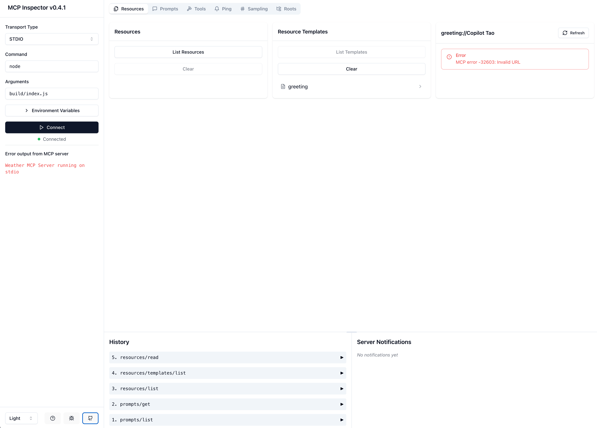

# MCP Demo: Weather

This is a demo of the MCP protocol in TypeScript. It demonstrates how to create a simple MCP server that exposes a weather tool and some data.

## How to debug

When you write the server but you don't have any client, you can use [MCP Inspector](https://github.com/modelcontextprotocol/inspector) to debug your server.

```bash
# build the server
npm run build

# start the debugger to inspect the MCP server
npx @modelcontextprotocol/inspector node build/index.js

# Output
# Starting MCP inspector...
# Proxy server listening on port 3000

# 🔍 MCP Inspector is up and running at http://localhost:5173 🚀
```



[Extra startup command](https://modelcontextprotocol.io/docs/tools/inspector)

```bash
# Pass arguments only
npx @modelcontextprotocol/inspector build/index.js arg1 arg2

# Pass environment variables only
npx @modelcontextprotocol/inspector -e KEY=value -e KEY2=$VALUE2 node build/index.js

# Pass both environment variables and arguments
npx @modelcontextprotocol/inspector -e KEY=value -e KEY2=$VALUE2 node build/index.js arg1 arg2

# Use -- to separate inspector flags from server arguments
npx @modelcontextprotocol/inspector -e KEY=$VALUE -- node build/index.js -e server-flag

# the inspector runs a client UI (default port 5173) and an MCP proxy server (default port 3000).
# customize the ports if needed:
CLIENT_PORT=8080 SERVER_PORT=9000 npx @modelcontextprotocol/inspector node build/index.js
```

## References

- [MCP Protocol](https://modelcontextprotocol.io/introduction)

- [MCP TypeScript SDK](https://github.com/modelcontextprotocol/typescript-sdk)
