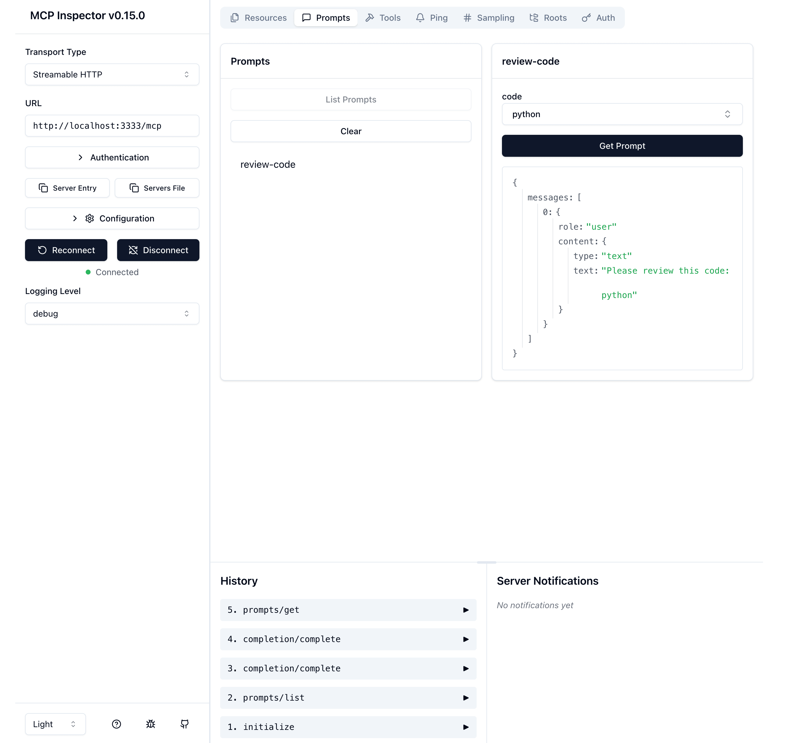
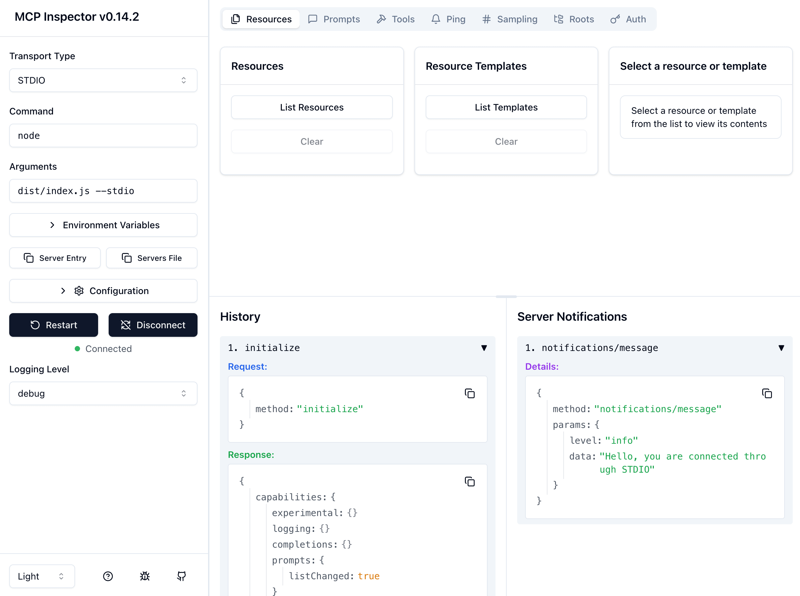

# MCP Demo: Weather

This is a demo of the MCP protocol in TypeScript. It demonstrates how to create a simple MCP server that exposes a weather tool and some data.

## Development and Debugging

> [More details about MCP Inspector](https://modelcontextprotocol.io/docs/tools/inspector)

When you write the server but you don't have any client, you can use [MCP Inspector](https://github.com/modelcontextprotocol/inspector) to debug your server.

After you write the capabilities of your server, you can use the MCP Inspector to debug your server.

Use VS Code Task to build the server in watch mode and start the debugger.

**MCP Inspector through Streamable HTTP**

Choose `Tasks: Run Task` and choose `Inspect (HTTP)` from VS Code command palette.

Select `Transport Type` as `Streamable HTTP`.



<details>
<summary>

**MCP Inspector through STDIO**

</summary>

The `tsx` would not generate a `dist` folder, so you might need to start the task each time when you make changes.

Choose `Tasks: Run Task` and choose `Inspect (STDIO)` from VS Code command palette.

Select `Transport Type` as `STDIO`.



</details>

<details>
<summary>

**MCP Inspector through SSE** (deprecated)

</summary>

Choose `Tasks: Run Task` and choose `Inspect (HTTP)` from VS Code command palette.

Select `Transport Type` as `SSE` (Server Sent Events).


</details>

## Docker

Server is running in **STDIO mode** by default in docker.

Build the image: `docker build -t mcp-server-weather ./`

Run the image: `docker run -i --rm mcp-server-weather`

### Inspect the MCP server in Docker

Use config file `Dockerfile.inspect` to build the image.

```bash
docker build -t mcp-server-weather-inspect -f Dockerfile.inspect ./
```

Run the image and connect to the MCP through **STDIO transport**:

```bash
docker run --rm -p 6274:6274 -p 6277:6277 mcp-server-weather-inspect
```

Or, Choose `Tasks: Run Task` and choose `Inspect (Docker)` from VS Code command palette.

## References

- [MCP Protocol](https://modelcontextprotocol.io/introduction)

- [MCP TypeScript SDK](https://github.com/modelcontextprotocol/typescript-sdk)

- [Figma Context MCP](https://github.com/GLips/Figma-Context-MCP): A great showcase for MCP.
