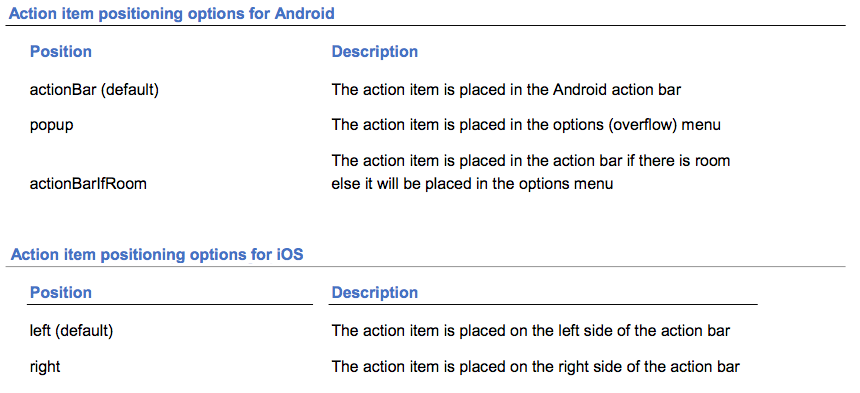
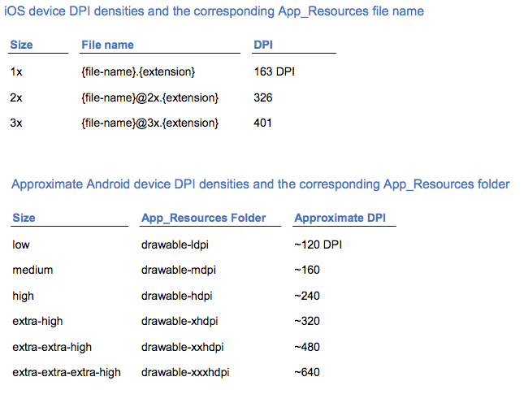
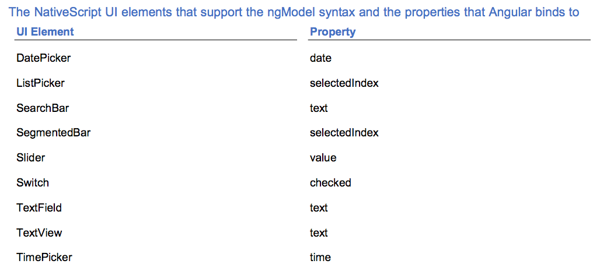

Since each nativescript project is a little bigger than normal ones for that it contains a lot of pictures, which makes it hard to structure all of the project in one folder, the file comes out...

# The playlist:

- [groceries-NS-tutorial-ts](https://github.com/AkatQuas/groceries-NS-tutorial-ts)

- Tkemo-core throughout the book:
    - [project](https://github.com/AkatQuas/Tekmo-ns-core)
    - [The NativeScript book](https://www.nativescript.org/get-the-nativescript-book?utm_medium=website&utm_campaign=yellowstrip&utm_source=nativescriptdotorg)

- [Pet ScrapBook](https://github.com/AkatQuas/petscrapbook-ns-ng)


# Something about the above The NativeScript Book
Chapter 3 discusses something on how to support different devices, from iPhone to iPad.
Chapter 11 Section 2 shows an example to make that happen.

Let's build an iOS App target iOS 8 and above, forget about the iOS 7 and berfore.

Add the `moduleId: module.Id` attribute in `@Component` decorator make it fine to resolve the relative path in `templateUrl` and `styleUrls`

Two-way binding needs `NativeScriptFormsModule` from `nativescript-angular/forms`.

Many amazing code samples are [here](https://docs.nativescript.org/angular/code-samples/overview)

When open a dialog modal, you should declare the component both in `declaration` and `entryComponent` property in the `@NgModule` in `app.module.ts`.

# Best practice:

- [Amazing Plugins](#amazing-plugins)
- [global](#global)
- [template list](#template-list)
- [Label](#label)
- [Date Picker](#date-picker)
- [ES6 syntax](#es6-syntax)
- [Navigation](#navigation)
- [Icons & positions in ActionBar](#actionbar)
- [Image and its resolution](#image)
- [File System](#file-system)
- [Camera](#camera)
- [GPS](#gps)
- [Themes](#themes)
- [Build on iOS](#build-on-ios)
- [Routing in NS-Ng](#routing-in-ns-ng)
- [Forms in Ng](#forms-in-ng)

## global
Sometimes we need the `global` to accomplish something. What NativeScript offers us is `Application Resources` which can be referred as the following ways:

```js
// filePath: app/app.js

var application = require('application')
// ...
var resources = application.getResources()
resources.globalObject = globalObject;
// the globalObject should be registered in this way, and can be reached all over the application
``` 

> page `load` before `shown modal`

## template list

Created from `tns create [projcet name] --template`

- vanilla, [tns-template-blank](https://github.com/NativeScript/template-blank)
- vanilla tutorial, nativescript-template-hello-world
- typescript no Angular, [tns-template-blank-ts](https://github.com/NativeScript/template-blank-ts)
- Angular Tutorial, nativescript-template-ng-turorial
- Angular, [tns-template-blank-ng](https://github.com/NativeScript/template-blank-ng)

## Label 

set the `textWrap="true"` immediately after creating `Label`

## Date Picker

It is recommended to use timestamp in the app rather the date string.

## ActionBar
- icons
`seeting icons` in `ActionBar.ActionItem`, [ios](https://docs.nativescript.org/ui/action-bar#setting-icons), [android](http://androiddrawables.com/)

- position



[top](#best-practice)

## ES6 Syntax

- `arrow function` is supported both in `NS-core` and `NS-Ng`

- `short handed` property is supported

[top](#best-practice)

## Navigation

`backstackVisible` makes the target page only can be navigated once, and can not be navigated back to. [doc](https://docs.nativescript.org/api-reference/interfaces/_ui_frame_.navigationentry#backstackvisible)

`transition` between page navigation:

- `fade`: Android, iOS
- `flipRight`: Android, iOS
- `flipLeft`: Android, iOS
- `slideLeft`: Android, iOS
- `slideRight`: Android, iOS
- `slideTop`: Android, iOS
- `slideBottom`: Android, iOS
- `explode`: Android
- `curlUp`: iOS
- `curlDown`: iOS

- better to pre-defined the propertyName you need in the bindingContext on `loaded` function 

[top](#best-practice) 

## File System

[doc](https://docs.nativescript.org/api-reference/modules/_file_system_)
2 different folders in `knownFolders`, referred as `documents()` and `temp()`

Class [Folder](https://docs.nativescript.org/api-reference/classes/_file_system_.folder) has many useful methods:

- `exists`
- `getFile` & `clear`
- `rename` & `renameSync`
- `remove` & `removeSync`

After `getFile()` from a `Folder`, useful methods, [doc](https://docs.nativescript.org/api-reference/classes/_file_system_.file):

- `extension`
- `readSync` & `writeSync`
- `readText` & `readTextSync`
- `writeText` & `writeTextSync`
- `rename` & `renameSync`
- it is ok to deal with binary in files, to be found!

[top](#best-practice)

## Camera

run `npm install nativescript-camera --save` first. ( or use `tns plugin add nativescript-camera`). After import or require, `camera.requestPermissions()` in the function. The documentation is [here](https://github.com/NativeScript/nativescript-camera), camera is not in the core module.

## Image 

the data is always binary after taking the shot (though the image resource path is a string?), be careful when dealing with binary. `Base64` is a good one and NativeScript’s image module already has implementations for converting images to and from base64 encoded strings.

**Image resolution**



And As for image resources, [NativeScript Image Builder](http://nsimage.brosteins.com/) helps a lot.

[top](#best-practice)

## GPS

run `npm install nativescript-geolocation --save`. [Doc is here](https://github.com/NativeScript/nativescript-geolocation), geolocation is not in the core module. Kind of failure because of the so-called `Google Plaer service`.

## Themes

Only a limited number of styles are [supported](https://docs.nativescript.org/ui/styling)

in the core theme, [desipte](https://ell.stackexchange.com/questions/506/usage-in-spite-of-and-despite-of/508) the color differentiation, the same class are:

- Text size: `h1, h2, h3, h4, h5, h6`
- Label: `label`
- Text align: `text-center`, `{margin/padding}- {top/bottom/left/right}-{amount}`
- Button: `btn btn-primary btn-outline btn-rounded-sm/lg btn-active` (recommended to be used with margin/padding)
- ListView: `list-group, list-group-item, list-group-item-heading list-group-item-text`, `thumb` (under `list-group-item`)
- Image: `image-circle, image-rounded, image-thumbnail`
- Form: `form, input-field`,

## i18n
There is an npm plugin named `nativescript-i18n` that implements i18n. By using this plugin, you can build you app so it can support multiple languages and cultures.

If your app requires support for i18n, or you want to build an app that is accessible to multiple languages and cultures, check out this plugin at [here]( https://www.npmjs.com/package/nativescript-i18n.)

[top](#best-practice)

## Build on iOS

**id:** in the `package.json` -> `nativescript` -> `id`

**rename the app:** updating the `Info.plist` file, specifically the `CFBundleDisplayName` value.

**Version:** CFBundleVersion, which corresponds to the version number, and CFBundleShortVersionString, which corresponds to the build number.

**App Icon:** All icons are stored in the `App_Resources/iOS/Assets.xcassets/AppIcon.appiconset` folder, named `icons-{size}.png`, remember to rename to match the convention.

**Splash, LaunchScreen:** replace the image in the `LaunchScreen.Center.imageset` and `LaunchScreen.AspectFill.imageset`, remember to rename to match the convention.

**Device orientation:**

All the supported orientaion is here, choose those you need.

```
# Info.plist
<key>UISupportedInterfaceOrientations</key>
<array>
    <string>UIInterfaceOrientationPortrait</string>
    <string>UIInterfaceOrientationLandscapeLeft</string>
    <string>UIInterfaceOrientationLandscapeRight</string>
</array>
<key>UISupportedInterfaceOrientations~ipad</key>
<array>
    <string>UIInterfaceOrientationPortrait</string>
    <string>UIInterfaceOrientationPortraitUpsideDown</string>
    <string>UIInterfaceOrientationLandscapeLeft</string>
    <string>UIInterfaceOrientationLandscapeRight</string>
</array>
```

**iOS APP security component:** You need to become familiar with the following five iOS app security components: 

1. Apple Developer Account associated with an Apple ID

1. App identifiers

1. Certificates

1. Registered devices 

1. Provisioning profiles

**Step by Step:**

1. App IDs

1. Certificates, iOS Distribution recommended

1. Registered Devices

1. Provisioning Profiles

**Read the document please**

[top](#best-practice)

## Routing in NS-Ng

The complete document is [here](https://docs.nativescript.org/core-concepts/angular-navigation).

What I want to point out is that You can also use the stock `Angular Route` and `Location` classes to handle your navigation — `RouterExtensions` actually invokes those APIs internally. However, `RouterExtensions` provides access to some NativeScript-specific features like clearing navigation history or defining page transitions, and the [detail](https://docs.nativescript.org/core-concepts/angular-navigation#navigation-options).

Besides, it is ok to navigate back in `routerExtensions`.

```ts
@Component({
    // ...
})
export class MainComponent {
    constructor(private routerExtensions: RouterExtensions) {
        // ...
    }
}

public goBack() {
    this.routerExtensions.back();
}

public goBackPage() {
    this.routerExtensions.backToPreviousPage();
}
```

Getting data passed in via the route parameters, importing `PageRoute` from `@nativescript-angular/router` and importing `rxjs/add/operator/switchMap`, the [doc](https://docs.nativescript.org/core-concepts/angular-navigation#passing-parameter).

```ts
 this.pageRoute.activatedRoute
     .switchMap(activatedRoute => activatedRoute.params)
     .forEach(params => { id = +params["id"]; });
```

[top](#best-practice)

## Forms in Ng

The property in Native UI components when using `[(ngModle)]`



[top](#best-practice)

## Amazing Plugins

- [nativescript-appversion](https://github.com/eddyverbruggen/nativescript-appversion): NativeScript doesn’t provide a built-in mechanism for getting an app’s version number, but the nativescript-appversion plugin does. 

- [NativeScript + Angular Snippets for Visual Studio Code](https://github.com/NathanWalker/nativescript-ng2-vscode-snippets): Snippets for NativeScript + Angular 2 Development, available in VS Code Extensions.


[top](#best-practice)

[top](#best-practice)

[top](#best-practice)

[top](#best-practice)

[top](#best-practice)

[top](#best-practice)

[top](#best-practice)

