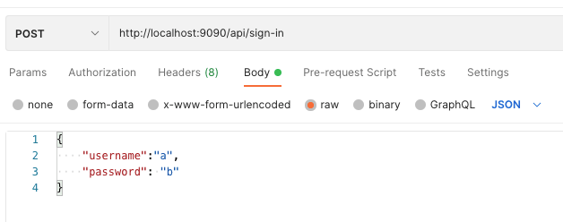
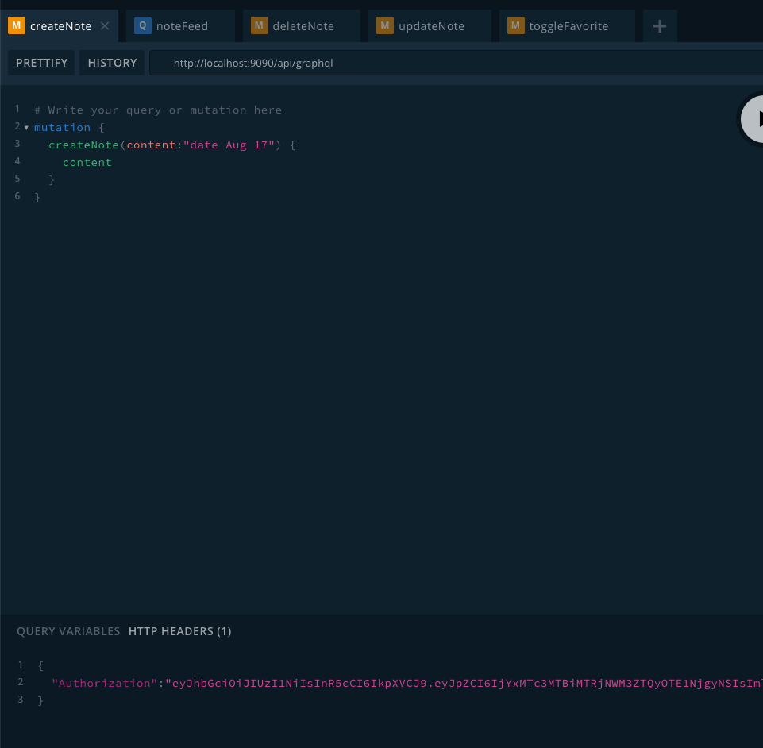
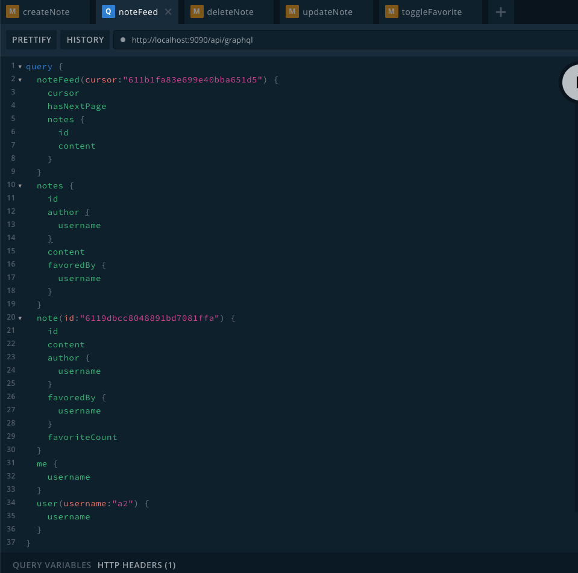

# Notedly

This is an API server, built on Nest / GraphQL / Typegoose.

The authorization token could be required using RESTful API.

Then you're good to play with the graphql playground.

<details>

<summary>Screenshots</summary>







</details>

## Mongo CLI commands cheat sheet

https://docs.mongodb.com/manual/reference/mongo-shell/

## Installation

```bash
$ yarn install
```

## Running the app

```bash
# development
$ yarn run start

# watch mode
$ yarn run start:dev

# production mode
$ yarn run start:prod
```

## Test

```bash
# unit tests
$ yarn run test

# e2e tests
$ yarn run test:e2e

# test coverage
$ yarn run test:cov
```

## Support

Nest is an MIT-licensed open source project. It can grow thanks to the sponsors and support by the amazing backers. If you'd like to join them, please [read more here](https://docs.nestjs.com/support).

## License

Nest is [MIT licensed](LICENSE).
