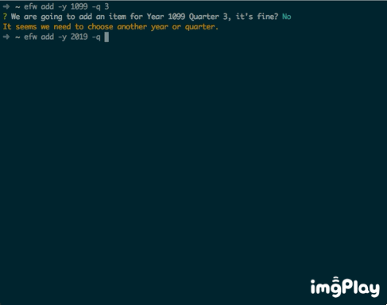
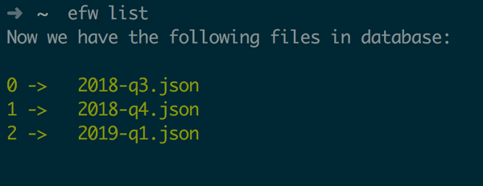
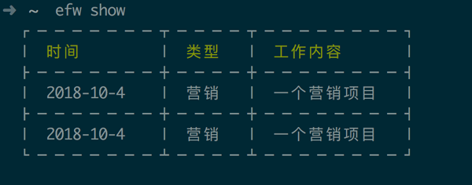
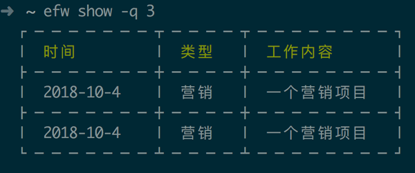
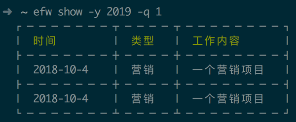

# Excel for Work

This program is just for laziness. I don't want to open the Excel App which takes too much time to launch.

# Installation

```bash
npm install -g git+https://github.com/AkatQuas/excel-for-work
# or
yarn global add git+https://github.com/AkatQuas/excel-for-work
```

# Usage

    efw help

Check at the mannual, PLEASE!

    efw add [-y <n>] [-q <n>]

Add a work item to the database in the current quarter and year, or you can input the year and quarter.



    efw list

List the quarter data you have in the database.



    efw show [-y <n>] [-q <n>]

Cat and show one quarter report in terminal.







    efw export

Select one quarter to export as an excel! It will export a file at the current working directory when you call this command.

    efw raw-edit

This is a private command to edit the json files in the database directly. So use it with extra caution.

# Test

No Unit test. But do have a `test.js` in `utils` for testing the utils functions.

# Contact me !

Feel free to write an email to me.

# LICENSE

No License, feel free to use.
