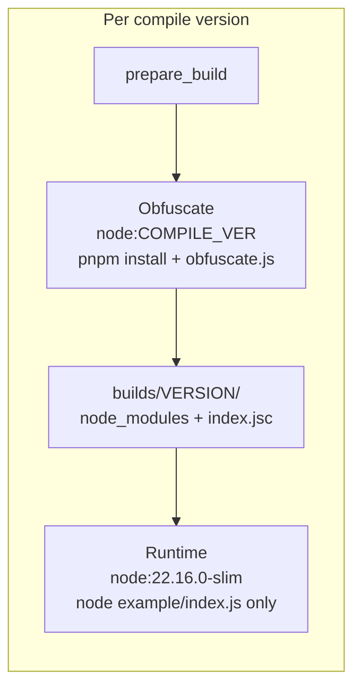

# test-obfuscate

Docker-based harness for testing **bytenode** obfuscation compatibility: compile JavaScript on newer Node 22.x versions, then run the bytecode on a fixed older production runtime.

**Latest results:** see [REPORT.md](REPORT.md)

## Goal

1. Obfuscate source with **bytenode** using Node versions in the **22.21.x–22.22.x** range.
2. Run the obfuscated entry (`node index.js`) on a **fixed older runtime** (production target).
3. Use Docker to switch Node versions without local installs.
4. Keep the entry command unchanged after obfuscation: `node index.js`.

## Obfuscation Flow

[`obfuscate.js`](obfuscate.js):

1. `bytenode --compile example/index.js` → produces `example/index.jsc`
2. Replace `example/index.js` with loader stub:

```javascript
require('bytenode');require('./index.jsc')
```

## Project Layout

```text
test-obfuscate/
  obfuscate.js              # bytenode compile + loader stub
  package.json              # bytenode dependency
  example/
    index.source.js         # pristine test source (restored each run)
    index.js                # compiled target / loader after obfuscate
    index.jsc               # V8 bytecode (generated)
  builds/
    <node-version>/         # isolated artifact per compile version
      node_modules/         # bytenode installed at obfuscate time only
      example/index.js
      example/index.jsc
      obfuscate.js
      package.json
  run-matrix.sh             # Docker matrix runner
  README.md                 # this file
  REPORT.md                 # test results and findings
```

## Test Application

[`example/index.source.js`](example/index.source.js) — three plain functions with nested calls (bytenode-safe, no arrow functions):

- `add(a, b)`
- `multiply(a, b)`
- `compute(x, y)` → `multiply(add(x,y), add(x,y))`

Expected output on success:

```text
RESULT:25
NODE:v<runtime-version>
```

## Docker Matrix Design



| Stage | Image | Install? | Working dir |
|-------|-------|----------|-------------|
| Obfuscate | `node:<compile-version>` (full) | Yes — `pnpm install` + bytenode | `builds/<version>/` |
| Runtime | `node:22.16.0-slim` | **No** — reuses obfuscate `node_modules` | `builds/<version>/` |

Each compile version gets its **own** `builds/<version>/` directory and **own** `node_modules` install. Runtime only executes; it does not run `pnpm install`.

All orchestration uses **`docker run`** inside [`run-matrix.sh`](run-matrix.sh). Docker Compose is not required.

## How to Run

From workspace root:

```bash
pnpm compat:matrix
```

Override runtime or compile set:

```bash
RUNTIME_VERSION=22.16.0 RUNTIME_IMAGE=node:22.16.0-slim pnpm compat:matrix
COMPILE_VERSIONS="22.22.3" bash test-obfuscate/run-matrix.sh
```

Single compile version:

```bash
COMPILE_VERSIONS="22.22.1" bash test-obfuscate/run-matrix.sh
```

## Files

| File | Role |
|------|------|
| [`obfuscate.js`](obfuscate.js) | Compile `example/index.js` → `.jsc`, write loader |
| [`run-matrix.sh`](run-matrix.sh) | Docker matrix automation |
| [`package.json`](package.json) | Local bytenode dependency and `compat:matrix` script |
| [`REPORT.md`](REPORT.md) | Compatibility test results and recommendations |
