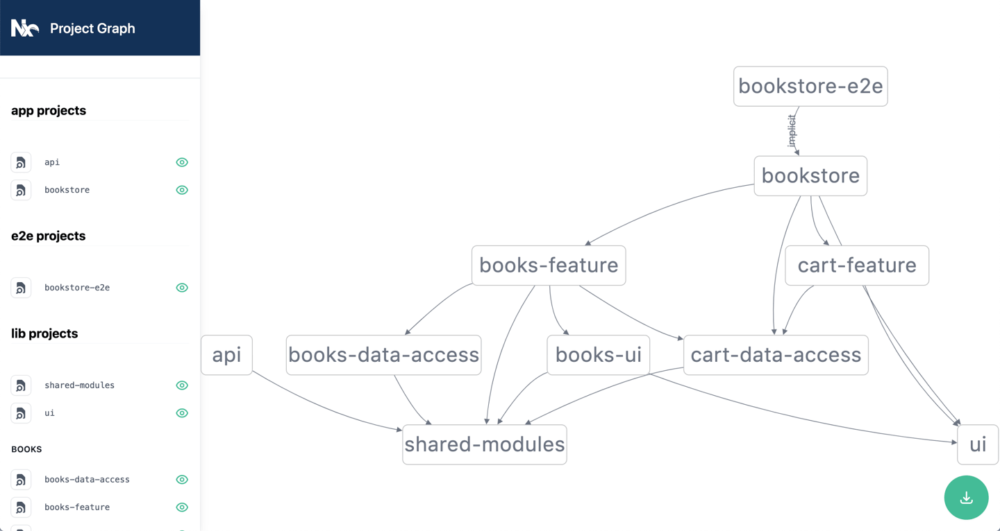

# Acme

This project was generated using [Nx](https://nx.dev) with `react` and `styled-components` preset.

Most codes are from this book [Effective React with NX-2022](http://leanpub.com/effective-react-with-nx).

<details>

<summary>Dep graph</summary>



</details>


## Development

1. Generate a _feature_ `books/feature` for _library_ `books`.

```bash
$  nx generate lib feature \
  --directory books \
  --appProject bookstore \
  --tags type:feature,scope:books
```

2. Generate a _ui_ library for common usage.

```bash
$ nx generate lib ui \
  --tags type:ui,scope:books \
  --no-interactive
```

And generate some components for that project `ui`:

```bash
$ for f in GlobalStyles Button Header Main; do \
  nx generate component ${f} --project ui --export --tags type:ui,scope:books; \
  done;

$ for f in NavigationList NavigationItem; do \
  nx generate component ${f} --project ui --directory lib/navigation --export --flat --tags type:ui,scope:books; \
  done;
```

3. Generate Data-access libraries for `books`

> Use `@nrwl/web` collection instead of the default `@nrwl/react` which is defined in [nx.json](./nx.json).

```bash
$ nx generate @nrwl/web:lib data-access --directory books --tags type:data-access,scope:books
```

4. Generate _presentational components_ for `books`

```bash
$ nx generate lib ui --directory books --tag type:ui,scope:books

$ for f in Books Book; do \
  nx generate component ${f} --project books-ui --export; \
  done;
```

5. Generate a backend service with `@nrwl/express`

```bash
$ npm install --save-dev @nrwl/express

$ nx generate @nrwl/express:app api --no-interactive --frontend-project=bookstore
```

The `--frontend-project` option will add a proxy configuration (`proxy.conf.json`) to the `bookstore` application such that requests going to `/api/*` will be forwarded to the API server.

Run `nx run-many --target=serve --projects=api,bookstore` to start both projects.

6. Generate shared modules

```bash
$ nx generate @nrwl/node:lib shared-modules --no-interactive
```

7. Generate Cart Feature for `bookstore`

```bash
$ nx generate @nrwl/web:lib data-access --directory=cart

# update data-access with redux toolkit
$ nx generate redux cart --project=cart-data-access --appProject=bookstore --tags type:data-access,scope:books

$ nx generate lib feature --directory=cart --appProject=bookstore --tags type:feature,scope:books
```

## On **Enforce module boundaries**

There's an entry for `@nrwl/nx/enforce-module-boundaries` in the `.eslintrc.json` file at the root of the project workspace as follows.

```json
{
  // omitted
  "rules": {
    "@nrwl/nx/enforce-module-boundaries": [
      "error",
      {
        "allowCircularSelfDependency": false,
        "enforceBuildableLibDependency": true,
        "allow": [],
        "depConstraints": [
          {
            "sourceTag": "type:app",
            "onlyDependOnLibsWithTags": ["type:feature", "type:ui", "type:util"]
          },
          {
            "sourceTag": "type:feature",
            "onlyDependOnLibsWithTags": ["type:feature", "type:ui", "type:util"]
          },
          {
            "sourceTag": "type:ui",
            "onlyDependOnLibsWithTags": ["type:ui", "type:util"]
          },
          {
            "sourceTag": "type:util",
            "onlyDependOnLibsWithTags": ["type:util"]
          },
          {
            "sourceTag": "scope:books",
            "onlyDependOnLibsWithTags": ["scope:shared", "scope:books"]
          },
          {
            "sourceTag": "scope:admin",
            "onlyDependOnLibsWithTags": ["scope:shared", "scope:admin"]
          },
          {
            "sourceTag": "scope:shared",
            "onlyDependOnLibsWithTags": ["scope:shared"]
          }
        ]
      }
    ]
  }
}
```

The `depConstraints` section is the one we will be spending most time fine-tuning. It accepts an array of constraints, each consisting of `sourceTag` and `onlyDependOnLibsWithTags` properties. The default configuration has a wildcard `*` set as a value for both of
them, meaning that _any project_ can import (depend on) _any other project_.

The `allowCircularSelfDependency` is a flag indicating whether circular dependencies is tolerable.

The `allow` section accepts array of strings, which is a whitelist listing the import definitions that should be omitted from further checks.

The flag `enforceBuildableLibDependency` prevents us from importing a non-buildable library into a buildable one.

**Constraints for module boundaries**

Here are some constraints for what each types of projects can depend on.

- Applications can depend on any types of libraries, but not other applications.
- Feature libraries can depend on any other library.
- UI libraries can only depend on other UI or utility libraries.
- Utility libraries can only depend on other utility libraries.

For `scopes`,

- Book application and libraries can only depend on `scope:books` libraries.
- Admin application and libraries can only depend on `scope:admin` libraries.
- Any applications and libraries can depend on `scope:shared` libraries.
