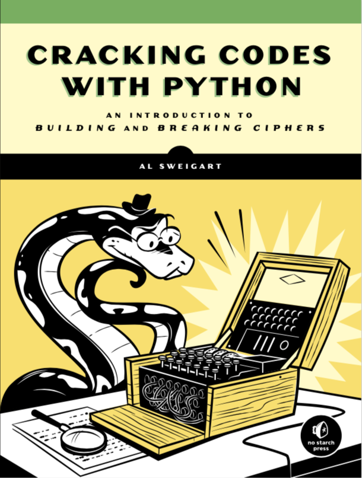

# Cracking Codes With Python

This book is an introduction to building and breaking ciphers written by Al Sweigart (al@inventwithpython.com).

From the most naive cipher to the most sophisticated:

1. **Caeser Cipher**

1. **Transposition Cipher**

1. **Affine Cipher**

1. **Simple Subsitution Cipher**

1. **Vigenère Cipher**

1. **RSA Encryption**

## Online Resources

[Online Purchasing](https://nostarch.com/crackingcodes/): Buy the book online!

[pyperclip.py](https://inventwithpython.com/pyperclip.py) : A cross-platform clipboard module for Python, with copy & paste functions for plain text written by Al Sweigart (al@inventwithpython.com).

