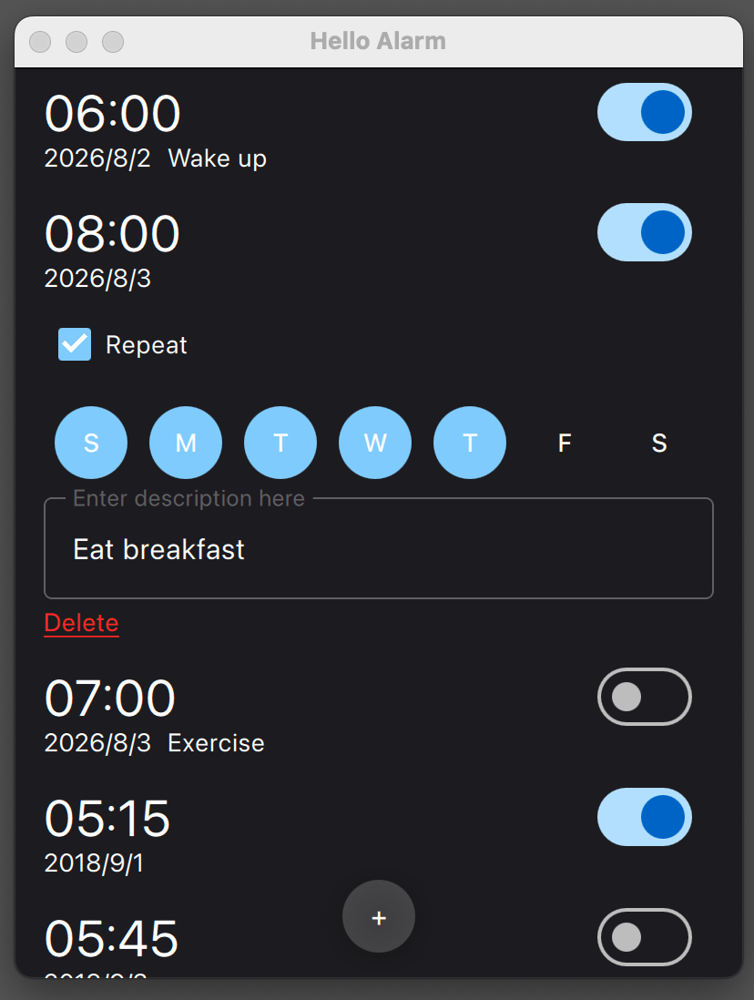
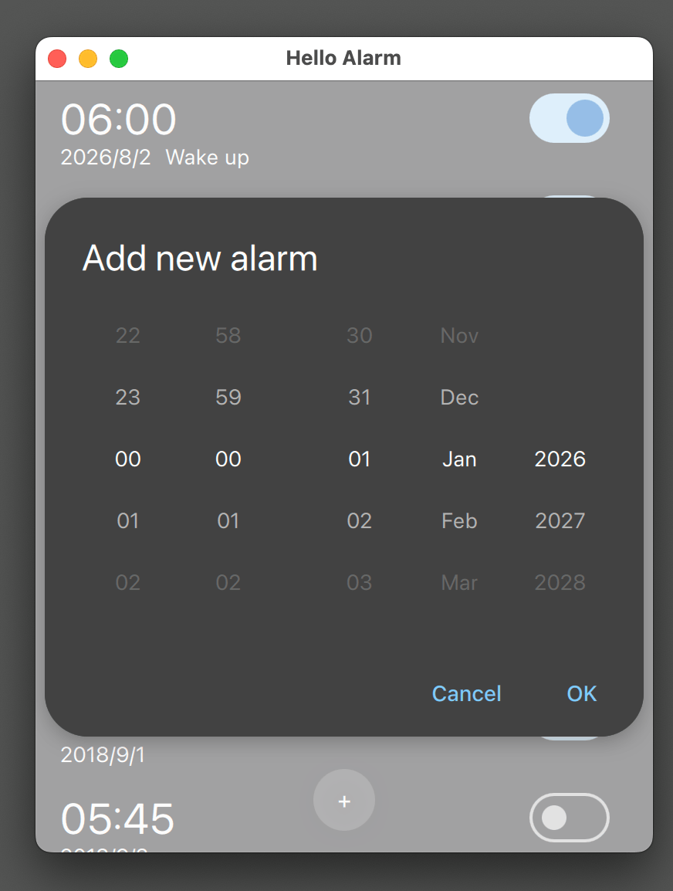

# Alarm

A desktop QT application from [Getting Started programming with Qt Quick: An Alarm Application](https://doc.qt.io/qt-6/qtdoc-tutorials-alarms-example.html).

Official code is hosted at [qt/qtdoc.git](https://code.qt.io/cgit/qt/qtdoc.git/tree/examples/tutorials/alarms?h=6.11).

Though the project compiles well, but nothing shows on the application.

And I use ai to fix. 

