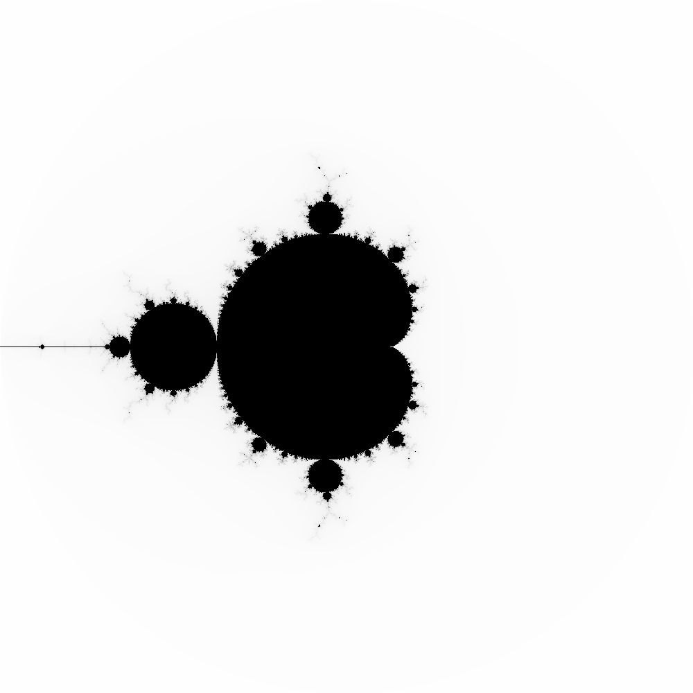
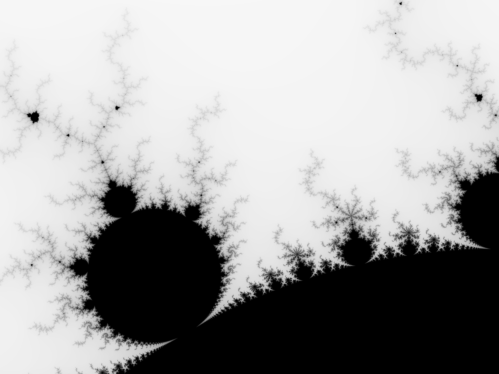
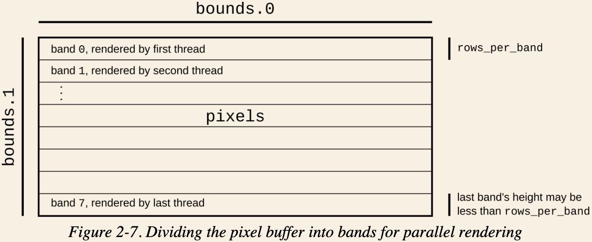

# Mandelbrot set

> All credit to the book [Programming Rust](https://www.oreilly.com/library/view/programming-rust-2nd/9781492052586/).

This executable draws a image (PNG) of mandelbrot set **concurrently**.

```bash
# draw a complete set of mandelbrot complex numbers
cargo run -- mandelbrot.png 500x500 -2.0,2.0 2.0,-2.0

# right half of the mandelbrot set
cargo run -- mandelbrot_right.png 250x500 0.0,2.0 2.0,-2.0

# left half of the mandelbrot set
cargo run -- mandelbrot_left.png 250x500 -2.0,2.0 0.0,-2.0
```

Here is the output.

| Full Set 500x500              | Left Half 250x500                   | Right Half 250 x500                  |
| ----------------------------- | ----------------------------------- | ------------------------------------ |
|  |  |  |

## Timing comparison.

We took a much detailed part of the mandelbrot set in a bigger image size.

```bash
# Zoom in to check more detail
# see bin/main.rs
$ cargo run -- mandelbrot_detail.png 4000x3000 -1.20,0.35 -1,0.20
Render timing: 13549ms.

# Use single thread, much slower
# see bin/single.rs
$ cargo run --bin single -- mandelbrot_detail_single.png 4000x3000 -1.20,0.35 -1,0.20
Render timing: 40157ms.
```

A more detailed segmentation, 4000x3000.



## Render concurrently

Given 8 threads, let's divide pixel buffer into 8 bands, so each thread could tackle it's own bounds of pixels.



One band is a small sliced image to render.
