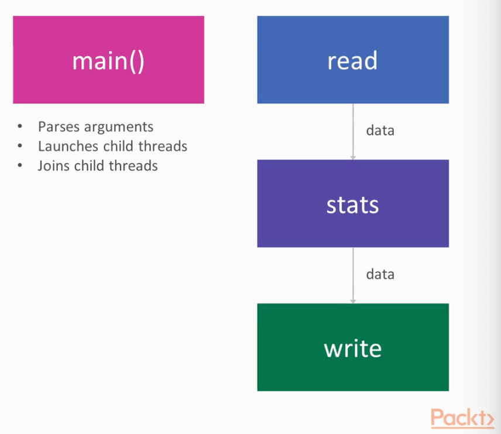

# PipeViewer

## Usage

```bash
$ cargo run --bin pv_single -- --help
$ cargo run --bin pv_mpsc -- --help
$ cargo run --bin pv_crossbeam -- --help

$ echo "some input" | ./target/debug/pv_single

$ echo "some input" | cargo run --bin pv_mpsc

$ echo "some input" | cargo run --bin pv_mpsc -- -o output.txt

$ echo "some input" | cargo run --bin pv_mpsc -- -s

$ echo "some input" | cargo run --bin pv_crossbeam
```

## MPSC architecture



## Crossbeam architecture


## Development

```bash
# create a file with rand bytes
$ dd if=/dev/urandom of=path/to/output_file bs=1024 count=1000

# create a file with 1024 rand bytes
$ dd if=/dev/urandom of=bytes-1k bs=1024 count=1


# the "yes" command

# create a "Broken pipe" Error
$ cargo build && yes | ./target/debug/pv_crossbeam | head -n 100000 > /dev/null

# run specific bin
$ yes | cargo run --bin pv_mpsc | head -n 10000000 > /dev/null

# generate document
$ cargo doc --no-deps --open
```
