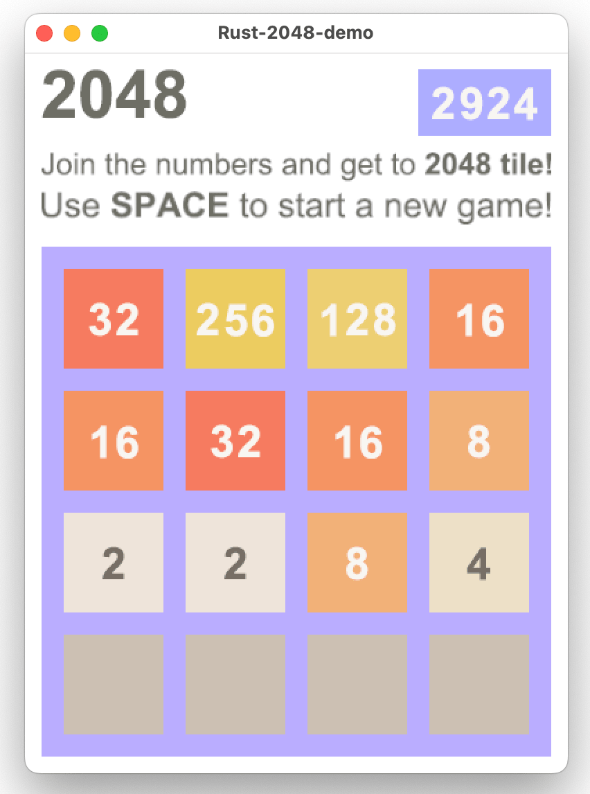
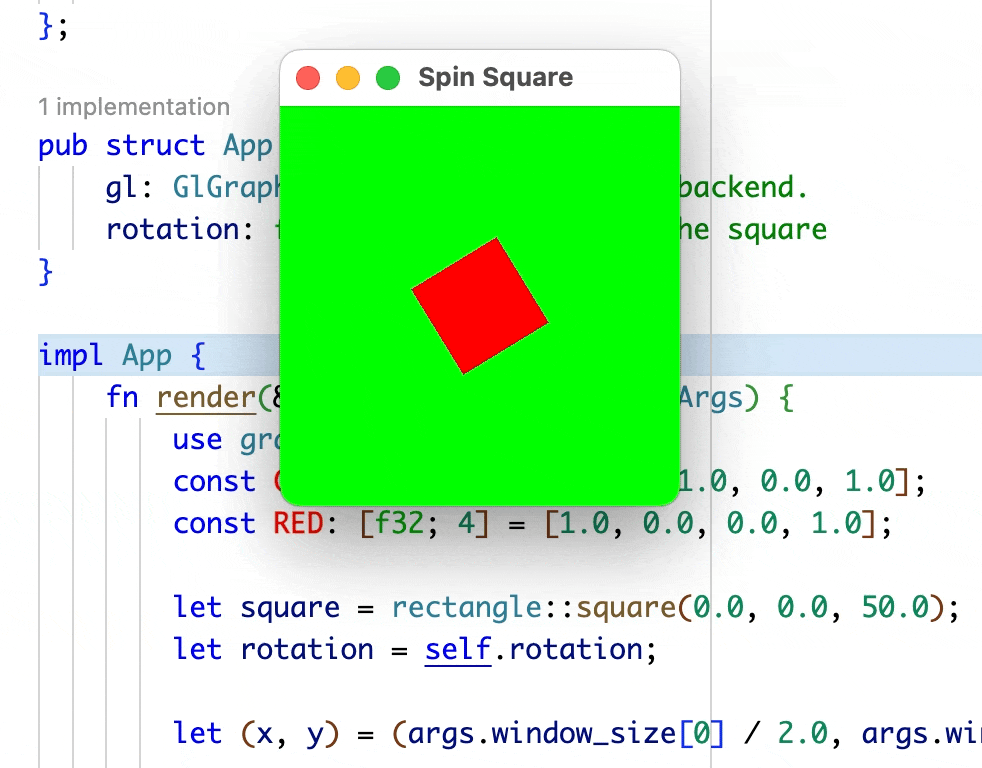

# Rust 2048

Thanks to [coeuvre](https://github.com/coeuvre/rust-2048).

---

A game built on [Piston game engine](https://www.piston.rs/).

You also need the _Freetype 6_ and _SDL2_ libs.
Look at [Piston-Tutorials - Installing Dependencies](https://github.com/PistonDevelopers/Piston-Tutorials/tree/master/getting-started#installing-dependencies) and [Rust-SDL2 - Requirements](https://github.com/AngryLawyer/rust-sdl2#sdl20--development-libraries) how to install them.

Play! Use arrow key to move tiles.

```bash
cargo run --bin 2048-demo
```



I could have added some audios or sound effects if this [compatible issue](https://github.com/PistonDevelopers/music/issues/88) was solved.

## Bonus Game: Spin Square

From this [tutorial](https://github.com/PistonDevelopers/Piston-Tutorials/tree/master/getting-started).

> A very old [tutorial](http://piston-tutorial.logdown.com/pages/table-of-contents) just for reference.

```bash
cargo run --bin spin-square

# use ⬆️ or ⬇️ to change rotation speed.
```


