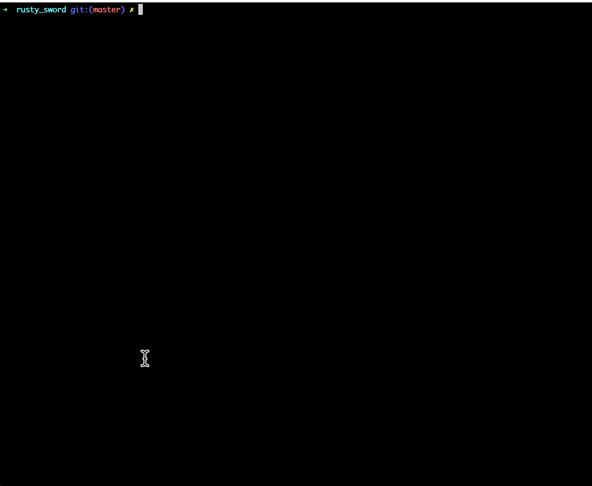

# Acknowledgement

This is a project forked from [rusty sword].

---

# Rusty Sword: Game of Infamy!

Rusty Sword is a terminal-based arcade game used to demonstrate the [Rust] programming language
through live-coding presentations. It has been tested on macOS, Linux, and Windows.



## To play

- [Install Rust] if you don't have it already.
- If you are on Linux, install the [Linux dependencies] listed for [rusty_audio]
- Clone the "Rusty Sword" repository, and change directory to it with your terminal. For example:

```
git clone git@github.com:CleanCut/rusty_sword.git
```

- Build and run to play!

```
cargo run --release
```

## Gameplay instructions

- The `⦲` represents you, and the arrow symbol next to you is your rusty sword.
- Use arrow keys or `WASD` keys to move. Your sword will always point in the direction you are moving. (You are not particularly skilled at swordfighting, apparently).
- Monsters will attempt to eat you. If they touch you, your HP decreases. They will succeed and the game will be over if your HP reaches 0.
- Neither you or monster could move across the block part `⊘` .
- Touching a monster with your rusty sword will instantly kill it (naturally, since monsters are unsafe).
- Scores are different for each monster. Gain as much as you can.
- Have fun!

## Screencast (minus audio)

[](https://asciinema.org/a/308544)

[rusty sword]: https://github.com/CleanCut/rusty_sword
[install rust]: https://www.rust-lang.org/tools/install
[linux dependencies]: https://github.com/CleanCut/rusty_audio#dependencies-on-linux
[rust]: https://www.rust-lang.org/
[rusty_audio]: https://github.com/CleanCut/rusty_audio
