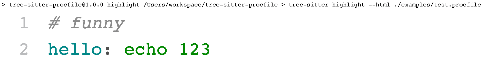

# Tree-sitter writeup

Learn something about the [tree-sitter](https://tree-sitter.github.io/tree-sitter/).

## Development workflow

1.  Create a new parser project `mkdir tree-sitter-{language}`.
1.  Initialize the project with dependencies.

    ```bash
      cd tree-sitter-{language}
      pnpm init
      pnpm add nan node-gyp
      pnpm add tree-sitter-cli -D
    ```

1.  Initialize global config for tree-sitter, add [`Paths`](https://tree-sitter.github.io/tree-sitter/syntax-highlighting#paths).

    ```bash
    ./node_modules/.bin/tree-sitter init-config
         ^ this would print out the path to config file

    # add the parent folder of `tree-sitter-{language}` to the field "parser-directories"
    # so that tree-sitter can find the parser project
    ```

1.  Write some grammar in `grammar.js`. Here is an [example](https://github.com/tree-sitter/tree-sitter-ruby/blob/master/grammar.js).

1.  Call `./node_modules/.bin/tree-sitter generate path-to-grammar.js` to generate several new files important.

1.  Run `node-gyp configure && node-gyp build` to build the final parser.

### Test

1.  Add test files in the directory `corpus`. Check out the [example](https://github.com/siraben/tree-sitter-imp/tree/master/corpus).

1.  Run `./node_modules/.bin/tree-sitter test` to verify. Add `--update` option to update the syntax.

### Highlight

1. Add `highlights.scm` in the directory `queries`. Check out the [example](https://github.com/tree-sitter/tree-sitter-ruby/tree/master/queries).

1. Run `./node_modules/.bin/tree-sitter highlight --html ./examples/source.imp` to generate a result in html.

1. Open that html to view the grammar highlight output.




###

## Acknowledgement

Watch the video: [Tree-sitter: a new parsing system for programming tools - GitHub Universe 2017](https://www.youtube.com/watch?v=a1rC79DHpmY)

Read some blogs:

- [Guide to your first Tree-sitter grammar](https://gist.github.com/Aerijo/df27228d70c633e088b0591b8857eeef): A detailed post on writing a parser for tree-sitter.

- [Lightweight linting with tree-sitter](https://deepsource.com/blog/lightweight-linting/): A post on using tree-sitter to write a linter. Manipulate the [S-expression](https://en.wikipedia.org/wiki/S-expression) is interesting but difficult.

  Here is another [lint tools](https://github.com/siraben/ts-lint-example) with JavaScript bindings.

- [How to write a tree-sitter grammar in an afternoon](https://siraben.dev/2022/03/01/tree-sitter.html): A good article on how to write a parser in action.
