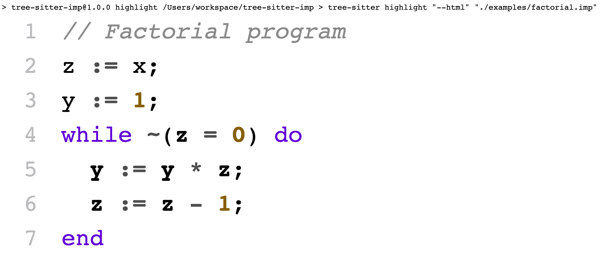

# Tree-sitter-imp

This project is for learning, and a fork from [tree-sitter-imp](https://github.com/siraben/tree-sitter-imp/).

Read [How to write a tree-sitter grammar in an afternoon](https://siraben.dev/2022/03/01/tree-sitter.html) for more details.

## Scripts

1. "build": build the parser.
1. "highlight": grammar highlight the example files.
1. "test": run test files in corpus

## Highlight

