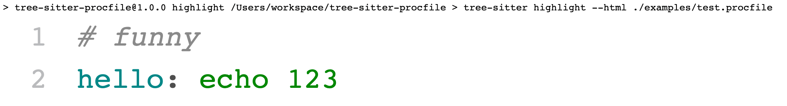

# Tree-sitter-procfile

A parser for [`Procfile`](https://devcenter.heroku.com/articles/procfile) using [`tree-sitter`](https://tree-sitter.github.io/tree-sitter/).

## Folder Structure

```
tree-sitter-procfile
|- corpus
| `(test files)
|- grammar.js
|- node_modules
| ` (dependencies)
`- package.json
```

## Highlight



## References

- [tree-sitter-dockerfile](https://github.com/camdencheek/tree-sitter-dockerfile).
