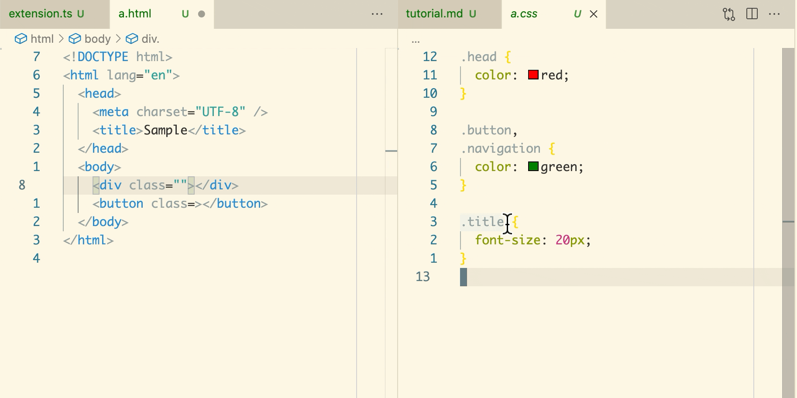
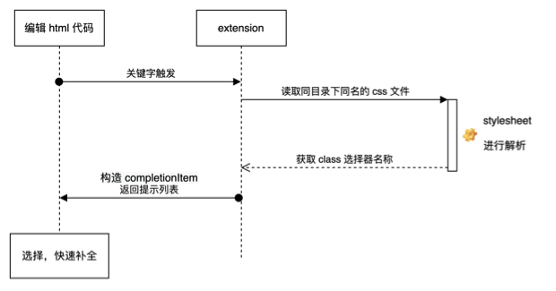
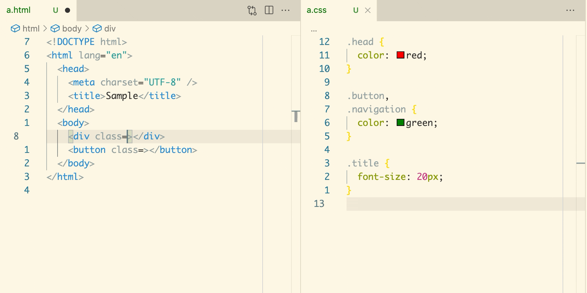

# 一个简单的 css 类选择器补全插件

> [English version](./tutorial.md)

平常在 `html` 文件编写的时候，有一件让人抓狂的事情就是给 `class` 属性添加类选择器。

```html
<div class="?"></div>
```

定义在 css 文件的类选择器有时候比较长，如果手动输入难免会拼错。通常的做法是，左侧开一个 html 文件，右侧开相应的 css 文件，从 css 文件中复制一个类选择器来粘贴到 html 文件中。就像下图这样，这种做法有点太累人了。



所以，如果编辑器能有自动提示功能就很方便了。

接下来，本文会一步一步地带你实现一个具有自动提示 css 类选择器的 vscode 插件。

> 样例插件的功能比较简单，仅支持同目录下同名的文件提示，主要做练习目的。

## 基础知识

vscode 提供了一个 [API `registerCompletionItemProvider`](https://code.visualstudio.com/api/references/vscode-api#languages) 使得插件在激活时，注册一个补全功能。简单的例子如下。

```typescript
const provider = {
  provideCompletionItems(document, position, token, context) {
    /* 返回 CompletionItem 数组，也可以返回 Promise<CompletionItem[]> 的异步结果 */
  }
};
vscode.languages.registerCompletionItemProvider(
  'html' /* language id */,
  provider,
  '"' /* trigger character */,
  '=' /* trigger character */
  // ...
);
```

`registerCompletionItemProvider` 接收多个参数：

- 第一个参数指定了目标文件，当这些目标文件在编辑时，后续的 provider 才会被触发。
- 第二个参数是一个具有 `provideCompletionItems` 方法的对象，定义了补全触发时，返回相应的可能补全结果，可以同步地返回 `CompletionItem` 数组，也可以异步地返回 `Promise<CompletionItem[]>` 的结果。
- 第三个参数开始往后，都是长度为 1 的字符串，作为 `triggerCharacter` ，表示 `provideCompletionItems` 方法触发字符。

provider 中的 `provideCompletionItems` 方法的前两个参数 `document` 和 `position` 分别表示了当前正在被编辑的文件，光标所在的位置。后面两个参数暂时用不到，有兴趣了解的同学可以看相应的 API 自行研究。

## 流程梳理

补全的流程设计如下图所示：



当编辑 html 文件的 class 属性时，读取同目录下的同名 css 文件，做一波 Stylesheet 的解析，获取其中所有的 _类选择器_ 。把这些类选择器的文本进行去重，然后构造成 `CompletionItem` 的数组，返回补全结果。

## 关键点实现

类选择器补全时有两个前提：

- 编辑文件 `document` 的 `languageId` 为 `html` 的。
- 编辑位置 `position` 应该是在 _属性的值_ 中，且属性名为 `class` ，而不是 `onclick` 等其他属性。

关于前提检测过程，可以用下面这个函数来实现，[灵感来源](https://github.com/microsoft/vscode-extension-samples/blob/355d5851a8e87301cf814a3d20f3918cb162ff73/lsp-embedded-request-forwarding/client/src/embeddedSupport.ts#L31-L50) 。

`ensureAttribute` 函数会扫描 `html` 文件的 token 流，记录每一次 `AttributeName` 的 token 时的文本，再下一次遇到 `AttributeValue` 的 token 时进行检测。

当 `AttributeName` 是 `class` 时，再通过 offset 判断所属位置是否符合补全的要求。

```typescript
function ensureAttribute(htmlLanguageService, document, position) {
  const scanner = htmlLanguageService.createScanner(document.getText());
  const offset = document.offsetAt(position);
  let lastAttributeName: string | null = null;
  let token = scanner.scan();
  while (token !== TokenType.EOS) {
    switch (token) {
      case TokenType.AttributeName:
        // 记录 属性名称
        lastAttributeName = scanner.getTokenText();
        break;
      case TokenType.AttributeValue:
        if (!lastAttributeName) {
          break;
        }
        if (lastAttributeName === 'class') {
          // 判断 position 的 offset 的位置符合要求
          if (
            offset > scanner.getTokenOffset() &&
            offset < scanner.getTokenEnd()
          ) {
            return true;
          }
        }
      default:
        break;
    }
    token = scanner.scan();
  }
  return false;
}
```

接下来就来解析一下同目录下的同名 css 文件。出于方便，选择了 `vscode-css-languageservice` 来做解析。解析结果是个 `Stylesheet` 的 AST 节点，构成参考 [cssNode.ts#Stylesheet](https://github.com/microsoft/vscode-css-languageservice/blob/a2417092c382f4ac2f86145d0c44d6bce1279ae1/src/parser/cssNodes.ts#L443) 。

我们会用到 Stylesheet 的 `accept` 方法，来进行 AST 的遍历，该方法的定义在[这里](https://github.com/microsoft/vscode-css-languageservice/blob/a2417092c382f4ac2f86145d0c44d6bce1279ae1/src/parser/cssNodes.ts#L226-L232)。

```typescript
async function parseCss(cssLanguageService, htmlDocument) {
  /* 构造 css 文件的路径 */
  const cssUri = htmlDocument.uri.with({
    path: htmlDocument.uri.path.slice(0, -4) + 'css'
  });

  /* 通过 vscode 的 API 打开该文件 */
  const cssDocument = await vscode.workspace.openTextDocument(cssUri);

  /* 因为类型要求，所以要重新构造 textDocument */
  const styleDocument = ServerTextDocument.create(
    cssUri.toString(),
    'css',
    cssDocument.version,
    cssDocument.getText()
  );

  /* 解析得到 stylesheet AST */
  return cssLanguageService.parseStylesheet(styleDocument);
}
```

## 完善 CompletionProvider

以上两个环节是插件的关键步骤，现在把他们的串联起来，完善整个 provider 的功能。

```typescript
const provider = {
  async provideCompletionItems(document, position, _token, _context) {
    const attributeResult = ensureAttribute(
      htmlLanguageService,
      document,
      position
    );
    if (!attributeResult) {
      return [];
    }

    const stylesheet = await parseCss(cssLanguageService, document);

    // 类名去重
    const raw: Set<string> = new Set();

    // 遍历 stylesheet AST node
    (stylesheet as any).accept((node: any) => {
      // ClassSelector 类选择器的 enum 值为 14
      // https://github.com/microsoft/vscode-css-languageservice/blob/main/src/parser/cssNodes.ts#L29
      if (node.type === 14) {
        // 去掉首位字符 `.`
        raw.add(node.getText().substr(1));
      }

      // 返回 true 使得子节点的遍历能够继续
      return true;
    });

    // 构造 CompletionItem 并返回结果
    return Array.from(raw).map(
      (selector) => new CompletionItem(selector, CompletionItemKind.Color)
    );
  }
};
```

## 运行起来

在 vscode 编辑器打开一个借由 [`yo code`](https://code.visualstudio.com/api/get-started/your-first-extension) 创建一个空的插件项目中，把上述的代码整合一下，通过 F5 来运行插件，下图是效果：


