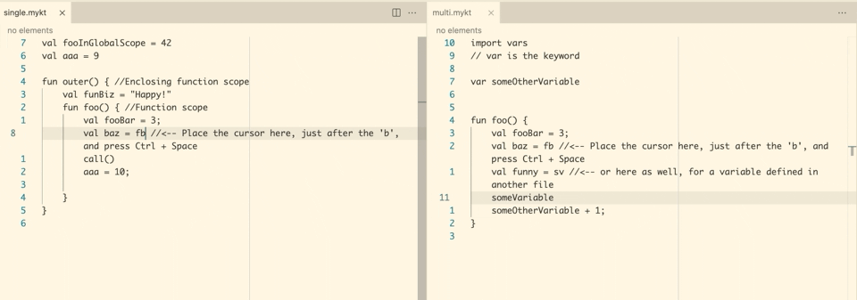

# LSP Example: My Kotlin

This repository contains the code inspired by the article, [Integrating Code Completion in Visual Studio Code – With the Language Server Protocol](https://tomassetti.me/integrating-code-completion-in-visual-studio-code-with-the-language-server-protocol/) and [Go To Definition in the Language Server Protocol](https://tomassetti.me/go-to-definition-in-the-language-server-protocol/), published on the Strumenta blog.

The code is released under the Apache license and is intended for demonstration purposes only.

## Functionality

This Language Server works for plain text file. It has the following language features:

- Completions (syntactic and semantic)
- Go To Definition



The code was originally adapted from Microsoft's LSP samples.

## Structure

```
.
├── client // Language Client
│   ├── src
│   │   ├── test // End to End tests for Language Client / Server
│   │   └── extension.ts // Language Client entry point
├── package.json // The extension manifest.
└── server // Language Server
    └── src
        └── server.ts // Language Server entry point
```

## Running the Sample

- Run `npm install` in this folder. This installs all necessary npm modules in both the client and server folder
- Open VS Code on this folder.
- Press Ctrl+Shift+B to compile the client and server.
- Switch to the Debug viewlet.
- Select `Launch Client` from the drop down.
- Run the launch config.
- If you want to debug the server as well use the launch configuration `Attach to Server`
- In the [Extension Development Host] instance of VSCode, open a document in 'plain text' language mode.
  - open the Samples folder, editing three `.mykt` files
