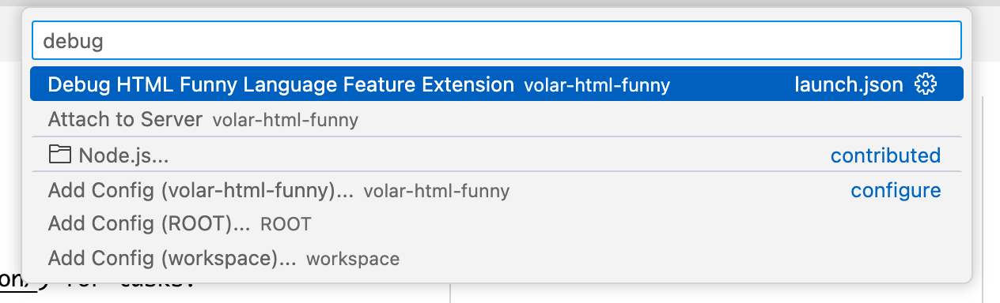

# HTML Funny Language Feature using Volar JS

## Prerequisite

Install [Task](https://taskfile.dev/installation/) for tasks.

Run `pnpm install` to install dependencies.

## Start Up

Launch extension in VS Code Debug.

> **Attach to server** if you want to debug the server scripts.

Install [VolarJS Labs Extension](https://marketplace.visualstudio.com/items?itemName=johnsoncodehk.volarjs-labs) and debug the language feature extension.

## Pack up

Run `task pack`.

## Acknowledgement

Based on [VolarJS starter template](https://github.com/volarjs/starter/tree/76a2a226f6f1108ec6e36165233778f5df1b2955).
